# Ch3. 特征增强：清洗数据

在接下来的几章中，我们将：
- 识别数据中的缺失值；
- 删除有害数据；
- 输入（填充）缺失值；
- 对数据进行归一化/标准化；
- 构建新特征；手动或自动选择（移除）特征；
- 使用数学矩阵计算将数据集转换到不同的维度。

## 3.1 识别数据中的缺失值 


```python
import pandas as pd
import numpy as np
import matplotlib.pyplot as plt
import seaborn as sns
plt.style.use('fivethirtyeight')
```


```python
pima = pd.read_csv('C:/pwork/Feature-Engineering-Made-Easy/data/pima.data')
pima.head()
```


<div>
<style scoped>
    .dataframe tbody tr th:only-of-type {
        vertical-align: middle;
    }

    .dataframe tbody tr th {
        vertical-align: top;
    }

    .dataframe thead th {
        text-align: right;
    }
</style>
<table border="1" class="dataframe">
  <thead>
    <tr style="text-align: right;">
      <th></th>
      <th>6</th>
      <th>148</th>
      <th>72</th>
      <th>35</th>
      <th>0</th>
      <th>33.6</th>
      <th>0.627</th>
      <th>50</th>
      <th>1</th>
    </tr>
  </thead>
  <tbody>
    <tr>
      <th>0</th>
      <td>1</td>
      <td>85</td>
      <td>66</td>
      <td>29</td>
      <td>0</td>
      <td>26.6</td>
      <td>0.351</td>
      <td>31</td>
      <td>0</td>
    </tr>
    <tr>
      <th>1</th>
      <td>8</td>
      <td>183</td>
      <td>64</td>
      <td>0</td>
      <td>0</td>
      <td>23.3</td>
      <td>0.672</td>
      <td>32</td>
      <td>1</td>
    </tr>
    <tr>
      <th>2</th>
      <td>1</td>
      <td>89</td>
      <td>66</td>
      <td>23</td>
      <td>94</td>
      <td>28.1</td>
      <td>0.167</td>
      <td>21</td>
      <td>0</td>
    </tr>
    <tr>
      <th>3</th>
      <td>0</td>
      <td>137</td>
      <td>40</td>
      <td>35</td>
      <td>168</td>
      <td>43.1</td>
      <td>2.288</td>
      <td>33</td>
      <td>1</td>
    </tr>
    <tr>
      <th>4</th>
      <td>5</td>
      <td>116</td>
      <td>74</td>
      <td>0</td>
      <td>0</td>
      <td>25.6</td>
      <td>0.201</td>
      <td>30</td>
      <td>0</td>
    </tr>
  </tbody>
</table>
</div>


```python
pima_column_names = [
    'times_pregnant', 'plasma_glucose_concentration', 'diastolic_blood_pressure',
    'triceps_thickness', 'serum_insulin', 'bmi', 
    'pedigree_function', 'age', 'onset_diabetes'
]
pima = pd.read_csv(
    'C:/pwork/Feature-Engineering-Made-Easy/data/pima.data',
    names=pima_column_names
)
# 空准确率，65%的人没有糖尿病
pima['onset_diabetes'].value_counts(normalize=True)
```


    0    0.651042
    1    0.348958
    Name: onset_diabetes, dtype: float64


```python
col = 'plasma_glucose_concentration'
plt.hist(pima[pima['onset_diabetes']==0][col], 20, alpha=0.5, label='non-diabetes')
plt.hist(pima[pima['onset_diabetes']==1][col], 20, alpha=0.5, label='diabetes')
plt.legend(loc='upper right')
plt.xlabel(col)
plt.ylabel('Frequency')
plt.title(f'Historgram of {col}')
plt.show()
```


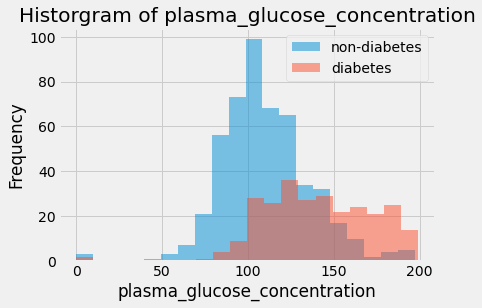


```python
for col in pima_column_names[:-1]:
    plt.hist(pima[pima['onset_diabetes']==0][col], 20, alpha=0.5, label='non-diabetes')
    plt.hist(pima[pima['onset_diabetes']==1][col], 20, alpha=0.5, label='diabetes')
    plt.legend(loc='upper right')
    plt.xlabel(col)
    plt.ylabel('Frequency')
    plt.title(f'Historgram of {col}')
    plt.show()
```


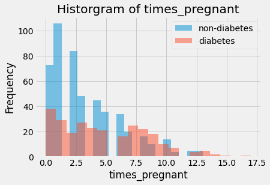


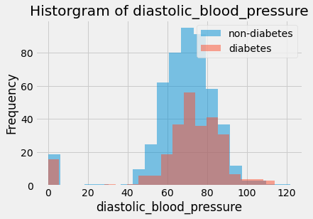


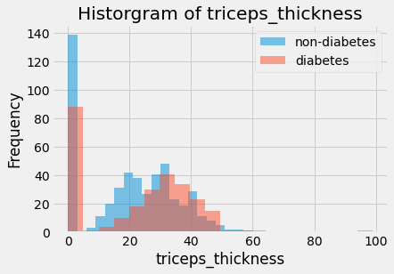


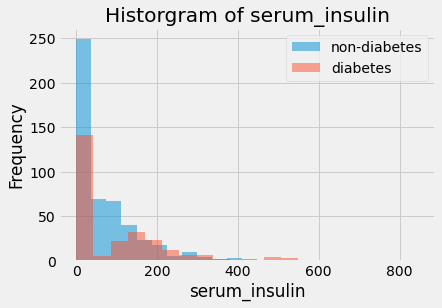


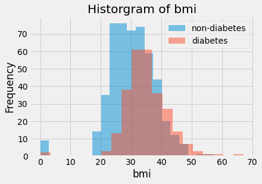


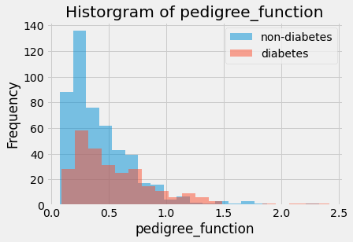


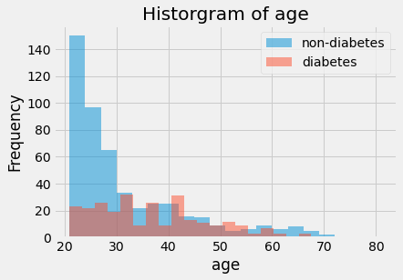


```python
sns.heatmap(pima.corr())
```


    <matplotlib.axes._subplots.AxesSubplot at 0x13770ac0>


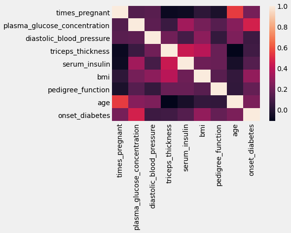


```python
pima.corr()['onset_diabetes']# 相关矩阵 
# plasma_glucose_concentration 很明显是重要的变量 
```


    times_pregnant                  0.221898
    plasma_glucose_concentration    0.466581
    diastolic_blood_pressure        0.065068
    triceps_thickness               0.074752
    serum_insulin                   0.130548
    bmi                             0.292695
    pedigree_function               0.173844
    age                             0.238356
    onset_diabetes                  1.000000
    Name: onset_diabetes, dtype: float64


```python
pima.isnull().sum()
```


    times_pregnant                  0
    plasma_glucose_concentration    0
    diastolic_blood_pressure        0
    triceps_thickness               0
    serum_insulin                   0
    bmi                             0
    pedigree_function               0
    age                             0
    onset_diabetes                  0
    dtype: int64


```python
pima['serum_insulin'].isnull().sum()
```


    0


```python
pima.describe() # 基本的描述性统计 
```


<div>
<style scoped>
    .dataframe tbody tr th:only-of-type {
        vertical-align: middle;
    }

    .dataframe tbody tr th {
        vertical-align: top;
    }

    .dataframe thead th {
        text-align: right;
    }
</style>
<table border="1" class="dataframe">
  <thead>
    <tr style="text-align: right;">
      <th></th>
      <th>times_pregnant</th>
      <th>plasma_glucose_concentration</th>
      <th>diastolic_blood_pressure</th>
      <th>triceps_thickness</th>
      <th>serum_insulin</th>
      <th>bmi</th>
      <th>pedigree_function</th>
      <th>age</th>
      <th>onset_diabetes</th>
    </tr>
  </thead>
  <tbody>
    <tr>
      <th>count</th>
      <td>768.000000</td>
      <td>768.000000</td>
      <td>768.000000</td>
      <td>768.000000</td>
      <td>768.000000</td>
      <td>768.000000</td>
      <td>768.000000</td>
      <td>768.000000</td>
      <td>768.000000</td>
    </tr>
    <tr>
      <th>mean</th>
      <td>3.845052</td>
      <td>120.894531</td>
      <td>69.105469</td>
      <td>20.536458</td>
      <td>79.799479</td>
      <td>31.992578</td>
      <td>0.471876</td>
      <td>33.240885</td>
      <td>0.348958</td>
    </tr>
    <tr>
      <th>std</th>
      <td>3.369578</td>
      <td>31.972618</td>
      <td>19.355807</td>
      <td>15.952218</td>
      <td>115.244002</td>
      <td>7.884160</td>
      <td>0.331329</td>
      <td>11.760232</td>
      <td>0.476951</td>
    </tr>
    <tr>
      <th>min</th>
      <td>0.000000</td>
      <td>0.000000</td>
      <td>0.000000</td>
      <td>0.000000</td>
      <td>0.000000</td>
      <td>0.000000</td>
      <td>0.078000</td>
      <td>21.000000</td>
      <td>0.000000</td>
    </tr>
    <tr>
      <th>25%</th>
      <td>1.000000</td>
      <td>99.000000</td>
      <td>62.000000</td>
      <td>0.000000</td>
      <td>0.000000</td>
      <td>27.300000</td>
      <td>0.243750</td>
      <td>24.000000</td>
      <td>0.000000</td>
    </tr>
    <tr>
      <th>50%</th>
      <td>3.000000</td>
      <td>117.000000</td>
      <td>72.000000</td>
      <td>23.000000</td>
      <td>30.500000</td>
      <td>32.000000</td>
      <td>0.372500</td>
      <td>29.000000</td>
      <td>0.000000</td>
    </tr>
    <tr>
      <th>75%</th>
      <td>6.000000</td>
      <td>140.250000</td>
      <td>80.000000</td>
      <td>32.000000</td>
      <td>127.250000</td>
      <td>36.600000</td>
      <td>0.626250</td>
      <td>41.000000</td>
      <td>1.000000</td>
    </tr>
    <tr>
      <th>max</th>
      <td>17.000000</td>
      <td>199.000000</td>
      <td>122.000000</td>
      <td>99.000000</td>
      <td>846.000000</td>
      <td>67.100000</td>
      <td>2.420000</td>
      <td>81.000000</td>
      <td>1.000000</td>
    </tr>
  </tbody>
</table>
</div>


数据中还是存在缺失值的！我们已经知道缺失的数据用0填充过了，真不走运。作为数据科学家，你必须时刻保持警惕，尽可能地了解数据集，以便找到使用其他符号填充的缺失数据。务必阅读公开数据集的所有文档，里面有可能提到了缺失数据的问题。

## 3.2 处理数据集中的缺失值 


```python
# 被错误填充的缺失值是 0 
pima['serum_insulin'].isnull().sum()
```


    0


```python
pima['serum_insulin'] = pima['serum_insulin'].replace([0], [None])
# 用 None 手动替换 0
```


```python
# 方式二：np.nan
# pima['serum_insulin_new'] = pima['serum_insulin'].replace(0, np.nan)
pima['serum_insulin'].isnull().sum()
```


    374


```python
# 直接对所有列操作，快一些 
columns = ['serum_insulin', 'bmi', 'plasma_glucose_concentration', 'diastolic_blood_pressure', 'triceps_thickness'] 
 
for col in columns:
    pima[col].replace([0], [None], inplace=True) 
```


```python
pima.isnull().sum()
```


    times_pregnant                    0
    plasma_glucose_concentration      5
    diastolic_blood_pressure         35
    triceps_thickness               227
    serum_insulin                   374
    bmi                              11
    pedigree_function                 0
    age                               0
    onset_diabetes                    0
    dtype: int64


```python
pima.head() 
```


<div>
<style scoped>
    .dataframe tbody tr th:only-of-type {
        vertical-align: middle;
    }

    .dataframe tbody tr th {
        vertical-align: top;
    }

    .dataframe thead th {
        text-align: right;
    }
</style>
<table border="1" class="dataframe">
  <thead>
    <tr style="text-align: right;">
      <th></th>
      <th>times_pregnant</th>
      <th>plasma_glucose_concentration</th>
      <th>diastolic_blood_pressure</th>
      <th>triceps_thickness</th>
      <th>serum_insulin</th>
      <th>bmi</th>
      <th>pedigree_function</th>
      <th>age</th>
      <th>onset_diabetes</th>
    </tr>
  </thead>
  <tbody>
    <tr>
      <th>0</th>
      <td>6</td>
      <td>148</td>
      <td>72</td>
      <td>35</td>
      <td>NaN</td>
      <td>33.6</td>
      <td>0.627</td>
      <td>50</td>
      <td>1</td>
    </tr>
    <tr>
      <th>1</th>
      <td>1</td>
      <td>85</td>
      <td>66</td>
      <td>29</td>
      <td>NaN</td>
      <td>26.6</td>
      <td>0.351</td>
      <td>31</td>
      <td>0</td>
    </tr>
    <tr>
      <th>2</th>
      <td>8</td>
      <td>183</td>
      <td>64</td>
      <td>None</td>
      <td>NaN</td>
      <td>23.3</td>
      <td>0.672</td>
      <td>32</td>
      <td>1</td>
    </tr>
    <tr>
      <th>3</th>
      <td>1</td>
      <td>89</td>
      <td>66</td>
      <td>23</td>
      <td>94.0</td>
      <td>28.1</td>
      <td>0.167</td>
      <td>21</td>
      <td>0</td>
    </tr>
    <tr>
      <th>4</th>
      <td>0</td>
      <td>137</td>
      <td>40</td>
      <td>35</td>
      <td>168.0</td>
      <td>43.1</td>
      <td>2.288</td>
      <td>33</td>
      <td>1</td>
    </tr>
  </tbody>
</table>
</div>


```python
pima.describe().round(3)
```


<div>
<style scoped>
    .dataframe tbody tr th:only-of-type {
        vertical-align: middle;
    }

    .dataframe tbody tr th {
        vertical-align: top;
    }

    .dataframe thead th {
        text-align: right;
    }
</style>
<table border="1" class="dataframe">
  <thead>
    <tr style="text-align: right;">
      <th></th>
      <th>times_pregnant</th>
      <th>serum_insulin</th>
      <th>pedigree_function</th>
      <th>age</th>
      <th>onset_diabetes</th>
    </tr>
  </thead>
  <tbody>
    <tr>
      <th>count</th>
      <td>768.000</td>
      <td>394.000</td>
      <td>768.000</td>
      <td>768.000</td>
      <td>768.000</td>
    </tr>
    <tr>
      <th>mean</th>
      <td>3.845</td>
      <td>155.548</td>
      <td>0.472</td>
      <td>33.241</td>
      <td>0.349</td>
    </tr>
    <tr>
      <th>std</th>
      <td>3.370</td>
      <td>118.776</td>
      <td>0.331</td>
      <td>11.760</td>
      <td>0.477</td>
    </tr>
    <tr>
      <th>min</th>
      <td>0.000</td>
      <td>14.000</td>
      <td>0.078</td>
      <td>21.000</td>
      <td>0.000</td>
    </tr>
    <tr>
      <th>25%</th>
      <td>1.000</td>
      <td>76.250</td>
      <td>0.244</td>
      <td>24.000</td>
      <td>0.000</td>
    </tr>
    <tr>
      <th>50%</th>
      <td>3.000</td>
      <td>125.000</td>
      <td>0.372</td>
      <td>29.000</td>
      <td>0.000</td>
    </tr>
    <tr>
      <th>75%</th>
      <td>6.000</td>
      <td>190.000</td>
      <td>0.626</td>
      <td>41.000</td>
      <td>1.000</td>
    </tr>
    <tr>
      <th>max</th>
      <td>17.000</td>
      <td>846.000</td>
      <td>2.420</td>
      <td>81.000</td>
      <td>1.000</td>
    </tr>
  </tbody>
</table>
</div>


```python
pima['plasma_glucose_concentration'].mean(), pima['plasma_glucose_concentration'].std()
```


    (121.6867627785059, 30.53564107280403)


### 3.2.1 删除有害的行


```python
pima_dropped = pima.dropna()
```


```python
pima_dropped
```


<div>
<style scoped>
    .dataframe tbody tr th:only-of-type {
        vertical-align: middle;
    }

    .dataframe tbody tr th {
        vertical-align: top;
    }

    .dataframe thead th {
        text-align: right;
    }
</style>
<table border="1" class="dataframe">
  <thead>
    <tr style="text-align: right;">
      <th></th>
      <th>times_pregnant</th>
      <th>plasma_glucose_concentration</th>
      <th>diastolic_blood_pressure</th>
      <th>triceps_thickness</th>
      <th>serum_insulin</th>
      <th>bmi</th>
      <th>pedigree_function</th>
      <th>age</th>
      <th>onset_diabetes</th>
    </tr>
  </thead>
  <tbody>
    <tr>
      <th>3</th>
      <td>1</td>
      <td>89</td>
      <td>66</td>
      <td>23</td>
      <td>94.0</td>
      <td>28.1</td>
      <td>0.167</td>
      <td>21</td>
      <td>0</td>
    </tr>
    <tr>
      <th>4</th>
      <td>0</td>
      <td>137</td>
      <td>40</td>
      <td>35</td>
      <td>168.0</td>
      <td>43.1</td>
      <td>2.288</td>
      <td>33</td>
      <td>1</td>
    </tr>
    <tr>
      <th>6</th>
      <td>3</td>
      <td>78</td>
      <td>50</td>
      <td>32</td>
      <td>88.0</td>
      <td>31</td>
      <td>0.248</td>
      <td>26</td>
      <td>1</td>
    </tr>
    <tr>
      <th>8</th>
      <td>2</td>
      <td>197</td>
      <td>70</td>
      <td>45</td>
      <td>543.0</td>
      <td>30.5</td>
      <td>0.158</td>
      <td>53</td>
      <td>1</td>
    </tr>
    <tr>
      <th>13</th>
      <td>1</td>
      <td>189</td>
      <td>60</td>
      <td>23</td>
      <td>846.0</td>
      <td>30.1</td>
      <td>0.398</td>
      <td>59</td>
      <td>1</td>
    </tr>
    <tr>
      <th>...</th>
      <td>...</td>
      <td>...</td>
      <td>...</td>
      <td>...</td>
      <td>...</td>
      <td>...</td>
      <td>...</td>
      <td>...</td>
      <td>...</td>
    </tr>
    <tr>
      <th>753</th>
      <td>0</td>
      <td>181</td>
      <td>88</td>
      <td>44</td>
      <td>510.0</td>
      <td>43.3</td>
      <td>0.222</td>
      <td>26</td>
      <td>1</td>
    </tr>
    <tr>
      <th>755</th>
      <td>1</td>
      <td>128</td>
      <td>88</td>
      <td>39</td>
      <td>110.0</td>
      <td>36.5</td>
      <td>1.057</td>
      <td>37</td>
      <td>1</td>
    </tr>
    <tr>
      <th>760</th>
      <td>2</td>
      <td>88</td>
      <td>58</td>
      <td>26</td>
      <td>16.0</td>
      <td>28.4</td>
      <td>0.766</td>
      <td>22</td>
      <td>0</td>
    </tr>
    <tr>
      <th>763</th>
      <td>10</td>
      <td>101</td>
      <td>76</td>
      <td>48</td>
      <td>180.0</td>
      <td>32.9</td>
      <td>0.171</td>
      <td>63</td>
      <td>0</td>
    </tr>
    <tr>
      <th>765</th>
      <td>5</td>
      <td>121</td>
      <td>72</td>
      <td>23</td>
      <td>112.0</td>
      <td>26.2</td>
      <td>0.245</td>
      <td>30</td>
      <td>0</td>
    </tr>
  </tbody>
</table>
<p>392 rows × 9 columns</p>
</div>


```python
num_rows_lost = round(100*(pima.shape[0] - pima_dropped.shape[0])/float(pima.shape[0]))
print("retained {}% of rows".format(num_rows_lost))
```

    retained 49% of rows
    


```python
# 丢弃缺失值前后的探索性数据分析 
pima_dropped['onset_diabetes'].value_counts(normalize=True)
# 前后的 True 和 False 比例差不多 
```


    0    0.668367
    1    0.331633
    Name: onset_diabetes, dtype: float64


```python
# 每列的均值（不算缺失值） 
pima.mean() 
```


    times_pregnant                    3.845052
    plasma_glucose_concentration    121.686763
    diastolic_blood_pressure         72.405184
    triceps_thickness                29.153420
    serum_insulin                   155.548223
    bmi                              32.457464
    pedigree_function                 0.471876
    age                              33.240885
    onset_diabetes                    0.348958
    dtype: float64


```python
# 每列的均值（删除缺失值） 
pima_dropped.mean() 
```


    times_pregnant                    3.301020
    plasma_glucose_concentration    122.627551
    diastolic_blood_pressure         70.663265
    triceps_thickness                29.145408
    serum_insulin                   156.056122
    bmi                              33.086224
    pedigree_function                 0.523046
    age                              30.864796
    onset_diabetes                    0.331633
    dtype: float64


```python
# 均值变化百分比 
(pima_dropped.mean()- pima.mean())/pima.mean()
```


    times_pregnant                 -0.141489
    plasma_glucose_concentration    0.007731
    diastolic_blood_pressure       -0.024058
    triceps_thickness              -0.000275
    serum_insulin                   0.003265
    bmi                             0.019372
    pedigree_function               0.108439
    age                            -0.071481
    onset_diabetes                 -0.049650
    dtype: float64


```python
# 均值变化百分比条形图 
ax = ((pima_dropped.mean()- pima.mean())/pima.mean()).plot(kind='bar',
                                                           title='% change in average column values')
ax.set_ylabel('% change')
```


    Text(0, 0.5, '% change')


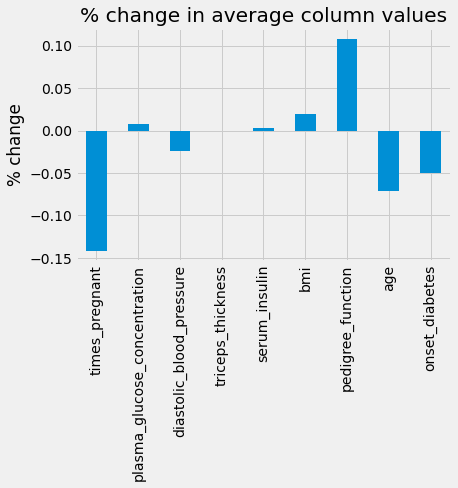


```python
# 开始机器学习 

# 注意使用删除缺失值后的数据 
from sklearn.neighbors import KNeighborsClassifier
from sklearn.model_selection import GridSearchCV

X_dropped = pima_dropped.drop('onset_diabetes', axis=1)
# 删除响应变量，建立特征矩阵 
print("learning from {} rows".format(X_dropped.shape[0])) 
y_dropped = pima_dropped['onset_diabetes']
```

    learning from 392 rows
    


```python
# 网格搜索所需的变量和实例 
 
# 需要试验的 KNN 模型参数 
knn_params = {
    'n_neighbors': [i for i in range(1, 25)]
}
knn = KNeighborsClassifier()
grid = GridSearchCV(knn, knn_params)
grid.fit(X_dropped, y_dropped)
print(grid.best_score_, grid.best_params_)
# 但是我们只学习了很少的行 
```

    0.7630314832846479 {'n_neighbors': 20}
    


```python
pima.isnull().sum()
```


    times_pregnant                    0
    plasma_glucose_concentration      5
    diastolic_blood_pressure         35
    triceps_thickness               227
    serum_insulin                   374
    bmi                              11
    pedigree_function                 0
    age                               0
    onset_diabetes                    0
    dtype: int64


```python
pima[pima['plasma_glucose_concentration'].isnull()].index
```


    Int64Index([75, 182, 342, 349, 502], dtype='int64')


```python
empty_plasma_index = pima[pima['plasma_glucose_concentration'].isnull()].index
pima.loc[empty_plasma_index]['plasma_glucose_concentration']
```


    75     None
    182    None
    342    None
    349    None
    502    None
    Name: plasma_glucose_concentration, dtype: object


```python
pima['plasma_glucose_concentration'].fillna(
pima['plasma_glucose_concentration'].mean(), inplace=True)
```

### 3.2.2 填充缺失值


```python
pima.isnull().sum()
```


    times_pregnant                    0
    plasma_glucose_concentration      0
    diastolic_blood_pressure         35
    triceps_thickness               227
    serum_insulin                   374
    bmi                              11
    pedigree_function                 0
    age                               0
    onset_diabetes                    0
    dtype: int64


```python
pima.loc[empty_plasma_index]['plasma_glucose_concentration']
```


    75     121.686763
    182    121.686763
    342    121.686763
    349    121.686763
    502    121.686763
    Name: plasma_glucose_concentration, dtype: float64


```python
# pima.drop('serum_insulin_new', axis=1, inplace=True)
```


```python
from sklearn.impute import SimpleImputer
imputer = SimpleImputer(strategy='mean')
```


```python
pima_imputed = imputer.fit_transform(pima)
```


```python
pima_column_names
```


    ['times_pregnant',
     'plasma_glucose_concentration',
     'diastolic_blood_pressure',
     'triceps_thickness',
     'serum_insulin',
     'bmi',
     'pedigree_function',
     'age',
     'onset_diabetes']


```python
pima_imputed = pd.DataFrame(pima_imputed, columns=pima_column_names)
```


```python
pima_imputed.loc[empty_plasma_index]['plasma_glucose_concentration']
```


    75     121.686763
    182    121.686763
    342    121.686763
    349    121.686763
    502    121.686763
    Name: plasma_glucose_concentration, dtype: float64


```python
pima.isnull().sum()
```


    times_pregnant                    0
    plasma_glucose_concentration      0
    diastolic_blood_pressure         35
    triceps_thickness               227
    serum_insulin                   374
    bmi                              11
    pedigree_function                 0
    age                               0
    onset_diabetes                    0
    dtype: int64


```python
pima_zero = pima.fillna(0)
X_zero = pima_zero.drop('onset_diabetes', axis=1)
y_zero = pima_zero['onset_diabetes']

knn_params = {
    'n_neighbors': [i for i in range(1, 8)]
}
knn = KNeighborsClassifier()
grid = GridSearchCV(knn, knn_params)
grid.fit(X_zero, y_zero)
print(grid.best_score_, grid.best_params_)
```

    0.7409387997623291 {'n_neighbors': 7}
    

### 3.2.3 在机器学习流水线中填充值


```python
from sklearn.model_selection import train_test_split

X = pima[['serum_insulin']].copy()
y = pima['onset_diabetes'].copy()
```


```python
X_train, X_test, y_train, y_test = train_test_split(X, y, random_state=99)
X.isnull().sum()
```


    serum_insulin    374
    dtype: int64


```python
training_mean = X_train.mean()
X_train = X_train.fillna(training_mean)
X_test = X_test.fillna(training_mean)

print(training_mean)
```

    serum_insulin    158.546053
    dtype: float64
    


```python
knn = KNeighborsClassifier()
knn.fit(X_train, y_train)
print(knn.score(X_test, y_test))
```

    0.4895833333333333
    


```python
from sklearn.pipeline import Pipeline

knn_params = {
    'classify__n_neighbors':[i for i in range(1, 30)]
}
knn = KNeighborsClassifier()
mean_impute = Pipeline([('impute', SimpleImputer(strategy='mean')), ('classify', knn)])

X = pima.drop('onset_diabetes', axis=1)
y = pima['onset_diabetes']

grid = GridSearchCV(mean_impute, knn_params)
grid.fit(X, y)
print(f'best score:{grid.best_score_}\n\
params:{grid.best_params_}')
```

    best score:0.7539512774806892
    params:{'classify__n_neighbors': 29}
    


```python
from sklearn.pipeline import Pipeline

knn_params = {
    'classify__n_neighbors':[i for i in range(1, 30)]
}
knn = KNeighborsClassifier()
mean_impute = Pipeline([('impute', SimpleImputer(strategy='median')), ('classify', knn)])

X = pima.drop('onset_diabetes', axis=1)
y = pima['onset_diabetes']

grid = GridSearchCV(mean_impute, knn_params)
grid.fit(X, y)
print(f'best score:{grid.best_score_}\n\
params:{grid.best_params_}')
```

    best score:0.7553263729734317
    params:{'classify__n_neighbors': 14}
    

## 3.3 标准化和归一化 


```python
impute = SimpleImputer(strategy='mean')
pima_imputed_mean = pd.DataFrame(impute.fit_transform(pima),
                                columns=pima_column_names)
```


```python
pima_imputed_mean.hist(figsize=(15,15))
```


    array([[<matplotlib.axes._subplots.AxesSubplot object at 0x13444FA0>,
            <matplotlib.axes._subplots.AxesSubplot object at 0x13411598>,
            <matplotlib.axes._subplots.AxesSubplot object at 0x132623A0>],
           [<matplotlib.axes._subplots.AxesSubplot object at 0x00895CE8>,
            <matplotlib.axes._subplots.AxesSubplot object at 0x008B36E8>,
            <matplotlib.axes._subplots.AxesSubplot object at 0x00B30088>],
           [<matplotlib.axes._subplots.AxesSubplot object at 0x00B30100>,
            <matplotlib.axes._subplots.AxesSubplot object at 0x00B42B08>,
            <matplotlib.axes._subplots.AxesSubplot object at 0x00B73E98>]],
          dtype=object)


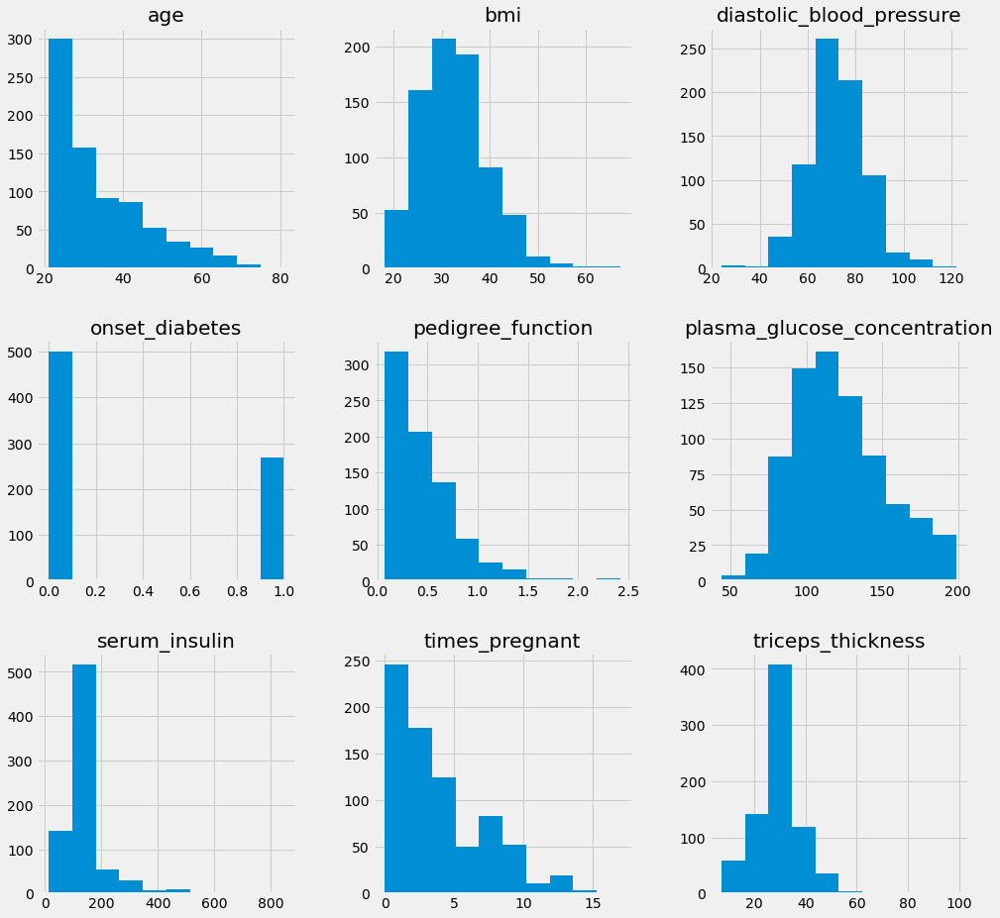


```python
pima_imputed_mean.hist(figsize=(15,15), sharex=True)
```


    array([[<matplotlib.axes._subplots.AxesSubplot object at 0x010CDBF8>,
            <matplotlib.axes._subplots.AxesSubplot object at 0x010B2C40>,
            <matplotlib.axes._subplots.AxesSubplot object at 0x01127340>],
           [<matplotlib.axes._subplots.AxesSubplot object at 0x0113ABB0>,
            <matplotlib.axes._subplots.AxesSubplot object at 0x0115A448>,
            <matplotlib.axes._subplots.AxesSubplot object at 0x010D1250>],
           [<matplotlib.axes._subplots.AxesSubplot object at 0x13190160>,
            <matplotlib.axes._subplots.AxesSubplot object at 0x131A29E8>,
            <matplotlib.axes._subplots.AxesSubplot object at 0x131DA310>]],
          dtype=object)


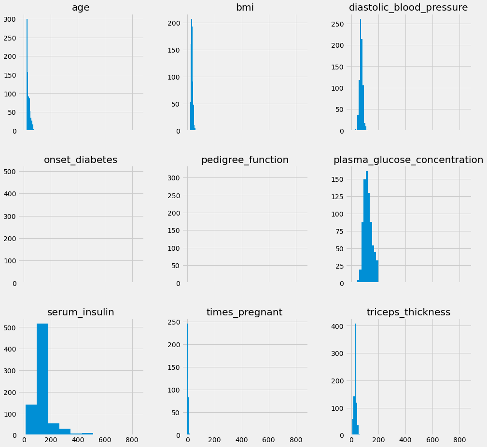


### 3.3.1 z分数标准化 


```python
print(pima['plasma_glucose_concentration'].head()) 
```

    0    148.0
    1     85.0
    2    183.0
    3     89.0
    4    137.0
    Name: plasma_glucose_concentration, dtype: float64
    


```python
from sklearn.preprocessing import StandardScaler

print(f"mean:{pima['plasma_glucose_concentration'].mean()}")
print(f"std:{pima['plasma_glucose_concentration'].std()}")
ax = pima['plasma_glucose_concentration'].hist()
ax.set_title('Distribution of plasma_glucose_concentration')
```

    mean:121.68676277850591
    std:30.435948867207657
    


    Text(0.5, 1.0, 'Distribution of plasma_glucose_concentration')


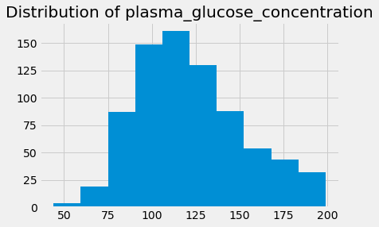


```python
scaler = StandardScaler()
glucose_z_score_standardized = scaler.fit_transform(pima[['plasma_glucose_concentration']])
# 注意我们用双方括号，因为转换需要一个 DataFrame
# 均值是 0（浮点数误差），标准差是 1 
print(f'mean:{glucose_z_score_standardized.mean()}')
print(f'std:{glucose_z_score_standardized.std()}')
ax = pd.Series(glucose_z_score_standardized.reshape(-1,)).hist()
ax.set_title('Distribution of plasma_glucose_concentration after Z Score Scaling')
```

    mean:-3.561965537339044e-16
    std:1.0
    


    Text(0.5, 1.0, 'Distribution of plasma_glucose_concentration after Z Score Scaling')


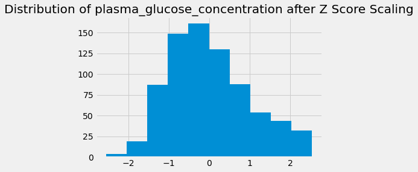


```python
scale = StandardScaler()
pima_imputed_mean_scaled = pd.DataFrame(scale.fit_transform(pima_imputed_mean),
                                       columns=pima_column_names)
pima_imputed_mean_scaled.hist(figsize=(15,15), sharex=True)
# 空间相同了 
```


    array([[<matplotlib.axes._subplots.AxesSubplot object at 0x144F77F0>,
            <matplotlib.axes._subplots.AxesSubplot object at 0x144FA100>,
            <matplotlib.axes._subplots.AxesSubplot object at 0x145E3EC8>],
           [<matplotlib.axes._subplots.AxesSubplot object at 0x1460B190>,
            <matplotlib.axes._subplots.AxesSubplot object at 0x14622430>,
            <matplotlib.axes._subplots.AxesSubplot object at 0x1463BAF0>],
           [<matplotlib.axes._subplots.AxesSubplot object at 0x1384BDA8>,
            <matplotlib.axes._subplots.AxesSubplot object at 0x1310D3E8>,
            <matplotlib.axes._subplots.AxesSubplot object at 0x13788B08>]],
          dtype=object)


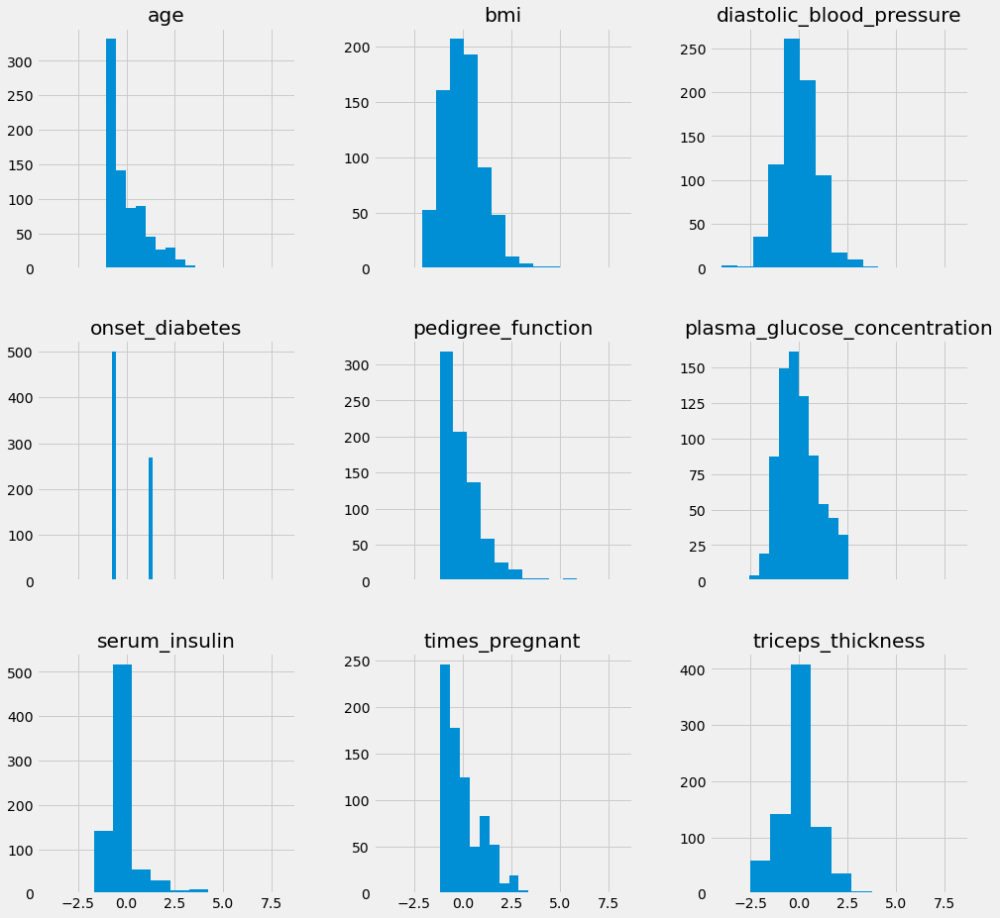


```python
knn_params = {
    'impute__strategy': ['mean', 'median'],
    'classify__n_neighbors': [i for i in range(1, 8)]
}
knn = KNeighborsClassifier()
mean_impute_standardize = Pipeline(
[('impute', SimpleImputer()), ('standardize', StandardScaler()), ('classify', knn)])
X = pima.drop('onset_diabetes', axis=1) 
y = pima['onset_diabetes']

grid = GridSearchCV(mean_impute_standardize, knn_params)
grid.fit(X, y)
print(f'best score:{grid.best_score_}\n\
params:{grid.best_params_}')
```

    best score:0.7539173245055598
    params:{'classify__n_neighbors': 7, 'impute__strategy': 'mean'}
    

### 3.3.2 min-max标准化 


```python
from sklearn.preprocessing import MinMaxScaler

min_max = MinMaxScaler()

pima_min_maxed = pd.DataFrame(min_max.fit_transform(pima_imputed), columns=pima_column_names)
pima_min_maxed.describe()
```


<div>
<style scoped>
    .dataframe tbody tr th:only-of-type {
        vertical-align: middle;
    }

    .dataframe tbody tr th {
        vertical-align: top;
    }

    .dataframe thead th {
        text-align: right;
    }
</style>
<table border="1" class="dataframe">
  <thead>
    <tr style="text-align: right;">
      <th></th>
      <th>times_pregnant</th>
      <th>plasma_glucose_concentration</th>
      <th>diastolic_blood_pressure</th>
      <th>triceps_thickness</th>
      <th>serum_insulin</th>
      <th>bmi</th>
      <th>pedigree_function</th>
      <th>age</th>
      <th>onset_diabetes</th>
    </tr>
  </thead>
  <tbody>
    <tr>
      <th>count</th>
      <td>768.000000</td>
      <td>768.000000</td>
      <td>768.000000</td>
      <td>768.000000</td>
      <td>768.000000</td>
      <td>768.000000</td>
      <td>768.000000</td>
      <td>768.000000</td>
      <td>768.000000</td>
    </tr>
    <tr>
      <th>mean</th>
      <td>0.226180</td>
      <td>0.501205</td>
      <td>0.493930</td>
      <td>0.240798</td>
      <td>0.170130</td>
      <td>0.291564</td>
      <td>0.168179</td>
      <td>0.204015</td>
      <td>0.348958</td>
    </tr>
    <tr>
      <th>std</th>
      <td>0.198210</td>
      <td>0.196361</td>
      <td>0.123432</td>
      <td>0.095554</td>
      <td>0.102189</td>
      <td>0.140596</td>
      <td>0.141473</td>
      <td>0.196004</td>
      <td>0.476951</td>
    </tr>
    <tr>
      <th>min</th>
      <td>0.000000</td>
      <td>0.000000</td>
      <td>0.000000</td>
      <td>0.000000</td>
      <td>0.000000</td>
      <td>0.000000</td>
      <td>0.000000</td>
      <td>0.000000</td>
      <td>0.000000</td>
    </tr>
    <tr>
      <th>25%</th>
      <td>0.058824</td>
      <td>0.359677</td>
      <td>0.408163</td>
      <td>0.195652</td>
      <td>0.129207</td>
      <td>0.190184</td>
      <td>0.070773</td>
      <td>0.050000</td>
      <td>0.000000</td>
    </tr>
    <tr>
      <th>50%</th>
      <td>0.176471</td>
      <td>0.470968</td>
      <td>0.491863</td>
      <td>0.240798</td>
      <td>0.170130</td>
      <td>0.290389</td>
      <td>0.125747</td>
      <td>0.133333</td>
      <td>0.000000</td>
    </tr>
    <tr>
      <th>75%</th>
      <td>0.352941</td>
      <td>0.620968</td>
      <td>0.571429</td>
      <td>0.271739</td>
      <td>0.170130</td>
      <td>0.376278</td>
      <td>0.234095</td>
      <td>0.333333</td>
      <td>1.000000</td>
    </tr>
    <tr>
      <th>max</th>
      <td>1.000000</td>
      <td>1.000000</td>
      <td>1.000000</td>
      <td>1.000000</td>
      <td>1.000000</td>
      <td>1.000000</td>
      <td>1.000000</td>
      <td>1.000000</td>
      <td>1.000000</td>
    </tr>
  </tbody>
</table>
</div>


```python
from sklearn.preprocessing import MinMaxScaler

knn_params = {
    'impute__strategy': ['mean', 'median'],
    'classify__n_neighbors': [i for i in range(1, 10)]
}
knn = KNeighborsClassifier()
mean_impute_standardize = Pipeline(
[('impute', SimpleImputer()), ('standardize', MinMaxScaler()), ('classify', knn)])
X = pima.drop('onset_diabetes', axis=1) 
y = pima['onset_diabetes']

grid = GridSearchCV(mean_impute_standardize, knn_params)
grid.fit(X, y)
print(f'best score:{grid.best_score_}\n\
params:{grid.best_params_}')
```

    best score:0.7630336983278159
    params:{'classify__n_neighbors': 7, 'impute__strategy': 'median'}
    

### 3.3.3 行归一化 


```python
np.sqrt((pima_imputed**2).sum(axis=1)).mean()
```


    223.36222025823744


```python
from sklearn.preprocessing import Normalizer

normalize = Normalizer()
pima_normalized = pd.DataFrame(normalize.fit_transform(pima_imputed),
                              columns=pima_column_names)
np.sqrt((pima_normalized**2).sum(axis=1))
```


    0      1.0
    1      1.0
    2      1.0
    3      1.0
    4      1.0
          ... 
    763    1.0
    764    1.0
    765    1.0
    766    1.0
    767    1.0
    Length: 768, dtype: float64


```python
pima_normalized.hist(figsize=(15,15))
```


    array([[<matplotlib.axes._subplots.AxesSubplot object at 0x135794D8>,
            <matplotlib.axes._subplots.AxesSubplot object at 0x147E30B8>,
            <matplotlib.axes._subplots.AxesSubplot object at 0x14804DF0>],
           [<matplotlib.axes._subplots.AxesSubplot object at 0x148217F0>,
            <matplotlib.axes._subplots.AxesSubplot object at 0x14838718>,
            <matplotlib.axes._subplots.AxesSubplot object at 0x148580B8>],
           [<matplotlib.axes._subplots.AxesSubplot object at 0x14858130>,
            <matplotlib.axes._subplots.AxesSubplot object at 0x14C28B38>,
            <matplotlib.axes._subplots.AxesSubplot object at 0x14C59EC8>]],
          dtype=object)


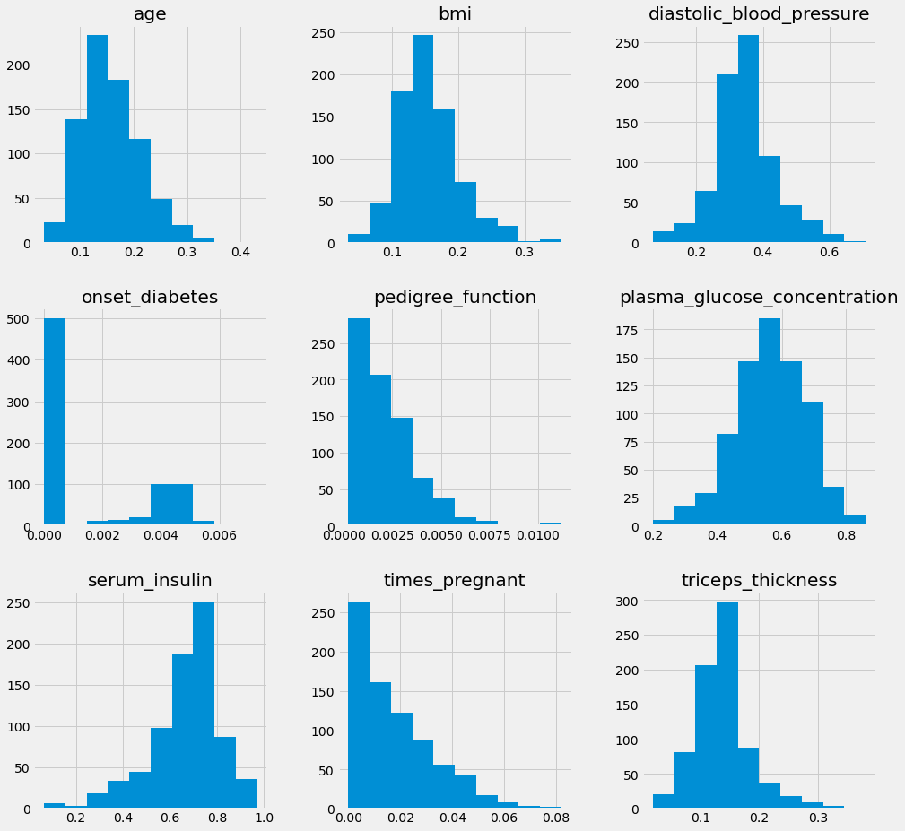


```python
from sklearn.preprocessing import MinMaxScaler

knn_params = {
    'impute__strategy': ['mean', 'median'],
    'classify__n_neighbors': [i for i in range(1, 8)]
}
knn = KNeighborsClassifier()
mean_impute_standardize = Pipeline(
[('impute', SimpleImputer()), ('standardize', Normalizer()), ('classify', knn)])
X = pima.drop('onset_diabetes', axis=1) 
y = pima['onset_diabetes']

grid = GridSearchCV(mean_impute_standardize, knn_params)
grid.fit(X, y)
print(f'best score:{grid.best_score_}\n\
params:{grid.best_params_}')
```

    best score:0.7006111535523301
    params:{'classify__n_neighbors': 7, 'impute__strategy': 'median'}
    
