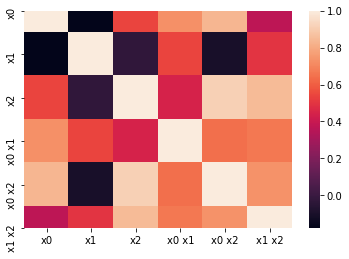

# Ch4. 特征构建：我能生成新特征吗

我们会探讨如下主题：
- 检查数据集；
- 填充分类特征；
- 编码分类变量；
- 扩展数值特征；
- 针对文本的特征构建。 

## 4.1 检查数据集


```python
import pandas as pd

X = pd.DataFrame({
    'city': ['tokyo', None, 'london', 'seattle', 'san francisco', 'tokyo'],
    'boolean':['yes', 'no', None, 'no', 'no', 'yes'], 
    'ordinal_column':['somewhat like', 'like', 'somewhat like', 'like', 'somewhat like', 'dislike'],
    'quantitative_column':[1, 11, -.5, 10, None, 20]
})
```


```python
X
```


<div>
<style scoped>
    .dataframe tbody tr th:only-of-type {
        vertical-align: middle;
    }

    .dataframe tbody tr th {
        vertical-align: top;
    }

    .dataframe thead th {
        text-align: right;
    }
</style>
<table border="1" class="dataframe">
  <thead>
    <tr style="text-align: right;">
      <th></th>
      <th>city</th>
      <th>boolean</th>
      <th>ordinal_column</th>
      <th>quantitative_column</th>
    </tr>
  </thead>
  <tbody>
    <tr>
      <td>0</td>
      <td>tokyo</td>
      <td>yes</td>
      <td>somewhat like</td>
      <td>1.0</td>
    </tr>
    <tr>
      <td>1</td>
      <td>None</td>
      <td>no</td>
      <td>like</td>
      <td>11.0</td>
    </tr>
    <tr>
      <td>2</td>
      <td>london</td>
      <td>None</td>
      <td>somewhat like</td>
      <td>-0.5</td>
    </tr>
    <tr>
      <td>3</td>
      <td>seattle</td>
      <td>no</td>
      <td>like</td>
      <td>10.0</td>
    </tr>
    <tr>
      <td>4</td>
      <td>san francisco</td>
      <td>no</td>
      <td>somewhat like</td>
      <td>NaN</td>
    </tr>
    <tr>
      <td>5</td>
      <td>tokyo</td>
      <td>yes</td>
      <td>dislike</td>
      <td>20.0</td>
    </tr>
  </tbody>
</table>
</div>


## 4.2 填充分类特征


```python
X.isnull().sum()
```


    city                   1
    boolean                1
    ordinal_column         0
    quantitative_column    1
    dtype: int64


```python
X['city'].value_counts().index[0]
```


    'tokyo'


我们注意到，tokyo是频繁出现的城市。知道了应该用哪个值来填充，就可以开始处理了。


```python
X['city'].fillna(X['city'].value_counts().index[0])
```


    0            tokyo
    1            tokyo
    2           london
    3          seattle
    4    san francisco
    5            tokyo
    Name: city, dtype: object


### 4.2.1 自定义填充器

在写代码之前，快速回顾一下机器学习流水线：
- 我们可以用流水线按顺序应用转换和最终的预测器；
- 流水线的中间步骤只能是转换，这意味着它们必须实现fit和transform方法；
- 最终的预测器只需要实现fit方法。

### 4.2.2 自定义分类填充器


```python
# from sklearn.impute import SimpleImputer

# impute = SimpleImputer(strategy='mean')
# X['quantitative_column'] = impute.fit_transform(X[['quantitative_column']])
```


```python
from sklearn.base import TransformerMixin

class CustomCategoryImputer(TransformerMixin):
    def __init__(self, cols=None):
        self.cols = cols
    def transform(self, df):
        X = df.copy()
        for col in self.cols:
            X[col].fillna(X[col].value_counts().index[0], inplace=True)
        return X
    def fit(self, *_):
        return self
```


```python
cci = CustomCategoryImputer(cols=['city', 'boolean'])
cci.fit_transform(X)
```


<div>
<style scoped>
    .dataframe tbody tr th:only-of-type {
        vertical-align: middle;
    }

    .dataframe tbody tr th {
        vertical-align: top;
    }

    .dataframe thead th {
        text-align: right;
    }
</style>
<table border="1" class="dataframe">
  <thead>
    <tr style="text-align: right;">
      <th></th>
      <th>city</th>
      <th>boolean</th>
      <th>ordinal_column</th>
      <th>quantitative_column</th>
    </tr>
  </thead>
  <tbody>
    <tr>
      <td>0</td>
      <td>tokyo</td>
      <td>yes</td>
      <td>somewhat like</td>
      <td>1.0</td>
    </tr>
    <tr>
      <td>1</td>
      <td>tokyo</td>
      <td>no</td>
      <td>like</td>
      <td>11.0</td>
    </tr>
    <tr>
      <td>2</td>
      <td>london</td>
      <td>no</td>
      <td>somewhat like</td>
      <td>-0.5</td>
    </tr>
    <tr>
      <td>3</td>
      <td>seattle</td>
      <td>no</td>
      <td>like</td>
      <td>10.0</td>
    </tr>
    <tr>
      <td>4</td>
      <td>san francisco</td>
      <td>no</td>
      <td>somewhat like</td>
      <td>NaN</td>
    </tr>
    <tr>
      <td>5</td>
      <td>tokyo</td>
      <td>yes</td>
      <td>dislike</td>
      <td>20.0</td>
    </tr>
  </tbody>
</table>
</div>


### 4.2.3 自定义定量填充器 


```python
X['quantitative_column'].mean()
```


    8.3


```python
X
```


<div>
<style scoped>
    .dataframe tbody tr th:only-of-type {
        vertical-align: middle;
    }

    .dataframe tbody tr th {
        vertical-align: top;
    }

    .dataframe thead th {
        text-align: right;
    }
</style>
<table border="1" class="dataframe">
  <thead>
    <tr style="text-align: right;">
      <th></th>
      <th>city</th>
      <th>boolean</th>
      <th>ordinal_column</th>
      <th>quantitative_column</th>
    </tr>
  </thead>
  <tbody>
    <tr>
      <td>0</td>
      <td>tokyo</td>
      <td>yes</td>
      <td>somewhat like</td>
      <td>1.0</td>
    </tr>
    <tr>
      <td>1</td>
      <td>None</td>
      <td>no</td>
      <td>like</td>
      <td>11.0</td>
    </tr>
    <tr>
      <td>2</td>
      <td>london</td>
      <td>None</td>
      <td>somewhat like</td>
      <td>-0.5</td>
    </tr>
    <tr>
      <td>3</td>
      <td>seattle</td>
      <td>no</td>
      <td>like</td>
      <td>10.0</td>
    </tr>
    <tr>
      <td>4</td>
      <td>san francisco</td>
      <td>no</td>
      <td>somewhat like</td>
      <td>NaN</td>
    </tr>
    <tr>
      <td>5</td>
      <td>tokyo</td>
      <td>yes</td>
      <td>dislike</td>
      <td>20.0</td>
    </tr>
  </tbody>
</table>
</div>


```python
from sklearn.base import TransformerMixin
from sklearn.impute import SimpleImputer

class CustomQuantitativeImputer(TransformerMixin):
    def __init__(self, cols=None, strategy='mean'):
        self.cols = cols
        self.strategy = strategy
    def transform(self, df):
        X = df.copy()
        impute = SimpleImputer(strategy=self.strategy)
        for col in self.cols:
            X[col] = impute.fit_transform(X[[col]])
        return X
    def fit(self, *_):
        return self
```


```python
cqi = CustomQuantitativeImputer(cols=['quantitative_column'])
cqi.fit_transform(X)
```


<div>
<style scoped>
    .dataframe tbody tr th:only-of-type {
        vertical-align: middle;
    }

    .dataframe tbody tr th {
        vertical-align: top;
    }

    .dataframe thead th {
        text-align: right;
    }
</style>
<table border="1" class="dataframe">
  <thead>
    <tr style="text-align: right;">
      <th></th>
      <th>city</th>
      <th>boolean</th>
      <th>ordinal_column</th>
      <th>quantitative_column</th>
    </tr>
  </thead>
  <tbody>
    <tr>
      <td>0</td>
      <td>tokyo</td>
      <td>yes</td>
      <td>somewhat like</td>
      <td>1.0</td>
    </tr>
    <tr>
      <td>1</td>
      <td>None</td>
      <td>no</td>
      <td>like</td>
      <td>11.0</td>
    </tr>
    <tr>
      <td>2</td>
      <td>london</td>
      <td>None</td>
      <td>somewhat like</td>
      <td>-0.5</td>
    </tr>
    <tr>
      <td>3</td>
      <td>seattle</td>
      <td>no</td>
      <td>like</td>
      <td>10.0</td>
    </tr>
    <tr>
      <td>4</td>
      <td>san francisco</td>
      <td>no</td>
      <td>somewhat like</td>
      <td>8.3</td>
    </tr>
    <tr>
      <td>5</td>
      <td>tokyo</td>
      <td>yes</td>
      <td>dislike</td>
      <td>20.0</td>
    </tr>
  </tbody>
</table>
</div>


```python
from sklearn.pipeline import Pipeline

cqi = CustomQuantitativeImputer(cols=['quantitative_column'])
cci = CustomCategoryImputer(cols=['city', 'boolean'])
imputer = Pipeline([('quant', cqi), ('category', cci)])
imputer.fit_transform(X)
```


<div>
<style scoped>
    .dataframe tbody tr th:only-of-type {
        vertical-align: middle;
    }

    .dataframe tbody tr th {
        vertical-align: top;
    }

    .dataframe thead th {
        text-align: right;
    }
</style>
<table border="1" class="dataframe">
  <thead>
    <tr style="text-align: right;">
      <th></th>
      <th>city</th>
      <th>boolean</th>
      <th>ordinal_column</th>
      <th>quantitative_column</th>
    </tr>
  </thead>
  <tbody>
    <tr>
      <td>0</td>
      <td>tokyo</td>
      <td>yes</td>
      <td>somewhat like</td>
      <td>1.0</td>
    </tr>
    <tr>
      <td>1</td>
      <td>tokyo</td>
      <td>no</td>
      <td>like</td>
      <td>11.0</td>
    </tr>
    <tr>
      <td>2</td>
      <td>london</td>
      <td>no</td>
      <td>somewhat like</td>
      <td>-0.5</td>
    </tr>
    <tr>
      <td>3</td>
      <td>seattle</td>
      <td>no</td>
      <td>like</td>
      <td>10.0</td>
    </tr>
    <tr>
      <td>4</td>
      <td>san francisco</td>
      <td>no</td>
      <td>somewhat like</td>
      <td>8.3</td>
    </tr>
    <tr>
      <td>5</td>
      <td>tokyo</td>
      <td>yes</td>
      <td>dislike</td>
      <td>20.0</td>
    </tr>
  </tbody>
</table>
</div>


## 4.3 编码分类变量

### 4.3.1 定类等级的编码


```python
pd.get_dummies(X, columns=['city', 'boolean'])
```


<div>
<style scoped>
    .dataframe tbody tr th:only-of-type {
        vertical-align: middle;
    }

    .dataframe tbody tr th {
        vertical-align: top;
    }

    .dataframe thead th {
        text-align: right;
    }
</style>
<table border="1" class="dataframe">
  <thead>
    <tr style="text-align: right;">
      <th></th>
      <th>ordinal_column</th>
      <th>quantitative_column</th>
      <th>city_london</th>
      <th>city_san francisco</th>
      <th>city_seattle</th>
      <th>city_tokyo</th>
      <th>boolean_no</th>
      <th>boolean_yes</th>
    </tr>
  </thead>
  <tbody>
    <tr>
      <td>0</td>
      <td>somewhat like</td>
      <td>1.0</td>
      <td>0</td>
      <td>0</td>
      <td>0</td>
      <td>1</td>
      <td>0</td>
      <td>1</td>
    </tr>
    <tr>
      <td>1</td>
      <td>like</td>
      <td>11.0</td>
      <td>0</td>
      <td>0</td>
      <td>0</td>
      <td>0</td>
      <td>1</td>
      <td>0</td>
    </tr>
    <tr>
      <td>2</td>
      <td>somewhat like</td>
      <td>-0.5</td>
      <td>1</td>
      <td>0</td>
      <td>0</td>
      <td>0</td>
      <td>0</td>
      <td>0</td>
    </tr>
    <tr>
      <td>3</td>
      <td>like</td>
      <td>10.0</td>
      <td>0</td>
      <td>0</td>
      <td>1</td>
      <td>0</td>
      <td>1</td>
      <td>0</td>
    </tr>
    <tr>
      <td>4</td>
      <td>somewhat like</td>
      <td>NaN</td>
      <td>0</td>
      <td>1</td>
      <td>0</td>
      <td>0</td>
      <td>1</td>
      <td>0</td>
    </tr>
    <tr>
      <td>5</td>
      <td>dislike</td>
      <td>20.0</td>
      <td>0</td>
      <td>0</td>
      <td>0</td>
      <td>1</td>
      <td>0</td>
      <td>1</td>
    </tr>
  </tbody>
</table>
</div>


```python
# 自定义虚拟变量编码器 
from sklearn.base import TransformerMixin

class CustomDummifier(TransformerMixin):
    def __init__(self, cols=None):
        self.cols = cols
    def transform(self, df):
        X = df.copy()
        return pd.get_dummies(X, columns=self.cols)
    def fit(self, *_):
        return self
```


```python
cd = CustomDummifier(cols=['boolean', 'city'])
cd.fit_transform(X)
```


<div>
<style scoped>
    .dataframe tbody tr th:only-of-type {
        vertical-align: middle;
    }

    .dataframe tbody tr th {
        vertical-align: top;
    }

    .dataframe thead th {
        text-align: right;
    }
</style>
<table border="1" class="dataframe">
  <thead>
    <tr style="text-align: right;">
      <th></th>
      <th>ordinal_column</th>
      <th>quantitative_column</th>
      <th>boolean_no</th>
      <th>boolean_yes</th>
      <th>city_london</th>
      <th>city_san francisco</th>
      <th>city_seattle</th>
      <th>city_tokyo</th>
    </tr>
  </thead>
  <tbody>
    <tr>
      <td>0</td>
      <td>somewhat like</td>
      <td>1.0</td>
      <td>0</td>
      <td>1</td>
      <td>0</td>
      <td>0</td>
      <td>0</td>
      <td>1</td>
    </tr>
    <tr>
      <td>1</td>
      <td>like</td>
      <td>11.0</td>
      <td>1</td>
      <td>0</td>
      <td>0</td>
      <td>0</td>
      <td>0</td>
      <td>0</td>
    </tr>
    <tr>
      <td>2</td>
      <td>somewhat like</td>
      <td>-0.5</td>
      <td>0</td>
      <td>0</td>
      <td>1</td>
      <td>0</td>
      <td>0</td>
      <td>0</td>
    </tr>
    <tr>
      <td>3</td>
      <td>like</td>
      <td>10.0</td>
      <td>1</td>
      <td>0</td>
      <td>0</td>
      <td>0</td>
      <td>1</td>
      <td>0</td>
    </tr>
    <tr>
      <td>4</td>
      <td>somewhat like</td>
      <td>NaN</td>
      <td>1</td>
      <td>0</td>
      <td>0</td>
      <td>1</td>
      <td>0</td>
      <td>0</td>
    </tr>
    <tr>
      <td>5</td>
      <td>dislike</td>
      <td>20.0</td>
      <td>0</td>
      <td>1</td>
      <td>0</td>
      <td>0</td>
      <td>0</td>
      <td>1</td>
    </tr>
  </tbody>
</table>
</div>


### 4.3.2 定序等级的编码 


```python
print(X['ordinal_column'])
```

    0    somewhat like
    1             like
    2    somewhat like
    3             like
    4    somewhat like
    5          dislike
    Name: ordinal_column, dtype: object
    


```python
ordering = ['dislike', 'somewhat like', 'like']
ordering.index('dislike')
```


    0


```python
X['ordinal_column'].map(lambda x: ordering.index(x))
```


    0    1
    1    2
    2    1
    3    2
    4    1
    5    0
    Name: ordinal_column, dtype: int64


```python
from sklearn.base import TransformerMixin

class CustomEncoder(TransformerMixin):
    def __init__(self, col, ordering=None):
        self.col = col
        self.ordering = ordering
    def transform(self, df):
        X = df.copy()
        X[self.col] = X[self.col].map(lambda x: self.ordering.index(x))
        return X
    def fit(self, *_):
        return self
```


```python
ce = CustomEncoder(col='ordinal_column', ordering = ['dislike', 'somewhat like', 'like'])
ce.fit_transform(X)
```


<div>
<style scoped>
    .dataframe tbody tr th:only-of-type {
        vertical-align: middle;
    }

    .dataframe tbody tr th {
        vertical-align: top;
    }

    .dataframe thead th {
        text-align: right;
    }
</style>
<table border="1" class="dataframe">
  <thead>
    <tr style="text-align: right;">
      <th></th>
      <th>city</th>
      <th>boolean</th>
      <th>ordinal_column</th>
      <th>quantitative_column</th>
    </tr>
  </thead>
  <tbody>
    <tr>
      <td>0</td>
      <td>tokyo</td>
      <td>yes</td>
      <td>1</td>
      <td>1.0</td>
    </tr>
    <tr>
      <td>1</td>
      <td>None</td>
      <td>no</td>
      <td>2</td>
      <td>11.0</td>
    </tr>
    <tr>
      <td>2</td>
      <td>london</td>
      <td>None</td>
      <td>1</td>
      <td>-0.5</td>
    </tr>
    <tr>
      <td>3</td>
      <td>seattle</td>
      <td>no</td>
      <td>2</td>
      <td>10.0</td>
    </tr>
    <tr>
      <td>4</td>
      <td>san francisco</td>
      <td>no</td>
      <td>1</td>
      <td>NaN</td>
    </tr>
    <tr>
      <td>5</td>
      <td>tokyo</td>
      <td>yes</td>
      <td>0</td>
      <td>20.0</td>
    </tr>
  </tbody>
</table>
</div>


### 4.3.3 将连续特征分箱


```python
X['quantitative_column']
```


    0     1.0
    1    11.0
    2    -0.5
    3    10.0
    4     NaN
    5    20.0
    Name: quantitative_column, dtype: float64


```python
pd.cut(X['quantitative_column'], bins=3)
```


    0     (-0.52, 6.333]
    1    (6.333, 13.167]
    2     (-0.52, 6.333]
    3    (6.333, 13.167]
    4                NaN
    5     (13.167, 20.0]
    Name: quantitative_column, dtype: category
    Categories (3, interval[float64]): [(-0.52, 6.333] < (6.333, 13.167] < (13.167, 20.0]]


```python
# 不使用标签 
pd.cut(X['quantitative_column'], bins=3, labels=False)
```


    0    0.0
    1    1.0
    2    0.0
    3    1.0
    4    NaN
    5    2.0
    Name: quantitative_column, dtype: float64


```python
from sklearn.base import TransformerMixin

class CustomCutter(TransformerMixin):
    def __init__(self, col, bins, labels=False):
        self.col = col
        self.bins = bins
        self.labels = labels
        
    def transform(self, df):
        X = df.copy()
        X[self.col] = pd.cut(X[self.col], bins=self.bins, labels=self.labels)
        return X
    
    def fit(self, *_):
        return self
```


```python
cc = CustomCutter(col='quantitative_column', bins=3) 
cc.fit_transform(X)
```


<div>
<style scoped>
    .dataframe tbody tr th:only-of-type {
        vertical-align: middle;
    }

    .dataframe tbody tr th {
        vertical-align: top;
    }

    .dataframe thead th {
        text-align: right;
    }
</style>
<table border="1" class="dataframe">
  <thead>
    <tr style="text-align: right;">
      <th></th>
      <th>city</th>
      <th>boolean</th>
      <th>ordinal_column</th>
      <th>quantitative_column</th>
    </tr>
  </thead>
  <tbody>
    <tr>
      <td>0</td>
      <td>tokyo</td>
      <td>yes</td>
      <td>somewhat like</td>
      <td>0.0</td>
    </tr>
    <tr>
      <td>1</td>
      <td>None</td>
      <td>no</td>
      <td>like</td>
      <td>1.0</td>
    </tr>
    <tr>
      <td>2</td>
      <td>london</td>
      <td>None</td>
      <td>somewhat like</td>
      <td>0.0</td>
    </tr>
    <tr>
      <td>3</td>
      <td>seattle</td>
      <td>no</td>
      <td>like</td>
      <td>1.0</td>
    </tr>
    <tr>
      <td>4</td>
      <td>san francisco</td>
      <td>no</td>
      <td>somewhat like</td>
      <td>NaN</td>
    </tr>
    <tr>
      <td>5</td>
      <td>tokyo</td>
      <td>yes</td>
      <td>dislike</td>
      <td>2.0</td>
    </tr>
  </tbody>
</table>
</div>


### 4.3.4 创建流水线


```python
from sklearn.pipeline import Pipeline

# 填充定类和定量缺失值
cqi = CustomQuantitativeImputer(cols=['quantitative_column'])
cci = CustomCategoryImputer(cols=['city', 'boolean'])
# 设置缺失值填充管道
imputer = Pipeline([('quant', cqi), ('category', cci)])
# 虚拟变量编码器
cd = CustomDummifier(cols=['boolean', 'city'])
# 定序等级的编码器
ce = CustomEncoder(col='ordinal_column', ordering = ['dislike', 'somewhat like', 'like'])
# 连续特征分箱
cc = CustomCutter(col='quantitative_column', bins=3)

# 流水线
pipe = Pipeline([("imputer", imputer), ("dummify", cd), ("encode", ce), ("cut", cc)])
```


```python
X
```


<div>
<style scoped>
    .dataframe tbody tr th:only-of-type {
        vertical-align: middle;
    }

    .dataframe tbody tr th {
        vertical-align: top;
    }

    .dataframe thead th {
        text-align: right;
    }
</style>
<table border="1" class="dataframe">
  <thead>
    <tr style="text-align: right;">
      <th></th>
      <th>city</th>
      <th>boolean</th>
      <th>ordinal_column</th>
      <th>quantitative_column</th>
    </tr>
  </thead>
  <tbody>
    <tr>
      <td>0</td>
      <td>tokyo</td>
      <td>yes</td>
      <td>somewhat like</td>
      <td>1.0</td>
    </tr>
    <tr>
      <td>1</td>
      <td>None</td>
      <td>no</td>
      <td>like</td>
      <td>11.0</td>
    </tr>
    <tr>
      <td>2</td>
      <td>london</td>
      <td>None</td>
      <td>somewhat like</td>
      <td>-0.5</td>
    </tr>
    <tr>
      <td>3</td>
      <td>seattle</td>
      <td>no</td>
      <td>like</td>
      <td>10.0</td>
    </tr>
    <tr>
      <td>4</td>
      <td>san francisco</td>
      <td>no</td>
      <td>somewhat like</td>
      <td>NaN</td>
    </tr>
    <tr>
      <td>5</td>
      <td>tokyo</td>
      <td>yes</td>
      <td>dislike</td>
      <td>20.0</td>
    </tr>
  </tbody>
</table>
</div>


```python
pipe.fit(X)
pipe.transform(X)
```


<div>
<style scoped>
    .dataframe tbody tr th:only-of-type {
        vertical-align: middle;
    }

    .dataframe tbody tr th {
        vertical-align: top;
    }

    .dataframe thead th {
        text-align: right;
    }
</style>
<table border="1" class="dataframe">
  <thead>
    <tr style="text-align: right;">
      <th></th>
      <th>ordinal_column</th>
      <th>quantitative_column</th>
      <th>boolean_no</th>
      <th>boolean_yes</th>
      <th>city_london</th>
      <th>city_san francisco</th>
      <th>city_seattle</th>
      <th>city_tokyo</th>
    </tr>
  </thead>
  <tbody>
    <tr>
      <td>0</td>
      <td>1</td>
      <td>0</td>
      <td>0</td>
      <td>1</td>
      <td>0</td>
      <td>0</td>
      <td>0</td>
      <td>1</td>
    </tr>
    <tr>
      <td>1</td>
      <td>2</td>
      <td>1</td>
      <td>1</td>
      <td>0</td>
      <td>0</td>
      <td>0</td>
      <td>0</td>
      <td>1</td>
    </tr>
    <tr>
      <td>2</td>
      <td>1</td>
      <td>0</td>
      <td>1</td>
      <td>0</td>
      <td>1</td>
      <td>0</td>
      <td>0</td>
      <td>0</td>
    </tr>
    <tr>
      <td>3</td>
      <td>2</td>
      <td>1</td>
      <td>1</td>
      <td>0</td>
      <td>0</td>
      <td>0</td>
      <td>1</td>
      <td>0</td>
    </tr>
    <tr>
      <td>4</td>
      <td>1</td>
      <td>1</td>
      <td>1</td>
      <td>0</td>
      <td>0</td>
      <td>1</td>
      <td>0</td>
      <td>0</td>
    </tr>
    <tr>
      <td>5</td>
      <td>0</td>
      <td>2</td>
      <td>0</td>
      <td>1</td>
      <td>0</td>
      <td>0</td>
      <td>0</td>
      <td>1</td>
    </tr>
  </tbody>
</table>
</div>


## 4.4 扩展数值特征

### 4.4.1 根据胸部加速度计识别动作的数据集


```python
path = "/Users/renyanmeng/Downloads/Feature-Engineering-Made-Easy-master/data/activity_recognizer/1.csv"
df = pd.read_csv(path, header = None)
df.columns = ['index', 'x', 'y', 'z', 'activity']
df.head()
```


<div>
<style scoped>
    .dataframe tbody tr th:only-of-type {
        vertical-align: middle;
    }

    .dataframe tbody tr th {
        vertical-align: top;
    }

    .dataframe thead th {
        text-align: right;
    }
</style>
<table border="1" class="dataframe">
  <thead>
    <tr style="text-align: right;">
      <th></th>
      <th>index</th>
      <th>x</th>
      <th>y</th>
      <th>z</th>
      <th>activity</th>
    </tr>
  </thead>
  <tbody>
    <tr>
      <td>0</td>
      <td>0.0</td>
      <td>1502</td>
      <td>2215</td>
      <td>2153</td>
      <td>1</td>
    </tr>
    <tr>
      <td>1</td>
      <td>1.0</td>
      <td>1667</td>
      <td>2072</td>
      <td>2047</td>
      <td>1</td>
    </tr>
    <tr>
      <td>2</td>
      <td>2.0</td>
      <td>1611</td>
      <td>1957</td>
      <td>1906</td>
      <td>1</td>
    </tr>
    <tr>
      <td>3</td>
      <td>3.0</td>
      <td>1601</td>
      <td>1939</td>
      <td>1831</td>
      <td>1</td>
    </tr>
    <tr>
      <td>4</td>
      <td>4.0</td>
      <td>1643</td>
      <td>1965</td>
      <td>1879</td>
      <td>1</td>
    </tr>
  </tbody>
</table>
</div>


```python
df.shape
```


    (162501, 5)


```python
df['activity'].value_counts(normalize=True)
```


    7    0.515369
    1    0.207242
    4    0.165291
    3    0.068793
    5    0.019637
    6    0.017951
    2    0.005711
    0    0.000006
    Name: activity, dtype: float64


```python
from sklearn.neighbors import KNeighborsClassifier
from sklearn.model_selection import GridSearchCV
```


```python
# 空准确率
X = df[['x', 'y', 'z']]
y = df['activity']

knn_params = {
    'n_neighbors': [i for i in range(3, 7)]
}
knn = KNeighborsClassifier()
grid = GridSearchCV(knn, knn_params)
grid.fit(X, y)
print(grid.best_score_, grid.best_params_)
```

    /Users/renyanmeng/opt/anaconda3/lib/python3.7/site-packages/sklearn/model_selection/_split.py:1978: FutureWarning: The default value of cv will change from 3 to 5 in version 0.22. Specify it explicitly to silence this warning.
      warnings.warn(CV_WARNING, FutureWarning)
    /Users/renyanmeng/opt/anaconda3/lib/python3.7/site-packages/sklearn/model_selection/_split.py:657: Warning: The least populated class in y has only 1 members, which is too few. The minimum number of members in any class cannot be less than n_splits=3.
      % (min_groups, self.n_splits)), Warning)
    

    0.720752487676999 {'n_neighbors': 5}
    

### 4.4.2 多项式特征


```python
from sklearn.preprocessing import PolynomialFeatures

poly = PolynomialFeatures(degree=2, include_bias=False, interaction_only=False)
X_poly = poly.fit_transform(X)
X_poly.shape
```


    (162501, 9)


```python
pd.DataFrame(X_poly, columns=poly.get_feature_names()).head()
```


<div>
<style scoped>
    .dataframe tbody tr th:only-of-type {
        vertical-align: middle;
    }

    .dataframe tbody tr th {
        vertical-align: top;
    }

    .dataframe thead th {
        text-align: right;
    }
</style>
<table border="1" class="dataframe">
  <thead>
    <tr style="text-align: right;">
      <th></th>
      <th>x0</th>
      <th>x1</th>
      <th>x2</th>
      <th>x0^2</th>
      <th>x0 x1</th>
      <th>x0 x2</th>
      <th>x1^2</th>
      <th>x1 x2</th>
      <th>x2^2</th>
    </tr>
  </thead>
  <tbody>
    <tr>
      <td>0</td>
      <td>1502.0</td>
      <td>2215.0</td>
      <td>2153.0</td>
      <td>2256004.0</td>
      <td>3326930.0</td>
      <td>3233806.0</td>
      <td>4906225.0</td>
      <td>4768895.0</td>
      <td>4635409.0</td>
    </tr>
    <tr>
      <td>1</td>
      <td>1667.0</td>
      <td>2072.0</td>
      <td>2047.0</td>
      <td>2778889.0</td>
      <td>3454024.0</td>
      <td>3412349.0</td>
      <td>4293184.0</td>
      <td>4241384.0</td>
      <td>4190209.0</td>
    </tr>
    <tr>
      <td>2</td>
      <td>1611.0</td>
      <td>1957.0</td>
      <td>1906.0</td>
      <td>2595321.0</td>
      <td>3152727.0</td>
      <td>3070566.0</td>
      <td>3829849.0</td>
      <td>3730042.0</td>
      <td>3632836.0</td>
    </tr>
    <tr>
      <td>3</td>
      <td>1601.0</td>
      <td>1939.0</td>
      <td>1831.0</td>
      <td>2563201.0</td>
      <td>3104339.0</td>
      <td>2931431.0</td>
      <td>3759721.0</td>
      <td>3550309.0</td>
      <td>3352561.0</td>
    </tr>
    <tr>
      <td>4</td>
      <td>1643.0</td>
      <td>1965.0</td>
      <td>1879.0</td>
      <td>2699449.0</td>
      <td>3228495.0</td>
      <td>3087197.0</td>
      <td>3861225.0</td>
      <td>3692235.0</td>
      <td>3530641.0</td>
    </tr>
  </tbody>
</table>
</div>


```python
import seaborn as sns
sns.heatmap(pd.DataFrame(X_poly, columns=poly.get_feature_names()).corr())
```


    <matplotlib.axes._subplots.AxesSubplot at 0x7fc1f8f01190>


```python
# interaction_only=True的情况
from sklearn.preprocessing import PolynomialFeatures

poly = PolynomialFeatures(degree=2, include_bias=False, interaction_only=True)
X_poly = poly.fit_transform(X)
X_poly.shape
```


    (162501, 6)


```python
pd.DataFrame(X_poly, columns=poly.get_feature_names()).head()
```


<div>
<style scoped>
    .dataframe tbody tr th:only-of-type {
        vertical-align: middle;
    }

    .dataframe tbody tr th {
        vertical-align: top;
    }

    .dataframe thead th {
        text-align: right;
    }
</style>
<table border="1" class="dataframe">
  <thead>
    <tr style="text-align: right;">
      <th></th>
      <th>x0</th>
      <th>x1</th>
      <th>x2</th>
      <th>x0 x1</th>
      <th>x0 x2</th>
      <th>x1 x2</th>
    </tr>
  </thead>
  <tbody>
    <tr>
      <td>0</td>
      <td>1502.0</td>
      <td>2215.0</td>
      <td>2153.0</td>
      <td>3326930.0</td>
      <td>3233806.0</td>
      <td>4768895.0</td>
    </tr>
    <tr>
      <td>1</td>
      <td>1667.0</td>
      <td>2072.0</td>
      <td>2047.0</td>
      <td>3454024.0</td>
      <td>3412349.0</td>
      <td>4241384.0</td>
    </tr>
    <tr>
      <td>2</td>
      <td>1611.0</td>
      <td>1957.0</td>
      <td>1906.0</td>
      <td>3152727.0</td>
      <td>3070566.0</td>
      <td>3730042.0</td>
    </tr>
    <tr>
      <td>3</td>
      <td>1601.0</td>
      <td>1939.0</td>
      <td>1831.0</td>
      <td>3104339.0</td>
      <td>2931431.0</td>
      <td>3550309.0</td>
    </tr>
    <tr>
      <td>4</td>
      <td>1643.0</td>
      <td>1965.0</td>
      <td>1879.0</td>
      <td>3228495.0</td>
      <td>3087197.0</td>
      <td>3692235.0</td>
    </tr>
  </tbody>
</table>
</div>


```python
import seaborn as sns
sns.heatmap(pd.DataFrame(X_poly, columns=poly.get_feature_names()).corr())
```


    <matplotlib.axes._subplots.AxesSubplot at 0x7fc1f9f5f590>





```python
from sklearn.pipeline import Pipeline
from sklearn.neighbors import KNeighborsClassifier
from sklearn.preprocessing import PolynomialFeatures

pipe_params = {
    'poly_features__degree': [1, 2, 3],
    'poly_features__interaction_only': [True, False],
    'classify__n_neighbors': [i for i in range(3, 7)],
}

knn = KNeighborsClassifier()
poly = PolynomialFeatures()
pipe = Pipeline([('poly_features', poly), ('classify', knn)])

grid = GridSearchCV(pipe, pipe_params)
grid.fit(X, y)
print(grid.best_score_, grid.best_params_)
```

    /Users/renyanmeng/opt/anaconda3/lib/python3.7/site-packages/sklearn/model_selection/_split.py:1978: FutureWarning: The default value of cv will change from 3 to 5 in version 0.22. Specify it explicitly to silence this warning.
      warnings.warn(CV_WARNING, FutureWarning)
    /Users/renyanmeng/opt/anaconda3/lib/python3.7/site-packages/sklearn/model_selection/_split.py:657: Warning: The least populated class in y has only 1 members, which is too few. The minimum number of members in any class cannot be less than n_splits=3.
      % (min_groups, self.n_splits)), Warning)
    

    0.7211894080651812 {'classify__n_neighbors': 5, 'poly_features__degree': 2, 'poly_features__interaction_only': True}
    

## 4.5 针对文本的特征构建

### 4.5.1 词袋法

将语料库转换为数值表示（也就是向量化）的常见方法是词袋（bagofwords），其背后的基本思想是：通过单词的出现来描述文档，完全忽略单词在文档中的位置。在它简单的形式中，用一个袋子表示文本，不考虑语法和词序，并将这个袋子视作一个集合，其中重复度高的单词更重要。词袋的3个步骤是：
- 分词（tokenizing）；
- 计数（counting）；
- 归一化（normalizing）。

首先介绍分词。分词过程是用空白和标点将单词分开，将其变为词项。每个可能出现的词项都有一个整数ID。然后是计数。简单地计算文档中词项的出现次数。最后是归一化。将词项在大多数文档中的重要性按逆序排列。

下面了解另外几个向量化方法。

### 4.5.2 CountVectorizer 


```python
import pandas as pd
```


```python
tweets = pd.read_csv('/Users/renyanmeng/Downloads/Feature-Engineering-Made-Easy-master/data/twitter_sentiment.csv', encoding='latin1')
tweets.head()
```


<div>
<style scoped>
    .dataframe tbody tr th:only-of-type {
        vertical-align: middle;
    }

    .dataframe tbody tr th {
        vertical-align: top;
    }

    .dataframe thead th {
        text-align: right;
    }
</style>
<table border="1" class="dataframe">
  <thead>
    <tr style="text-align: right;">
      <th></th>
      <th>ItemID</th>
      <th>Sentiment</th>
      <th>SentimentText</th>
    </tr>
  </thead>
  <tbody>
    <tr>
      <td>0</td>
      <td>1</td>
      <td>0</td>
      <td>is so sad for my APL frie...</td>
    </tr>
    <tr>
      <td>1</td>
      <td>2</td>
      <td>0</td>
      <td>I missed the New Moon trail...</td>
    </tr>
    <tr>
      <td>2</td>
      <td>3</td>
      <td>1</td>
      <td>omg its already 7:30 :O</td>
    </tr>
    <tr>
      <td>3</td>
      <td>4</td>
      <td>0</td>
      <td>.. Omgaga. Im sooo  im gunna CRy. I'...</td>
    </tr>
    <tr>
      <td>4</td>
      <td>5</td>
      <td>0</td>
      <td>i think mi bf is cheating on me!!!   ...</td>
    </tr>
  </tbody>
</table>
</div>


```python
del tweets['ItemID']
tweets.head()
```


<div>
<style scoped>
    .dataframe tbody tr th:only-of-type {
        vertical-align: middle;
    }

    .dataframe tbody tr th {
        vertical-align: top;
    }

    .dataframe thead th {
        text-align: right;
    }
</style>
<table border="1" class="dataframe">
  <thead>
    <tr style="text-align: right;">
      <th></th>
      <th>Sentiment</th>
      <th>SentimentText</th>
    </tr>
  </thead>
  <tbody>
    <tr>
      <td>0</td>
      <td>0</td>
      <td>is so sad for my APL frie...</td>
    </tr>
    <tr>
      <td>1</td>
      <td>0</td>
      <td>I missed the New Moon trail...</td>
    </tr>
    <tr>
      <td>2</td>
      <td>1</td>
      <td>omg its already 7:30 :O</td>
    </tr>
    <tr>
      <td>3</td>
      <td>0</td>
      <td>.. Omgaga. Im sooo  im gunna CRy. I'...</td>
    </tr>
    <tr>
      <td>4</td>
      <td>0</td>
      <td>i think mi bf is cheating on me!!!   ...</td>
    </tr>
  </tbody>
</table>
</div>


```python
from sklearn.feature_extraction.text import CountVectorizer

X = tweets['SentimentText']
y = tweets['Sentiment']

vect = CountVectorizer()
_ = vect.fit_transform(X)
print(_.shape)
```

    (99989, 105849)
    


```python
 # 删除英语停用词（if、a、the, 等等）
from sklearn.feature_extraction.text import CountVectorizer

X = tweets['SentimentText']
y = tweets['Sentiment']

vect = CountVectorizer(stop_words='english')
_ = vect.fit_transform(X)
print(_.shape)
```

    (99989, 105545)
    


```python
# 只保留至少在 5%文档中出现的单词 
vect = CountVectorizer(min_df=0.05)
_ = vect.fit_transform(X)
print(_.shape)
```

    (99989, 31)
    


```python
# 只保留至多在 80%文档中出现的单词
vect = CountVectorizer(max_df=0.8)
_ = vect.fit_transform(X)
print(_.shape)
```

    (99989, 105849)
    


```python
# 包括最多5个单词的短语
vect = CountVectorizer(ngram_range=(1, 5))
_ = vect.fit_transform(X)
print(_.shape) # 特征数爆炸
```

    (99989, 3219557)
    


```python
vect = CountVectorizer(analyzer='word')  # 默认分析器，划分为单词 
_ = vect.fit_transform(X)
print(_.shape)  
```

    (99989, 105849)
    


```python
from nltk.stem.snowball import SnowballStemmer
```


```python
stemmer = SnowballStemmer('english')

stemmer.stem('interesting')
```


    'interest'


```python
def word_tokenize(text, how='lemma'):
    words = text.split(' ') # 按词分词 
    return [stemmer.stem(word) for word in words]
```


```python
word_tokenize("hello you are very interesting")
```


    ['hello', 'you', 'are', 'veri', 'interest']


```python
# 将这个分词器传入分析器参数：
vect = CountVectorizer(analyzer=word_tokenize)
_ = vect.fit_transform(X)
print(_.shape)
```

    (99989, 154397)
    

CountVectorizer 是一个非常有用的工具，不仅可以扩展特征，还可以将文本转换为数值特征。我们再研究另一个常用的向量化器。 

### 4.5.3 TF-IDF向量化器


```python
from sklearn.feature_extraction.text import CountVectorizer

vect = CountVectorizer()
_ = vect.fit_transform(X)
print(_.shape, _[0,:].mean())
```

    (99989, 105849) 6.613194267305311e-05
    


```python
from sklearn.feature_extraction.text import TfidfVectorizer

vect = TfidfVectorizer()
_ = vect.fit_transform(X)
print(_.shape, _[0,:].mean())
```

    (99989, 105849) 2.1863060975751192e-05
    

### 4.5.4 在机器学习流水线中使用文本


```python
from sklearn.naive_bayes import MultinomialNB
```


```python
y.value_counts(normalize=True)
```


    1    0.564632
    0    0.435368
    Name: Sentiment, dtype: float64


```python
from sklearn.pipeline import Pipeline
from sklearn.model_selection import GridSearchCV
# 设置流水线参数 
pipe_params = {
    'vect__ngram_range': [(1, 1), (1, 2)],
    'vect__max_features': [1000, 10000],
    'vect__stop_words': [None, 'english']
}
# 实例化流水线 
pipe = Pipeline([('vect', CountVectorizer()), ('classify', MultinomialNB())])
grid = GridSearchCV(pipe, pipe_params)
grid.fit(X, y)
print(grid.best_score_, grid.best_params_)
```

    /Users/renyanmeng/opt/anaconda3/lib/python3.7/site-packages/sklearn/model_selection/_split.py:1978: FutureWarning: The default value of cv will change from 3 to 5 in version 0.22. Specify it explicitly to silence this warning.
      warnings.warn(CV_WARNING, FutureWarning)
    

    0.7557531328446129 {'vect__max_features': 10000, 'vect__ngram_range': (1, 2), 'vect__stop_words': None}
    


```python
from sklearn.pipeline import FeatureUnion
from sklearn.feature_extraction.text import TfidfVectorizer
from sklearn.feature_extraction.text import CountVectorizer

featurizer = FeatureUnion([('tfidf_vect', TfidfVectorizer()), ('count_vect', CountVectorizer())])
_ = featurizer.fit_transform(X)
print(_.shape) # 行数相同，但列数为2倍
```

    (99989, 211698)
    


```python
featurizer.set_params(tfidf_vect__max_features=100, count_vect__ngram_range=(1, 2),
                     count_vect__max_features=300)
_ = featurizer.fit_transform(X)
# TfidfVectorizer只保留100个单词，而CountVectorizer保留300个1～2个单词的短语
print(_.shape)
```

    (99989, 400)
    


```python
from sklearn.pipeline import Pipeline
from sklearn.model_selection import GridSearchCV
# 设置流水线参数 
pipe_params = {
    'featurizer__count_vect__ngram_range': [(1, 1), (1, 2)],
    'featurizer__count_vect__max_features': [1000, 10000],
    'featurizer__count_vect__stop_words':[None, 'english'],
    'featurizer__tfidf_vect__ngram_range': [(1, 1), (1, 2)],
    'featurizer__tfidf_vect__max_features': [1000, 10000],
    'featurizer__tfidf_vect__stop_words':[None, 'english'],
}

# 实例化流水线 
pipe = Pipeline([('featurizer', featurizer), ('classify', MultinomialNB())])
grid = GridSearchCV(pipe, pipe_params)
grid.fit(X, y)
print(grid.best_score_, grid.best_params_)
```

    /Users/renyanmeng/opt/anaconda3/lib/python3.7/site-packages/sklearn/model_selection/_split.py:1978: FutureWarning: The default value of cv will change from 3 to 5 in version 0.22. Specify it explicitly to silence this warning.
      warnings.warn(CV_WARNING, FutureWarning)
    

    0.7584334276770445 {'featurizer__count_vect__max_features': 10000, 'featurizer__count_vect__ngram_range': (1, 2), 'featurizer__count_vect__stop_words': None, 'featurizer__tfidf_vect__max_features': 10000, 'featurizer__tfidf_vect__ngram_range': (1, 1), 'featurizer__tfidf_vect__stop_words': 'english'}
    
