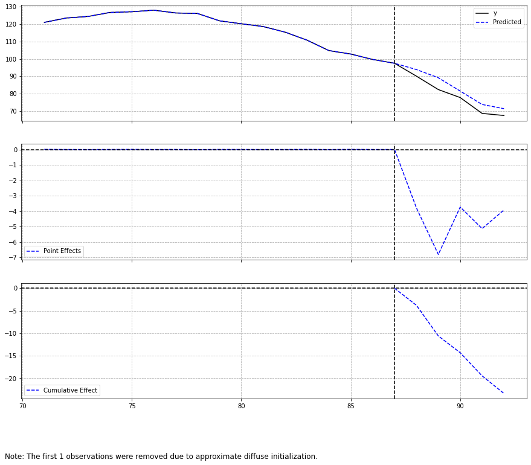
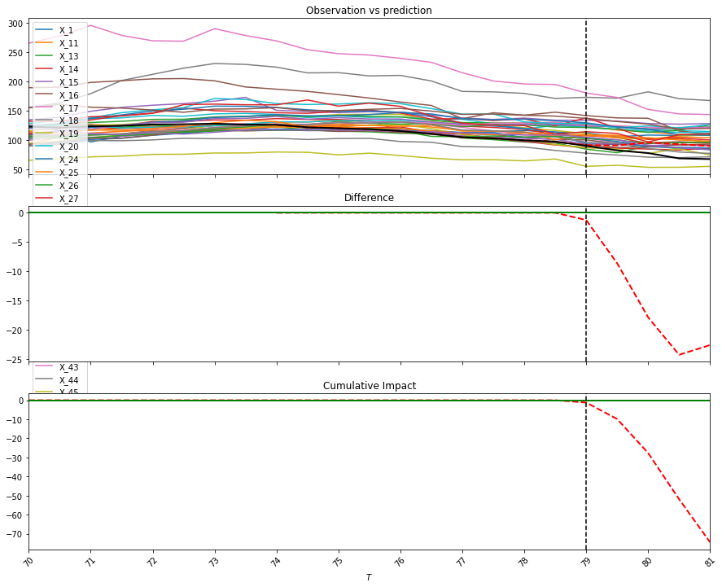

```python
import numpy as np
import pandas as pd
import plotly.express as px
import plotly.graph_objects as go
import statsmodels.api as sm
from causal_impact.causal_impact import CausalImpact as ci_tcassou
from causalimpact import CausalImpact as ci_dafiti

import warnings
warnings.filterwarnings('ignore')

%matplotlib inline
```

## (2) John Snowデータの読み込み
Data from Table.12 in Snow(1855)  
http://www.ph.ucla.edu/epi/snow/table12a.html  


```python
## 1849年におけるエリア毎のコレラによる死者数
### Southwark and Vauxhall Company
sv1849 = [283,157,192,249,259,226,352,97,111,8,235,92]
### Lambeth Company & Southwark and Vauxhall Company
lsv1849 = [256,267,312,257,318,446,143,193,243,215,544,187,153,81,113,176]

## 1849年におけるエリア毎のコレラによる死者数
### Southwark and Vauxhall Company
sv1854 = [371, 161, 148, 362, 244, 237, 282, 59, 171, 9, 240, 174]
### Lambeth Company & Southwark and Vauxhall Company
lsv1854 = [113,174,270,93,210,388,92,58,117,49,193,303,142,48,165,132]

## コレラの死者数を会社ごとにまとめる
sv_death = sv1849 + sv1854
lsv_death = lsv1849 + lsv1854

## どのデータがどのエリアのものか
sv_area = [f'sv_{i}' for i in range(1, len(sv1849)+1)] + [f'sv_{i}' for i in range(1, len(sv1854)+1)]
lsv_area = [f'lsv_{i}' for i in range(1, len(lsv1849)+1)] + [f'lsv_{i}' for i in range(1, len(lsv1854)+1)]

## どのデータがどの年のものか
sv_year = [1849 for i in range(0, len(sv1849))] + [1854 for i in range(0, len(sv1854))]
lsv_year = [1849 for i in range(0, len(lsv1849))] + [1854 for i in range(0, len(lsv1854))]

## Southwark & Vauxhallのデータフレームを作成
sv = pd.DataFrame({
    'area': sv_area,
    'year': sv_year,
    'death': sv_death,
    'LSV': 0,
    'company': 'Southwark and Vauxhall'
})

## Lambeth & Southwark and Vauxhallのデータフレームを作成
lsv = pd.DataFrame({
    'area': lsv_area,
    'year': lsv_year,
    'death': lsv_death,
    'LSV': 1,
    'company': 'Lambeth & Southwark and Vauxhall'
})

## 地域・年別のデータセットの作成
JS_df = pd.concat([sv, lsv], ignore_index=True)

## 会社別のデータセットを作成
JS_sum = JS_df.groupby(['company', 'LSV', 'year'], as_index=False).death.sum()
```

## (3) 集計と可視化による分析


```python
## 集計による推定
JS_grp_summary = JS_sum.pivot_table(
    values='death', index=['company', 'LSV'], columns=['year'], aggfunc='sum').add_prefix('year_').reset_index()
JS_grp_summary['gap'] = JS_grp_summary.year_1854 - JS_grp_summary.year_1849
JS_grp_summary['gap_rate'] = JS_grp_summary.year_1854 / JS_grp_summary.year_1849 - 1
JS_grp_summary
```


<div>
<style scoped>
    .dataframe tbody tr th:only-of-type {
        vertical-align: middle;
    }

    .dataframe tbody tr th {
        vertical-align: top;
    }

    .dataframe thead th {
        text-align: right;
    }
</style>
<table border="1" class="dataframe">
  <thead>
    <tr style="text-align: right;">
      <th>year</th>
      <th>company</th>
      <th>LSV</th>
      <th>year_1849</th>
      <th>year_1854</th>
      <th>gap</th>
      <th>gap_rate</th>
    </tr>
  </thead>
  <tbody>
    <tr>
      <th>0</th>
      <td>Lambeth &amp; Southwark and Vauxhall</td>
      <td>1</td>
      <td>3904</td>
      <td>2547</td>
      <td>-1357</td>
      <td>-0.347592</td>
    </tr>
    <tr>
      <th>1</th>
      <td>Southwark and Vauxhall</td>
      <td>0</td>
      <td>2261</td>
      <td>2458</td>
      <td>197</td>
      <td>0.087130</td>
    </tr>
  </tbody>
</table>
</div>


```python
## 集計による推定(log)
JS_grp_summary_ln = JS_sum.pivot_table(
    values='death', index=['company', 'LSV'], columns=['year'], aggfunc='sum').add_prefix('year_').reset_index()
JS_grp_summary_ln.year_1849 = np.log(JS_grp_summary_ln.year_1849)
JS_grp_summary_ln.year_1854 = np.log(JS_grp_summary_ln.year_1854)
JS_grp_summary_ln['gap'] = JS_grp_summary_ln.year_1854 - JS_grp_summary_ln.year_1849
JS_grp_summary_ln['gap_rate'] = JS_grp_summary_ln.year_1854 / JS_grp_summary_ln.year_1849 - 1
JS_grp_summary_ln
```


<div>
<style scoped>
    .dataframe tbody tr th:only-of-type {
        vertical-align: middle;
    }

    .dataframe tbody tr th {
        vertical-align: top;
    }

    .dataframe thead th {
        text-align: right;
    }
</style>
<table border="1" class="dataframe">
  <thead>
    <tr style="text-align: right;">
      <th>year</th>
      <th>company</th>
      <th>LSV</th>
      <th>year_1849</th>
      <th>year_1854</th>
      <th>gap</th>
      <th>gap_rate</th>
    </tr>
  </thead>
  <tbody>
    <tr>
      <th>0</th>
      <td>Lambeth &amp; Southwark and Vauxhall</td>
      <td>1</td>
      <td>8.269757</td>
      <td>7.842671</td>
      <td>-0.427085</td>
      <td>-0.051644</td>
    </tr>
    <tr>
      <th>1</th>
      <td>Southwark and Vauxhall</td>
      <td>0</td>
      <td>7.723562</td>
      <td>7.807103</td>
      <td>0.083541</td>
      <td>0.010816</td>
    </tr>
  </tbody>
</table>
</div>


## plotly expressによる可視化


```python
fig = px.scatter(JS_sum, x='year', y='death', color='company', trendline="ols", symbol='company', title='4.2 コレラによる死者数')
# 補助線を追加していく
fig.add_trace(go.Scatter(
    x=[1849, 1854],
    y=[3904, 3904 + 197],
    mode="lines",
    line=dict(color='gray', dash='dot'),
    name=''
))
fig.add_trace(go.Scatter(
    x=[1849, 1854],
    y=[3904, 3904],
    mode="lines",
    line=dict(color='gray', dash='dot'),
    name=''
))
fig.add_trace(go.Scatter(
    x=[1849, 1854],
    y=[2261, 2261],
    mode="lines",
    line=dict(color='gray', dash='dot'),
    name=''
))
fig.add_trace(go.Scatter(
    x=[1854.2, 1854.2],
    y=[2261, 2458],
    mode="lines+markers",
    line=dict(color='gray', width=1),
    name='',
))
fig.add_trace(go.Scatter(
    x=[1854.2],
    y=[2350],
    mode="text",
    name='',
    text='(1)',
    textposition='middle right'
))
fig.add_trace(go.Scatter(
    x=[1854.2, 1854.2],
    y=[3904, 3904+197],
    mode="lines+markers",
    line=dict(color='gray', width=1),
    name='',
))
fig.add_trace(go.Scatter(
    x=[1854.2],
    y=[3904+99],
    mode="text",
    name='',
    text='(2)',
    textposition='middle right'
))
fig.add_trace(go.Scatter(
    x=[1854.2, 1854.2],
    y=[2547, 3904],
    mode="lines+markers",
    line=dict(color='gray', width=1),
    name=''
))
fig.add_trace(go.Scatter(
    x=[1854.2],
    y=[3200],
    mode="text",
    name='',
    text='(3)',
    textposition='middle right'
))
```


```python
fig.write_html('../images/ch4_plot1.html', auto_open=False)
```

## (4) 回帰分析を用いたDID


```python
## Difference in Difference
JS_did = JS_sum.copy()
JS_did['D1854'] = JS_did.year.apply(lambda x: 1 if x == 1854 else 0)
JS_did['D1854_LSV'] = JS_did.D1854 * JS_did.LSV

y = JS_did.death
X = JS_did[['LSV', 'D1854', 'D1854_LSV']]
X = sm.add_constant(X)
results = sm.OLS(y, X).fit()
coef = results.summary().tables[1]
coef
```


<table class="simpletable">
<tr>
      <td></td>         <th>coef</th>     <th>std err</th>      <th>t</th>      <th>P>|t|</th>  <th>[0.025</th>    <th>0.975]</th>  
</tr>
<tr>
  <th>const</th>     <td> 2261.0000</td> <td>      inf</td> <td>        0</td> <td>   nan</td> <td>      nan</td> <td>      nan</td>
</tr>
<tr>
  <th>LSV</th>       <td> 1643.0000</td> <td>      inf</td> <td>        0</td> <td>   nan</td> <td>      nan</td> <td>      nan</td>
</tr>
<tr>
  <th>D1854</th>     <td>  197.0000</td> <td>      inf</td> <td>        0</td> <td>   nan</td> <td>      nan</td> <td>      nan</td>
</tr>
<tr>
  <th>D1854_LSV</th> <td>-1554.0000</td> <td>      inf</td> <td>       -0</td> <td>   nan</td> <td>      nan</td> <td>      nan</td>
</tr>
</table>


```python
## Difference in Difference(log)
JS_did_log = JS_sum.copy()
JS_did_log['D1854'] = JS_did_log.year.apply(lambda x: 1 if x == 1854 else 0)
JS_did_log['D1854_LSV'] = JS_did_log.D1854 * JS_did_log.LSV

y = np.log(JS_did_log.death)
X = JS_did_log[['LSV', 'D1854', 'D1854_LSV']]
X = sm.add_constant(X)
results = sm.OLS(y, X).fit()
coef = results.summary().tables[1]
coef
```


<table class="simpletable">
<tr>
      <td></td>         <th>coef</th>     <th>std err</th>      <th>t</th>      <th>P>|t|</th>  <th>[0.025</th>    <th>0.975]</th>  
</tr>
<tr>
  <th>const</th>     <td>    7.7236</td> <td>      inf</td> <td>        0</td> <td>   nan</td> <td>      nan</td> <td>      nan</td>
</tr>
<tr>
  <th>LSV</th>       <td>    0.5462</td> <td>      inf</td> <td>        0</td> <td>   nan</td> <td>      nan</td> <td>      nan</td>
</tr>
<tr>
  <th>D1854</th>     <td>    0.0835</td> <td>      inf</td> <td>        0</td> <td>   nan</td> <td>      nan</td> <td>      nan</td>
</tr>
<tr>
  <th>D1854_LSV</th> <td>   -0.5106</td> <td>      inf</td> <td>       -0</td> <td>   nan</td> <td>      nan</td> <td>      nan</td>
</tr>
</table>


```python
## Difference in Difference(エリア単位)
JS_did_area = JS_df.copy()
JS_did_area['D1854'] = JS_did_area.year.apply(lambda x: 1 if x == 1854 else 0)
JS_did_area['D1854_LSV'] = JS_did_area.D1854 * JS_did_area.LSV

y = JS_did_area.death
X = pd.get_dummies(JS_did_area[['LSV', 'area', 'D1854', 'D1854_LSV']], columns=['area'], drop_first=True)
X = sm.add_constant(X)
results = sm.OLS(y, X).fit()
coef = results.summary().tables[1]
coef = pd.read_html(coef.as_html(), header=0, index_col=0)[0]
coef.iloc[:4]
```


<div>
<style scoped>
    .dataframe tbody tr th:only-of-type {
        vertical-align: middle;
    }

    .dataframe tbody tr th {
        vertical-align: top;
    }

    .dataframe thead th {
        text-align: right;
    }
</style>
<table border="1" class="dataframe">
  <thead>
    <tr style="text-align: right;">
      <th></th>
      <th>coef</th>
      <th>std err</th>
      <th>t</th>
      <th>P&gt;|t|</th>
      <th>[0.025</th>
      <th>0.975]</th>
    </tr>
  </thead>
  <tbody>
    <tr>
      <th>const</th>
      <td>177.7076</td>
      <td>15.710</td>
      <td>11.312</td>
      <td>0.000</td>
      <td>145.415</td>
      <td>210.000</td>
    </tr>
    <tr>
      <th>LSV</th>
      <td>49.1987</td>
      <td>44.773</td>
      <td>1.099</td>
      <td>0.282</td>
      <td>-42.833</td>
      <td>141.230</td>
    </tr>
    <tr>
      <th>D1854</th>
      <td>16.4167</td>
      <td>25.365</td>
      <td>0.647</td>
      <td>0.523</td>
      <td>-35.721</td>
      <td>68.555</td>
    </tr>
    <tr>
      <th>D1854_LSV</th>
      <td>-101.2292</td>
      <td>33.554</td>
      <td>-3.017</td>
      <td>0.006</td>
      <td>-170.201</td>
      <td>-32.257</td>
    </tr>
  </tbody>
</table>
</div>


```python
## Difference in Difference(州単位、log)
JS_did_area_log = JS_df.copy()
JS_did_area_log['D1854'] = JS_did_area_log.year.apply(lambda x: 1 if x == 1854 else 0)
JS_did_area_log['D1854_LSV'] = JS_did_area_log.D1854 * JS_did_area_log.LSV

y = np.log(JS_did_area_log.death)
X = pd.get_dummies(JS_did_area_log[['LSV', 'area', 'D1854', 'D1854_LSV']], columns=['area'], drop_first=True)
X = sm.add_constant(X)
results = sm.OLS(y, X).fit()
coef = results.summary().tables[1]
coef = pd.read_html(coef.as_html(), header=0, index_col=0)[0]
coef.iloc[:4]
```


<div>
<style scoped>
    .dataframe tbody tr th:only-of-type {
        vertical-align: middle;
    }

    .dataframe tbody tr th {
        vertical-align: top;
    }

    .dataframe thead th {
        text-align: right;
    }
</style>
<table border="1" class="dataframe">
  <thead>
    <tr style="text-align: right;">
      <th></th>
      <th>coef</th>
      <th>std err</th>
      <th>t</th>
      <th>P&gt;|t|</th>
      <th>[0.025</th>
      <th>0.975]</th>
    </tr>
  </thead>
  <tbody>
    <tr>
      <th>const</th>
      <td>4.6461</td>
      <td>0.082</td>
      <td>56.393</td>
      <td>0.000</td>
      <td>4.477</td>
      <td>4.815</td>
    </tr>
    <tr>
      <th>LSV</th>
      <td>0.7363</td>
      <td>0.235</td>
      <td>3.136</td>
      <td>0.004</td>
      <td>0.254</td>
      <td>1.219</td>
    </tr>
    <tr>
      <th>D1854</th>
      <td>0.0739</td>
      <td>0.133</td>
      <td>0.556</td>
      <td>0.583</td>
      <td>-0.200</td>
      <td>0.347</td>
    </tr>
    <tr>
      <th>D1854_LSV</th>
      <td>-0.5661</td>
      <td>0.176</td>
      <td>-3.217</td>
      <td>0.003</td>
      <td>-0.928</td>
      <td>-0.204</td>
    </tr>
  </tbody>
</table>
</div>


## (7) Proposition99の分析：集計による分析

### データの用意
Rパッケージのデータセットをrpy2経由で取得するか、元データをローカルに保存しておくかの2通り記載する。

### 1. rpy2を経由してRパッケージEcdatから取得する
(事前にRにEcdatを下記のようにしてインストールする)
```
sudo R
install.packages('Ecdat')
```


```python
from rpy2.robjects import r, pandas2ri
from rpy2.robjects.packages import importr
pandas2ri.activate()
```


```python
importr('Ecdat')
importr('tidyverse')
### Common Trend Assumptionの為に分析から特定の州を外す
### タバコの税金が1988年以降50セント以上上がった州のリスト
### Alaska, Hawaii, Maryland, Michigan, New Jersey, New York, Washington
r('skip_state <- c(3,9,10,22,21,23,31,33,48)')
### Cigarデータセットの読み込み
### skip_stateに含まれる州のデータを削除
cigar = r('''Cigar <- Cigar %>%
  filter(!state %in% skip_state,
         year >= 70) %>%
  mutate(area = if_else(state == 5, "CA", "Rest of US"))''')
```

### 2. 元データをローカルに保存して読み込む
EcdatのCRANのドキュメントを確認する(https://cran.r-project.org/web/packages/Ecdat/Ecdat.pdf )と、  
Cigarデータセットは (https://www.wiley.com/legacy/wileychi/baltagi/ )が元であることが分かる。  
いくつかデータセットがあるが、Cigarにあたるのは右記 https://www.wiley.com/legacy/wileychi/baltagi/supp/Cigar.txt  
URLから直接pd.read_csvや、requests.getしてもうまくいかない（おそらく弾いてると思われる）ので、テキストをコピペして  
ローカルに保存しておく。(下記の場合は `../data/cigar.txt`に保存している)  
※1行目および最終行に空行があるので事前に消しておく


```python
cigar = pd.read_csv(
    '../data/cigar.txt',
    header=None, 
    sep='\s',
    names=['state', 'year', 'price', 'pop', 'pop16', 'cpi', 'ndi', 'sales','pimin']
)
skip_state = [3,9,10,22,21,23,31,33,48]
cigar = cigar[(~cigar['state'].isin(skip_state)) & (cigar['year'] >= 70)].reset_index(drop=True)
cigar['area'] = cigar['state'].apply(lambda x: 'CA' if x==5 else 'Rest of US')
```

## 前後比較による分析


```python
cigar_did = cigar.copy()
cigar_did['period'] = cigar_did.year.apply(lambda x: 'after' if x > 87 else 'before')
cigar_did['state'] = cigar_did.state.apply(lambda x: 'CA' if x==5 else 'Rest of US')
cigar_did['sales_pop16'] = cigar_did['sales'] * cigar_did['pop16']
summarised = cigar_did.groupby(['period', 'state'], as_index=False)['pop16', 'sales_pop16'].mean().sort_values('period', ascending=False)
summarised['sales'] = summarised.sales_pop16 / summarised.pop16
```


```python
summarised
```


<div>
<style scoped>
    .dataframe tbody tr th:only-of-type {
        vertical-align: middle;
    }

    .dataframe tbody tr th {
        vertical-align: top;
    }

    .dataframe thead th {
        text-align: right;
    }
</style>
<table border="1" class="dataframe">
  <thead>
    <tr style="text-align: right;">
      <th></th>
      <th>period</th>
      <th>state</th>
      <th>pop16</th>
      <th>sales_pop16</th>
      <th>sales</th>
    </tr>
  </thead>
  <tbody>
    <tr>
      <th>2</th>
      <td>before</td>
      <td>CA</td>
      <td>17674.250000</td>
      <td>2.061836e+06</td>
      <td>116.657645</td>
    </tr>
    <tr>
      <th>3</th>
      <td>before</td>
      <td>Rest of US</td>
      <td>2605.420216</td>
      <td>3.304769e+05</td>
      <td>126.842072</td>
    </tr>
    <tr>
      <th>0</th>
      <td>after</td>
      <td>CA</td>
      <td>22355.320000</td>
      <td>1.724154e+06</td>
      <td>77.124997</td>
    </tr>
    <tr>
      <th>1</th>
      <td>after</td>
      <td>Rest of US</td>
      <td>2948.603889</td>
      <td>3.151694e+05</td>
      <td>106.887669</td>
    </tr>
  </tbody>
</table>
</div>


```python
fig = px.scatter(summarised, x='period', y='sales', color='state', symbol='state', title='4.5 タバコの売上の前後比較')
fig.add_trace(go.Scatter(
    x=['before', 'after'],
    y=[126.842072, 106.887669],
    mode="lines",
    line=dict(color='gray', dash='dot'),
    name=''
))
fig.add_trace(go.Scatter(
    x=['before', 'after'],
    y=[116.657645, 77.124997],
    mode="lines",
    line=dict(color='gray', dash='dot'),
    name=''
))
fig.show()
```


```python
fig.write_html('../images/ch4_plot2.html', auto_open=False)
```

## タバコの売上のトレンドを示すプロット


```python
sales_trend = cigar_did.groupby(['year', 'state'], as_index=False)['pop16', 'sales_pop16'].mean()
sales_trend['sales'] = sales_trend.sales_pop16 / sales_trend.pop16
```


```python
fig = px.line(sales_trend, x='year', y='sales', color='state', title='4.6 売上のトレンドの確認')
fig.show()
```


```python
fig.write_html('../images/ch4_plot3.html', auto_open=False)
```

## (8) DIDのためのデータを準備


```python
cigar['post'] = cigar.year.apply(lambda x: 1 if x > 87 else 0)
cigar['ca'] = cigar.state.apply(lambda x: 1 if x == 5 else 0)
cigar['sales_pop16'] = cigar['sales'] * cigar['pop16']
```


```python
cigar_did_sum = cigar.groupby(['post', 'year', 'ca'], as_index=False)['pop16', 'sales_pop16'].mean()
cigar_did_sum['sales'] = cigar_did_sum.sales_pop16 / cigar_did_sum.pop16
cigar_did_sum['ca_post'] = cigar_did_sum.ca * cigar_did_sum.post

## カリフォルニア州とその他の州という州ごとでのデータ
cigar_did_data = cigar.groupby(['post', 'year', 'state'], as_index=False)['pop16', 'sales_pop16'].mean()
cigar_did_data['sales'] = cigar_did_data.sales_pop16 / cigar_did_data.pop16
```

## (9) カリフォルニア州とその他というグループでの分析


```python
## 2グループでのデータでの分析
y = cigar_did_sum.sales
X = pd.get_dummies(cigar_did_sum[['ca', 'post', 'ca_post', 'year']], columns=['year'], drop_first=True)
X = sm.add_constant(X)
results = sm.OLS(y, X).fit()
coef = results.summary().tables[1]
coef = pd.read_html(coef.as_html(), header=0, index_col=0)[0]
coef.iloc[:4]
```


<div>
<style scoped>
    .dataframe tbody tr th:only-of-type {
        vertical-align: middle;
    }

    .dataframe tbody tr th {
        vertical-align: top;
    }

    .dataframe thead th {
        text-align: right;
    }
</style>
<table border="1" class="dataframe">
  <thead>
    <tr style="text-align: right;">
      <th></th>
      <th>coef</th>
      <th>std err</th>
      <th>t</th>
      <th>P&gt;|t|</th>
      <th>[0.025</th>
      <th>0.975]</th>
    </tr>
  </thead>
  <tbody>
    <tr>
      <th>const</th>
      <td>123.5615</td>
      <td>4.519</td>
      <td>27.340</td>
      <td>0.000</td>
      <td>114.163</td>
      <td>132.960</td>
    </tr>
    <tr>
      <th>ca</th>
      <td>-9.0898</td>
      <td>2.074</td>
      <td>-4.384</td>
      <td>0.000</td>
      <td>-13.402</td>
      <td>-4.777</td>
    </tr>
    <tr>
      <th>post</th>
      <td>-13.8569</td>
      <td>4.423</td>
      <td>-3.133</td>
      <td>0.005</td>
      <td>-23.054</td>
      <td>-4.660</td>
    </tr>
    <tr>
      <th>ca_post</th>
      <td>-20.5435</td>
      <td>4.447</td>
      <td>-4.619</td>
      <td>0.000</td>
      <td>-29.792</td>
      <td>-11.295</td>
    </tr>
  </tbody>
</table>
</div>


```python
## 2グループでのデータでの分析(log)
y = np.log(cigar_did_sum.sales)
X = pd.get_dummies(cigar_did_sum[['ca', 'post', 'ca_post', 'year']], columns=['year'], drop_first=True)
X = sm.add_constant(X)
results = sm.OLS(y, X).fit()
coef = results.summary().tables[1]
coef = pd.read_html(coef.as_html(), header=0, index_col=0)[0]
coef.iloc[:4]
```


<div>
<style scoped>
    .dataframe tbody tr th:only-of-type {
        vertical-align: middle;
    }

    .dataframe tbody tr th {
        vertical-align: top;
    }

    .dataframe thead th {
        text-align: right;
    }
</style>
<table border="1" class="dataframe">
  <thead>
    <tr style="text-align: right;">
      <th></th>
      <th>coef</th>
      <th>std err</th>
      <th>t</th>
      <th>P&gt;|t|</th>
      <th>[0.025</th>
      <th>0.975]</th>
    </tr>
  </thead>
  <tbody>
    <tr>
      <th>const</th>
      <td>4.8171</td>
      <td>0.042</td>
      <td>114.363</td>
      <td>0.000</td>
      <td>4.729</td>
      <td>4.905</td>
    </tr>
    <tr>
      <th>ca</th>
      <td>-0.0767</td>
      <td>0.019</td>
      <td>-3.969</td>
      <td>0.001</td>
      <td>-0.117</td>
      <td>-0.037</td>
    </tr>
    <tr>
      <th>post</th>
      <td>-0.1213</td>
      <td>0.041</td>
      <td>-2.944</td>
      <td>0.008</td>
      <td>-0.207</td>
      <td>-0.036</td>
    </tr>
    <tr>
      <th>ca_post</th>
      <td>-0.2530</td>
      <td>0.041</td>
      <td>-6.105</td>
      <td>0.000</td>
      <td>-0.339</td>
      <td>-0.167</td>
    </tr>
  </tbody>
</table>
</div>


(10) 州ごとのデータでの分析については、書籍に記載がなくよくわからないので飛ばします

## (11) CausalImpactを利用した分析
causalimpactのPython実装はいくつかありますが、今回は下記2つで実験しました。  
dafiti/causalinpact: https://github.com/dafiti/causalimpact  
tcassou/causal_impact: https://github.com/tcassou/causal_impact  


```python
y = cigar[cigar.state == 5][['year', 'sales']].set_index('year')
y.columns = ['y']
X = pd.pivot_table(cigar[cigar.state != 5][['year', 'state', 'sales']], values='sales', index='year', columns='state').add_prefix('X_')
data = pd.concat([y, X], axis=1)

pre_period = [70, 87]
post_period = [88, 92]
ci = ci_dafiti(data, pre_period, post_period, prior_level_sd=None)
ci.plot()
```





```python
print(ci.summary())
```

    Posterior Inference {Causal Impact}
                              Average            Cumulative
    Actual                    77.3               386.5
    Prediction (s.d.)         81.97 (0.0)        409.87 (0.01)
    95% CI                    [81.97, 81.98]     [409.85, 409.89]
    
    Absolute effect (s.d.)    -4.67 (0.0)        -23.37 (0.01)
    95% CI                    [-4.68, -4.67]     [-23.39, -23.35]
    
    Relative effect (s.d.)    -5.7% (0.0%)       -5.7% (0.0%)
    95% CI                    [-5.71%, -5.7%]    [-5.71%, -5.7%]
    
    Posterior tail-area probability p: 0.0
    Posterior prob. of a causal effect: 100.0%
    
    For more details run the command: print(impact.summary('report'))
    

Absolute effectは-4.06で、グラフからも分かるとおり、書籍での結果（本家Rのcausalimpact）より効果は過小評価されている  
tcassou/causal_impactを用いて推定すると、より書籍に近い推定結果が得られる。両者の実装の違いよくわからない。。


```python
ci = ci_tcassou(data, 88)
ci.run(max_iter=1000)
ci.plot()
```





X軸の値が実際の値とずれてるのは仕様（ほんとは88が境界、推定も正しく行われてそうだけど表示だけおかしい）
