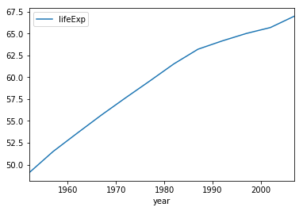

```python
import pandas
```


```python
df = pandas.read_csv('../data/gapminder.tsv', sep='\t')
```


```python
df.head()
```


<div>
<style>
    .dataframe thead tr:only-child th {
        text-align: right;
    }

    .dataframe thead th {
        text-align: left;
    }

    .dataframe tbody tr th {
        vertical-align: top;
    }
</style>
<table border="1" class="dataframe">
  <thead>
    <tr style="text-align: right;">
      <th></th>
      <th>country</th>
      <th>continent</th>
      <th>year</th>
      <th>lifeExp</th>
      <th>pop</th>
      <th>gdpPercap</th>
    </tr>
  </thead>
  <tbody>
    <tr>
      <th>0</th>
      <td>Afghanistan</td>
      <td>Asia</td>
      <td>1952</td>
      <td>28.801</td>
      <td>8425333</td>
      <td>779.445314</td>
    </tr>
    <tr>
      <th>1</th>
      <td>Afghanistan</td>
      <td>Asia</td>
      <td>1957</td>
      <td>30.332</td>
      <td>9240934</td>
      <td>820.853030</td>
    </tr>
    <tr>
      <th>2</th>
      <td>Afghanistan</td>
      <td>Asia</td>
      <td>1962</td>
      <td>31.997</td>
      <td>10267083</td>
      <td>853.100710</td>
    </tr>
    <tr>
      <th>3</th>
      <td>Afghanistan</td>
      <td>Asia</td>
      <td>1967</td>
      <td>34.020</td>
      <td>11537966</td>
      <td>836.197138</td>
    </tr>
    <tr>
      <th>4</th>
      <td>Afghanistan</td>
      <td>Asia</td>
      <td>1972</td>
      <td>36.088</td>
      <td>13079460</td>
      <td>739.981106</td>
    </tr>
  </tbody>
</table>
</div>


```python
import pandas as pd
```


```python
df = pd.read_csv('../data/gapminder.tsv', sep='\t')
```


```python
df.head()
```


<div>
<style>
    .dataframe thead tr:only-child th {
        text-align: right;
    }

    .dataframe thead th {
        text-align: left;
    }

    .dataframe tbody tr th {
        vertical-align: top;
    }
</style>
<table border="1" class="dataframe">
  <thead>
    <tr style="text-align: right;">
      <th></th>
      <th>country</th>
      <th>continent</th>
      <th>year</th>
      <th>lifeExp</th>
      <th>pop</th>
      <th>gdpPercap</th>
    </tr>
  </thead>
  <tbody>
    <tr>
      <th>0</th>
      <td>Afghanistan</td>
      <td>Asia</td>
      <td>1952</td>
      <td>28.801</td>
      <td>8425333</td>
      <td>779.445314</td>
    </tr>
    <tr>
      <th>1</th>
      <td>Afghanistan</td>
      <td>Asia</td>
      <td>1957</td>
      <td>30.332</td>
      <td>9240934</td>
      <td>820.853030</td>
    </tr>
    <tr>
      <th>2</th>
      <td>Afghanistan</td>
      <td>Asia</td>
      <td>1962</td>
      <td>31.997</td>
      <td>10267083</td>
      <td>853.100710</td>
    </tr>
    <tr>
      <th>3</th>
      <td>Afghanistan</td>
      <td>Asia</td>
      <td>1967</td>
      <td>34.020</td>
      <td>11537966</td>
      <td>836.197138</td>
    </tr>
    <tr>
      <th>4</th>
      <td>Afghanistan</td>
      <td>Asia</td>
      <td>1972</td>
      <td>36.088</td>
      <td>13079460</td>
      <td>739.981106</td>
    </tr>
  </tbody>
</table>
</div>


```python
type(df)
```


    pandas.core.frame.DataFrame


```python
df.shape
```


    (1704, 6)


```python
df.shape()
```


    ---------------------------------------------------------------------------

    TypeError                                 Traceback (most recent call last)

    <ipython-input-9-72b44c061663> in <module>()
    ----> 1 df.shape()
    

    TypeError: 'tuple' object is not callable


```python
df.columns
```


    Index(['country', 'continent', 'year', 'lifeExp', 'pop', 'gdpPercap'], dtype='object')


```python
df.index
```


    RangeIndex(start=0, stop=1704, step=1)


```python
df.values
```


    array([['Afghanistan', 'Asia', 1952, 28.801, 8425333, 779.4453145],
           ['Afghanistan', 'Asia', 1957, 30.331999999999997, 9240934,
            820.8530296],
           ['Afghanistan', 'Asia', 1962, 31.997, 10267083, 853.1007099999999],
           ..., 
           ['Zimbabwe', 'Africa', 1997, 46.809, 11404948, 792.4499602999999],
           ['Zimbabwe', 'Africa', 2002, 39.989000000000004, 11926563,
            672.0386227000001],
           ['Zimbabwe', 'Africa', 2007, 43.486999999999995, 12311143,
            469.70929810000007]], dtype=object)


```python
df.dtypes
```


    country       object
    continent     object
    year           int64
    lifeExp      float64
    pop            int64
    gdpPercap    float64
    dtype: object


```python
df.info()
```

    <class 'pandas.core.frame.DataFrame'>
    RangeIndex: 1704 entries, 0 to 1703
    Data columns (total 6 columns):
    country      1704 non-null object
    continent    1704 non-null object
    year         1704 non-null int64
    lifeExp      1704 non-null float64
    pop          1704 non-null int64
    gdpPercap    1704 non-null float64
    dtypes: float64(2), int64(2), object(2)
    memory usage: 80.0+ KB
    

# Subsetting


```python
country_df = df['country']
```


```python
country_df.head()
```


    0    Afghanistan
    1    Afghanistan
    2    Afghanistan
    3    Afghanistan
    4    Afghanistan
    Name: country, dtype: object


```python
country_df.tail()
```


    1699    Zimbabwe
    1700    Zimbabwe
    1701    Zimbabwe
    1702    Zimbabwe
    1703    Zimbabwe
    Name: country, dtype: object


```python
type(country_df)
```


    pandas.core.series.Series


```python
subset = df[['country', 'continent', 'year']]
```


```python
subset.head()
```


<div>
<style>
    .dataframe thead tr:only-child th {
        text-align: right;
    }

    .dataframe thead th {
        text-align: left;
    }

    .dataframe tbody tr th {
        vertical-align: top;
    }
</style>
<table border="1" class="dataframe">
  <thead>
    <tr style="text-align: right;">
      <th></th>
      <th>country</th>
      <th>continent</th>
      <th>year</th>
    </tr>
  </thead>
  <tbody>
    <tr>
      <th>0</th>
      <td>Afghanistan</td>
      <td>Asia</td>
      <td>1952</td>
    </tr>
    <tr>
      <th>1</th>
      <td>Afghanistan</td>
      <td>Asia</td>
      <td>1957</td>
    </tr>
    <tr>
      <th>2</th>
      <td>Afghanistan</td>
      <td>Asia</td>
      <td>1962</td>
    </tr>
    <tr>
      <th>3</th>
      <td>Afghanistan</td>
      <td>Asia</td>
      <td>1967</td>
    </tr>
    <tr>
      <th>4</th>
      <td>Afghanistan</td>
      <td>Asia</td>
      <td>1972</td>
    </tr>
  </tbody>
</table>
</div>


```python
pandas.__version__
```


    '0.20.3'


```python
df[[0, 1]]
```


    ---------------------------------------------------------------------------

    KeyError                                  Traceback (most recent call last)

    <ipython-input-22-1b57588e7b00> in <module>()
    ----> 1 df[[0, 1]]
    

    ~\Anaconda3\lib\site-packages\pandas\core\frame.py in __getitem__(self, key)
       1956         if isinstance(key, (Series, np.ndarray, Index, list)):
       1957             # either boolean or fancy integer index
    -> 1958             return self._getitem_array(key)
       1959         elif isinstance(key, DataFrame):
       1960             return self._getitem_frame(key)
    

    ~\Anaconda3\lib\site-packages\pandas\core\frame.py in _getitem_array(self, key)
       2000             return self.take(indexer, axis=0, convert=False)
       2001         else:
    -> 2002             indexer = self.loc._convert_to_indexer(key, axis=1)
       2003             return self.take(indexer, axis=1, convert=True)
       2004 
    

    ~\Anaconda3\lib\site-packages\pandas\core\indexing.py in _convert_to_indexer(self, obj, axis, is_setter)
       1229                 mask = check == -1
       1230                 if mask.any():
    -> 1231                     raise KeyError('%s not in index' % objarr[mask])
       1232 
       1233                 return _values_from_object(indexer)
    

    KeyError: '[0 1] not in index'


```python
df.head()
```


<div>
<style>
    .dataframe thead tr:only-child th {
        text-align: right;
    }

    .dataframe thead th {
        text-align: left;
    }

    .dataframe tbody tr th {
        vertical-align: top;
    }
</style>
<table border="1" class="dataframe">
  <thead>
    <tr style="text-align: right;">
      <th></th>
      <th>country</th>
      <th>continent</th>
      <th>year</th>
      <th>lifeExp</th>
      <th>pop</th>
      <th>gdpPercap</th>
    </tr>
  </thead>
  <tbody>
    <tr>
      <th>0</th>
      <td>Afghanistan</td>
      <td>Asia</td>
      <td>1952</td>
      <td>28.801</td>
      <td>8425333</td>
      <td>779.445314</td>
    </tr>
    <tr>
      <th>1</th>
      <td>Afghanistan</td>
      <td>Asia</td>
      <td>1957</td>
      <td>30.332</td>
      <td>9240934</td>
      <td>820.853030</td>
    </tr>
    <tr>
      <th>2</th>
      <td>Afghanistan</td>
      <td>Asia</td>
      <td>1962</td>
      <td>31.997</td>
      <td>10267083</td>
      <td>853.100710</td>
    </tr>
    <tr>
      <th>3</th>
      <td>Afghanistan</td>
      <td>Asia</td>
      <td>1967</td>
      <td>34.020</td>
      <td>11537966</td>
      <td>836.197138</td>
    </tr>
    <tr>
      <th>4</th>
      <td>Afghanistan</td>
      <td>Asia</td>
      <td>1972</td>
      <td>36.088</td>
      <td>13079460</td>
      <td>739.981106</td>
    </tr>
  </tbody>
</table>
</div>


```python
df.loc[0]
```


    country      Afghanistan
    continent           Asia
    year                1952
    lifeExp           28.801
    pop              8425333
    gdpPercap        779.445
    Name: 0, dtype: object


```python
df.loc[[0, 99]]
```


<div>
<style>
    .dataframe thead tr:only-child th {
        text-align: right;
    }

    .dataframe thead th {
        text-align: left;
    }

    .dataframe tbody tr th {
        vertical-align: top;
    }
</style>
<table border="1" class="dataframe">
  <thead>
    <tr style="text-align: right;">
      <th></th>
      <th>country</th>
      <th>continent</th>
      <th>year</th>
      <th>lifeExp</th>
      <th>pop</th>
      <th>gdpPercap</th>
    </tr>
  </thead>
  <tbody>
    <tr>
      <th>0</th>
      <td>Afghanistan</td>
      <td>Asia</td>
      <td>1952</td>
      <td>28.801</td>
      <td>8425333</td>
      <td>779.445314</td>
    </tr>
    <tr>
      <th>99</th>
      <td>Bangladesh</td>
      <td>Asia</td>
      <td>1967</td>
      <td>43.453</td>
      <td>62821884</td>
      <td>721.186086</td>
    </tr>
  </tbody>
</table>
</div>


```python
df.loc[-1]
```


    ---------------------------------------------------------------------------

    KeyError                                  Traceback (most recent call last)

    ~\Anaconda3\lib\site-packages\pandas\core\indexing.py in _has_valid_type(self, key, axis)
       1433                 if not ax.contains(key):
    -> 1434                     error()
       1435             except TypeError as e:
    

    ~\Anaconda3\lib\site-packages\pandas\core\indexing.py in error()
       1428                 raise KeyError("the label [%s] is not in the [%s]" %
    -> 1429                                (key, self.obj._get_axis_name(axis)))
       1430 
    

    KeyError: 'the label [-1] is not in the [index]'

    
    During handling of the above exception, another exception occurred:
    

    KeyError                                  Traceback (most recent call last)

    <ipython-input-26-c88d0e464df6> in <module>()
    ----> 1 df.loc[-1]
    

    ~\Anaconda3\lib\site-packages\pandas\core\indexing.py in __getitem__(self, key)
       1326         else:
       1327             key = com._apply_if_callable(key, self.obj)
    -> 1328             return self._getitem_axis(key, axis=0)
       1329 
       1330     def _is_scalar_access(self, key):
    

    ~\Anaconda3\lib\site-packages\pandas\core\indexing.py in _getitem_axis(self, key, axis)
       1549 
       1550         # fall thru to straight lookup
    -> 1551         self._has_valid_type(key, axis)
       1552         return self._get_label(key, axis=axis)
       1553 
    

    ~\Anaconda3\lib\site-packages\pandas\core\indexing.py in _has_valid_type(self, key, axis)
       1440                 raise
       1441             except:
    -> 1442                 error()
       1443 
       1444         return True
    

    ~\Anaconda3\lib\site-packages\pandas\core\indexing.py in error()
       1427                                     "key")
       1428                 raise KeyError("the label [%s] is not in the [%s]" %
    -> 1429                                (key, self.obj._get_axis_name(axis)))
       1430 
       1431             try:
    

    KeyError: 'the label [-1] is not in the [index]'


```python
df.iloc[0]
```


    country      Afghanistan
    continent           Asia
    year                1952
    lifeExp           28.801
    pop              8425333
    gdpPercap        779.445
    Name: 0, dtype: object


```python
df.iloc[[0, 99]]
```


<div>
<style>
    .dataframe thead tr:only-child th {
        text-align: right;
    }

    .dataframe thead th {
        text-align: left;
    }

    .dataframe tbody tr th {
        vertical-align: top;
    }
</style>
<table border="1" class="dataframe">
  <thead>
    <tr style="text-align: right;">
      <th></th>
      <th>country</th>
      <th>continent</th>
      <th>year</th>
      <th>lifeExp</th>
      <th>pop</th>
      <th>gdpPercap</th>
    </tr>
  </thead>
  <tbody>
    <tr>
      <th>0</th>
      <td>Afghanistan</td>
      <td>Asia</td>
      <td>1952</td>
      <td>28.801</td>
      <td>8425333</td>
      <td>779.445314</td>
    </tr>
    <tr>
      <th>99</th>
      <td>Bangladesh</td>
      <td>Asia</td>
      <td>1967</td>
      <td>43.453</td>
      <td>62821884</td>
      <td>721.186086</td>
    </tr>
  </tbody>
</table>
</div>


```python
df.iloc[-1]
```


    country      Zimbabwe
    continent      Africa
    year             2007
    lifeExp        43.487
    pop          12311143
    gdpPercap     469.709
    Name: 1703, dtype: object


```python
df.ix[0]
```


    country      Afghanistan
    continent           Asia
    year                1952
    lifeExp           28.801
    pop              8425333
    gdpPercap        779.445
    Name: 0, dtype: object


```python
subset = df.loc[:, ['year', 'pop']]
```


```python
subset.head()
```


<div>
<style>
    .dataframe thead tr:only-child th {
        text-align: right;
    }

    .dataframe thead th {
        text-align: left;
    }

    .dataframe tbody tr th {
        vertical-align: top;
    }
</style>
<table border="1" class="dataframe">
  <thead>
    <tr style="text-align: right;">
      <th></th>
      <th>year</th>
      <th>pop</th>
    </tr>
  </thead>
  <tbody>
    <tr>
      <th>0</th>
      <td>1952</td>
      <td>8425333</td>
    </tr>
    <tr>
      <th>1</th>
      <td>1957</td>
      <td>9240934</td>
    </tr>
    <tr>
      <th>2</th>
      <td>1962</td>
      <td>10267083</td>
    </tr>
    <tr>
      <th>3</th>
      <td>1967</td>
      <td>11537966</td>
    </tr>
    <tr>
      <th>4</th>
      <td>1972</td>
      <td>13079460</td>
    </tr>
  </tbody>
</table>
</div>


```python
subset = df.iloc[:, [2, 4]]
print(subset.head())
```

       year       pop
    0  1952   8425333
    1  1957   9240934
    2  1962  10267083
    3  1967  11537966
    4  1972  13079460
    


```python
subset = df.iloc[-5::2, :]
subset.head()
```


<div>
<style>
    .dataframe thead tr:only-child th {
        text-align: right;
    }

    .dataframe thead th {
        text-align: left;
    }

    .dataframe tbody tr th {
        vertical-align: top;
    }
</style>
<table border="1" class="dataframe">
  <thead>
    <tr style="text-align: right;">
      <th></th>
      <th>country</th>
      <th>continent</th>
      <th>year</th>
      <th>lifeExp</th>
      <th>pop</th>
      <th>gdpPercap</th>
    </tr>
  </thead>
  <tbody>
    <tr>
      <th>1699</th>
      <td>Zimbabwe</td>
      <td>Africa</td>
      <td>1987</td>
      <td>62.351</td>
      <td>9216418</td>
      <td>706.157306</td>
    </tr>
    <tr>
      <th>1701</th>
      <td>Zimbabwe</td>
      <td>Africa</td>
      <td>1997</td>
      <td>46.809</td>
      <td>11404948</td>
      <td>792.449960</td>
    </tr>
    <tr>
      <th>1703</th>
      <td>Zimbabwe</td>
      <td>Africa</td>
      <td>2007</td>
      <td>43.487</td>
      <td>12311143</td>
      <td>469.709298</td>
    </tr>
  </tbody>
</table>
</div>


# grouped calculations


```python
df.head()
```


<div>
<style>
    .dataframe thead tr:only-child th {
        text-align: right;
    }

    .dataframe thead th {
        text-align: left;
    }

    .dataframe tbody tr th {
        vertical-align: top;
    }
</style>
<table border="1" class="dataframe">
  <thead>
    <tr style="text-align: right;">
      <th></th>
      <th>country</th>
      <th>continent</th>
      <th>year</th>
      <th>lifeExp</th>
      <th>pop</th>
      <th>gdpPercap</th>
    </tr>
  </thead>
  <tbody>
    <tr>
      <th>0</th>
      <td>Afghanistan</td>
      <td>Asia</td>
      <td>1952</td>
      <td>28.801</td>
      <td>8425333</td>
      <td>779.445314</td>
    </tr>
    <tr>
      <th>1</th>
      <td>Afghanistan</td>
      <td>Asia</td>
      <td>1957</td>
      <td>30.332</td>
      <td>9240934</td>
      <td>820.853030</td>
    </tr>
    <tr>
      <th>2</th>
      <td>Afghanistan</td>
      <td>Asia</td>
      <td>1962</td>
      <td>31.997</td>
      <td>10267083</td>
      <td>853.100710</td>
    </tr>
    <tr>
      <th>3</th>
      <td>Afghanistan</td>
      <td>Asia</td>
      <td>1967</td>
      <td>34.020</td>
      <td>11537966</td>
      <td>836.197138</td>
    </tr>
    <tr>
      <th>4</th>
      <td>Afghanistan</td>
      <td>Asia</td>
      <td>1972</td>
      <td>36.088</td>
      <td>13079460</td>
      <td>739.981106</td>
    </tr>
  </tbody>
</table>
</div>


```python
df.groupby('year')['lifeExp'].mean()
```


    year
    1952    49.057620
    1957    51.507401
    1962    53.609249
    1967    55.678290
    1972    57.647386
    1977    59.570157
    1982    61.533197
    1987    63.212613
    1992    64.160338
    1997    65.014676
    2002    65.694923
    2007    67.007423
    Name: lifeExp, dtype: float64


```python
df\
    .groupby(['year', 'continent'])[['lifeExp', 'gdpPercap']]\
    .mean()
```


<div>
<style>
    .dataframe thead tr:only-child th {
        text-align: right;
    }

    .dataframe thead th {
        text-align: left;
    }

    .dataframe tbody tr th {
        vertical-align: top;
    }
</style>
<table border="1" class="dataframe">
  <thead>
    <tr style="text-align: right;">
      <th></th>
      <th></th>
      <th>lifeExp</th>
      <th>gdpPercap</th>
    </tr>
    <tr>
      <th>year</th>
      <th>continent</th>
      <th></th>
      <th></th>
    </tr>
  </thead>
  <tbody>
    <tr>
      <th rowspan="5" valign="top">1952</th>
      <th>Africa</th>
      <td>39.135500</td>
      <td>1252.572466</td>
    </tr>
    <tr>
      <th>Americas</th>
      <td>53.279840</td>
      <td>4079.062552</td>
    </tr>
    <tr>
      <th>Asia</th>
      <td>46.314394</td>
      <td>5195.484004</td>
    </tr>
    <tr>
      <th>Europe</th>
      <td>64.408500</td>
      <td>5661.057435</td>
    </tr>
    <tr>
      <th>Oceania</th>
      <td>69.255000</td>
      <td>10298.085650</td>
    </tr>
    <tr>
      <th rowspan="5" valign="top">1957</th>
      <th>Africa</th>
      <td>41.266346</td>
      <td>1385.236062</td>
    </tr>
    <tr>
      <th>Americas</th>
      <td>55.960280</td>
      <td>4616.043733</td>
    </tr>
    <tr>
      <th>Asia</th>
      <td>49.318544</td>
      <td>5787.732940</td>
    </tr>
    <tr>
      <th>Europe</th>
      <td>66.703067</td>
      <td>6963.012816</td>
    </tr>
    <tr>
      <th>Oceania</th>
      <td>70.295000</td>
      <td>11598.522455</td>
    </tr>
    <tr>
      <th rowspan="5" valign="top">1962</th>
      <th>Africa</th>
      <td>43.319442</td>
      <td>1598.078825</td>
    </tr>
    <tr>
      <th>Americas</th>
      <td>58.398760</td>
      <td>4901.541870</td>
    </tr>
    <tr>
      <th>Asia</th>
      <td>51.563223</td>
      <td>5729.369625</td>
    </tr>
    <tr>
      <th>Europe</th>
      <td>68.539233</td>
      <td>8365.486814</td>
    </tr>
    <tr>
      <th>Oceania</th>
      <td>71.085000</td>
      <td>12696.452430</td>
    </tr>
    <tr>
      <th rowspan="5" valign="top">1967</th>
      <th>Africa</th>
      <td>45.334538</td>
      <td>2050.363801</td>
    </tr>
    <tr>
      <th>Americas</th>
      <td>60.410920</td>
      <td>5668.253496</td>
    </tr>
    <tr>
      <th>Asia</th>
      <td>54.663640</td>
      <td>5971.173374</td>
    </tr>
    <tr>
      <th>Europe</th>
      <td>69.737600</td>
      <td>10143.823757</td>
    </tr>
    <tr>
      <th>Oceania</th>
      <td>71.310000</td>
      <td>14495.021790</td>
    </tr>
    <tr>
      <th rowspan="5" valign="top">1972</th>
      <th>Africa</th>
      <td>47.450942</td>
      <td>2339.615674</td>
    </tr>
    <tr>
      <th>Americas</th>
      <td>62.394920</td>
      <td>6491.334139</td>
    </tr>
    <tr>
      <th>Asia</th>
      <td>57.319269</td>
      <td>8187.468699</td>
    </tr>
    <tr>
      <th>Europe</th>
      <td>70.775033</td>
      <td>12479.575246</td>
    </tr>
    <tr>
      <th>Oceania</th>
      <td>71.910000</td>
      <td>16417.333380</td>
    </tr>
    <tr>
      <th rowspan="5" valign="top">1977</th>
      <th>Africa</th>
      <td>49.580423</td>
      <td>2585.938508</td>
    </tr>
    <tr>
      <th>Americas</th>
      <td>64.391560</td>
      <td>7352.007126</td>
    </tr>
    <tr>
      <th>Asia</th>
      <td>59.610556</td>
      <td>7791.314020</td>
    </tr>
    <tr>
      <th>Europe</th>
      <td>71.937767</td>
      <td>14283.979110</td>
    </tr>
    <tr>
      <th>Oceania</th>
      <td>72.855000</td>
      <td>17283.957605</td>
    </tr>
    <tr>
      <th rowspan="5" valign="top">1982</th>
      <th>Africa</th>
      <td>51.592865</td>
      <td>2481.592960</td>
    </tr>
    <tr>
      <th>Americas</th>
      <td>66.228840</td>
      <td>7506.737088</td>
    </tr>
    <tr>
      <th>Asia</th>
      <td>62.617939</td>
      <td>7434.135157</td>
    </tr>
    <tr>
      <th>Europe</th>
      <td>72.806400</td>
      <td>15617.896551</td>
    </tr>
    <tr>
      <th>Oceania</th>
      <td>74.290000</td>
      <td>18554.709840</td>
    </tr>
    <tr>
      <th rowspan="5" valign="top">1987</th>
      <th>Africa</th>
      <td>53.344788</td>
      <td>2282.668991</td>
    </tr>
    <tr>
      <th>Americas</th>
      <td>68.090720</td>
      <td>7793.400261</td>
    </tr>
    <tr>
      <th>Asia</th>
      <td>64.851182</td>
      <td>7608.226508</td>
    </tr>
    <tr>
      <th>Europe</th>
      <td>73.642167</td>
      <td>17214.310727</td>
    </tr>
    <tr>
      <th>Oceania</th>
      <td>75.320000</td>
      <td>20448.040160</td>
    </tr>
    <tr>
      <th rowspan="5" valign="top">1992</th>
      <th>Africa</th>
      <td>53.629577</td>
      <td>2281.810333</td>
    </tr>
    <tr>
      <th>Americas</th>
      <td>69.568360</td>
      <td>8044.934406</td>
    </tr>
    <tr>
      <th>Asia</th>
      <td>66.537212</td>
      <td>8639.690248</td>
    </tr>
    <tr>
      <th>Europe</th>
      <td>74.440100</td>
      <td>17061.568084</td>
    </tr>
    <tr>
      <th>Oceania</th>
      <td>76.945000</td>
      <td>20894.045885</td>
    </tr>
    <tr>
      <th rowspan="5" valign="top">1997</th>
      <th>Africa</th>
      <td>53.598269</td>
      <td>2378.759555</td>
    </tr>
    <tr>
      <th>Americas</th>
      <td>71.150480</td>
      <td>8889.300863</td>
    </tr>
    <tr>
      <th>Asia</th>
      <td>68.020515</td>
      <td>9834.093295</td>
    </tr>
    <tr>
      <th>Europe</th>
      <td>75.505167</td>
      <td>19076.781802</td>
    </tr>
    <tr>
      <th>Oceania</th>
      <td>78.190000</td>
      <td>24024.175170</td>
    </tr>
    <tr>
      <th rowspan="5" valign="top">2002</th>
      <th>Africa</th>
      <td>53.325231</td>
      <td>2599.385159</td>
    </tr>
    <tr>
      <th>Americas</th>
      <td>72.422040</td>
      <td>9287.677107</td>
    </tr>
    <tr>
      <th>Asia</th>
      <td>69.233879</td>
      <td>10174.090397</td>
    </tr>
    <tr>
      <th>Europe</th>
      <td>76.700600</td>
      <td>21711.732422</td>
    </tr>
    <tr>
      <th>Oceania</th>
      <td>79.740000</td>
      <td>26938.778040</td>
    </tr>
    <tr>
      <th rowspan="5" valign="top">2007</th>
      <th>Africa</th>
      <td>54.806038</td>
      <td>3089.032605</td>
    </tr>
    <tr>
      <th>Americas</th>
      <td>73.608120</td>
      <td>11003.031625</td>
    </tr>
    <tr>
      <th>Asia</th>
      <td>70.728485</td>
      <td>12473.026870</td>
    </tr>
    <tr>
      <th>Europe</th>
      <td>77.648600</td>
      <td>25054.481636</td>
    </tr>
    <tr>
      <th>Oceania</th>
      <td>80.719500</td>
      <td>29810.188275</td>
    </tr>
  </tbody>
</table>
</div>


```python

```


<div>
<style>
    .dataframe thead tr:only-child th {
        text-align: right;
    }

    .dataframe thead th {
        text-align: left;
    }

    .dataframe tbody tr th {
        vertical-align: top;
    }
</style>
<table border="1" class="dataframe">
  <thead>
    <tr style="text-align: right;">
      <th></th>
      <th>year</th>
      <th>continent</th>
      <th>lifeExp</th>
      <th>gdpPercap</th>
    </tr>
  </thead>
  <tbody>
    <tr>
      <th>0</th>
      <td>1952</td>
      <td>Africa</td>
      <td>39.135500</td>
      <td>1252.572466</td>
    </tr>
    <tr>
      <th>1</th>
      <td>1952</td>
      <td>Americas</td>
      <td>53.279840</td>
      <td>4079.062552</td>
    </tr>
    <tr>
      <th>2</th>
      <td>1952</td>
      <td>Asia</td>
      <td>46.314394</td>
      <td>5195.484004</td>
    </tr>
    <tr>
      <th>3</th>
      <td>1952</td>
      <td>Europe</td>
      <td>64.408500</td>
      <td>5661.057435</td>
    </tr>
    <tr>
      <th>4</th>
      <td>1952</td>
      <td>Oceania</td>
      <td>69.255000</td>
      <td>10298.085650</td>
    </tr>
    <tr>
      <th>5</th>
      <td>1957</td>
      <td>Africa</td>
      <td>41.266346</td>
      <td>1385.236062</td>
    </tr>
    <tr>
      <th>6</th>
      <td>1957</td>
      <td>Americas</td>
      <td>55.960280</td>
      <td>4616.043733</td>
    </tr>
    <tr>
      <th>7</th>
      <td>1957</td>
      <td>Asia</td>
      <td>49.318544</td>
      <td>5787.732940</td>
    </tr>
    <tr>
      <th>8</th>
      <td>1957</td>
      <td>Europe</td>
      <td>66.703067</td>
      <td>6963.012816</td>
    </tr>
    <tr>
      <th>9</th>
      <td>1957</td>
      <td>Oceania</td>
      <td>70.295000</td>
      <td>11598.522455</td>
    </tr>
    <tr>
      <th>10</th>
      <td>1962</td>
      <td>Africa</td>
      <td>43.319442</td>
      <td>1598.078825</td>
    </tr>
    <tr>
      <th>11</th>
      <td>1962</td>
      <td>Americas</td>
      <td>58.398760</td>
      <td>4901.541870</td>
    </tr>
    <tr>
      <th>12</th>
      <td>1962</td>
      <td>Asia</td>
      <td>51.563223</td>
      <td>5729.369625</td>
    </tr>
    <tr>
      <th>13</th>
      <td>1962</td>
      <td>Europe</td>
      <td>68.539233</td>
      <td>8365.486814</td>
    </tr>
    <tr>
      <th>14</th>
      <td>1962</td>
      <td>Oceania</td>
      <td>71.085000</td>
      <td>12696.452430</td>
    </tr>
    <tr>
      <th>15</th>
      <td>1967</td>
      <td>Africa</td>
      <td>45.334538</td>
      <td>2050.363801</td>
    </tr>
    <tr>
      <th>16</th>
      <td>1967</td>
      <td>Americas</td>
      <td>60.410920</td>
      <td>5668.253496</td>
    </tr>
    <tr>
      <th>17</th>
      <td>1967</td>
      <td>Asia</td>
      <td>54.663640</td>
      <td>5971.173374</td>
    </tr>
    <tr>
      <th>18</th>
      <td>1967</td>
      <td>Europe</td>
      <td>69.737600</td>
      <td>10143.823757</td>
    </tr>
    <tr>
      <th>19</th>
      <td>1967</td>
      <td>Oceania</td>
      <td>71.310000</td>
      <td>14495.021790</td>
    </tr>
    <tr>
      <th>20</th>
      <td>1972</td>
      <td>Africa</td>
      <td>47.450942</td>
      <td>2339.615674</td>
    </tr>
    <tr>
      <th>21</th>
      <td>1972</td>
      <td>Americas</td>
      <td>62.394920</td>
      <td>6491.334139</td>
    </tr>
    <tr>
      <th>22</th>
      <td>1972</td>
      <td>Asia</td>
      <td>57.319269</td>
      <td>8187.468699</td>
    </tr>
    <tr>
      <th>23</th>
      <td>1972</td>
      <td>Europe</td>
      <td>70.775033</td>
      <td>12479.575246</td>
    </tr>
    <tr>
      <th>24</th>
      <td>1972</td>
      <td>Oceania</td>
      <td>71.910000</td>
      <td>16417.333380</td>
    </tr>
    <tr>
      <th>25</th>
      <td>1977</td>
      <td>Africa</td>
      <td>49.580423</td>
      <td>2585.938508</td>
    </tr>
    <tr>
      <th>26</th>
      <td>1977</td>
      <td>Americas</td>
      <td>64.391560</td>
      <td>7352.007126</td>
    </tr>
    <tr>
      <th>27</th>
      <td>1977</td>
      <td>Asia</td>
      <td>59.610556</td>
      <td>7791.314020</td>
    </tr>
    <tr>
      <th>28</th>
      <td>1977</td>
      <td>Europe</td>
      <td>71.937767</td>
      <td>14283.979110</td>
    </tr>
    <tr>
      <th>29</th>
      <td>1977</td>
      <td>Oceania</td>
      <td>72.855000</td>
      <td>17283.957605</td>
    </tr>
    <tr>
      <th>30</th>
      <td>1982</td>
      <td>Africa</td>
      <td>51.592865</td>
      <td>2481.592960</td>
    </tr>
    <tr>
      <th>31</th>
      <td>1982</td>
      <td>Americas</td>
      <td>66.228840</td>
      <td>7506.737088</td>
    </tr>
    <tr>
      <th>32</th>
      <td>1982</td>
      <td>Asia</td>
      <td>62.617939</td>
      <td>7434.135157</td>
    </tr>
    <tr>
      <th>33</th>
      <td>1982</td>
      <td>Europe</td>
      <td>72.806400</td>
      <td>15617.896551</td>
    </tr>
    <tr>
      <th>34</th>
      <td>1982</td>
      <td>Oceania</td>
      <td>74.290000</td>
      <td>18554.709840</td>
    </tr>
    <tr>
      <th>35</th>
      <td>1987</td>
      <td>Africa</td>
      <td>53.344788</td>
      <td>2282.668991</td>
    </tr>
    <tr>
      <th>36</th>
      <td>1987</td>
      <td>Americas</td>
      <td>68.090720</td>
      <td>7793.400261</td>
    </tr>
    <tr>
      <th>37</th>
      <td>1987</td>
      <td>Asia</td>
      <td>64.851182</td>
      <td>7608.226508</td>
    </tr>
    <tr>
      <th>38</th>
      <td>1987</td>
      <td>Europe</td>
      <td>73.642167</td>
      <td>17214.310727</td>
    </tr>
    <tr>
      <th>39</th>
      <td>1987</td>
      <td>Oceania</td>
      <td>75.320000</td>
      <td>20448.040160</td>
    </tr>
    <tr>
      <th>40</th>
      <td>1992</td>
      <td>Africa</td>
      <td>53.629577</td>
      <td>2281.810333</td>
    </tr>
    <tr>
      <th>41</th>
      <td>1992</td>
      <td>Americas</td>
      <td>69.568360</td>
      <td>8044.934406</td>
    </tr>
    <tr>
      <th>42</th>
      <td>1992</td>
      <td>Asia</td>
      <td>66.537212</td>
      <td>8639.690248</td>
    </tr>
    <tr>
      <th>43</th>
      <td>1992</td>
      <td>Europe</td>
      <td>74.440100</td>
      <td>17061.568084</td>
    </tr>
    <tr>
      <th>44</th>
      <td>1992</td>
      <td>Oceania</td>
      <td>76.945000</td>
      <td>20894.045885</td>
    </tr>
    <tr>
      <th>45</th>
      <td>1997</td>
      <td>Africa</td>
      <td>53.598269</td>
      <td>2378.759555</td>
    </tr>
    <tr>
      <th>46</th>
      <td>1997</td>
      <td>Americas</td>
      <td>71.150480</td>
      <td>8889.300863</td>
    </tr>
    <tr>
      <th>47</th>
      <td>1997</td>
      <td>Asia</td>
      <td>68.020515</td>
      <td>9834.093295</td>
    </tr>
    <tr>
      <th>48</th>
      <td>1997</td>
      <td>Europe</td>
      <td>75.505167</td>
      <td>19076.781802</td>
    </tr>
    <tr>
      <th>49</th>
      <td>1997</td>
      <td>Oceania</td>
      <td>78.190000</td>
      <td>24024.175170</td>
    </tr>
    <tr>
      <th>50</th>
      <td>2002</td>
      <td>Africa</td>
      <td>53.325231</td>
      <td>2599.385159</td>
    </tr>
    <tr>
      <th>51</th>
      <td>2002</td>
      <td>Americas</td>
      <td>72.422040</td>
      <td>9287.677107</td>
    </tr>
    <tr>
      <th>52</th>
      <td>2002</td>
      <td>Asia</td>
      <td>69.233879</td>
      <td>10174.090397</td>
    </tr>
    <tr>
      <th>53</th>
      <td>2002</td>
      <td>Europe</td>
      <td>76.700600</td>
      <td>21711.732422</td>
    </tr>
    <tr>
      <th>54</th>
      <td>2002</td>
      <td>Oceania</td>
      <td>79.740000</td>
      <td>26938.778040</td>
    </tr>
    <tr>
      <th>55</th>
      <td>2007</td>
      <td>Africa</td>
      <td>54.806038</td>
      <td>3089.032605</td>
    </tr>
    <tr>
      <th>56</th>
      <td>2007</td>
      <td>Americas</td>
      <td>73.608120</td>
      <td>11003.031625</td>
    </tr>
    <tr>
      <th>57</th>
      <td>2007</td>
      <td>Asia</td>
      <td>70.728485</td>
      <td>12473.026870</td>
    </tr>
    <tr>
      <th>58</th>
      <td>2007</td>
      <td>Europe</td>
      <td>77.648600</td>
      <td>25054.481636</td>
    </tr>
    <tr>
      <th>59</th>
      <td>2007</td>
      <td>Oceania</td>
      <td>80.719500</td>
      <td>29810.188275</td>
    </tr>
  </tbody>
</table>
</div>


```python
import matplotlib.pyplot as plt
# probably don't need the magic anymore
%matplotlib inline

(df
     .groupby(['year'])
     [['lifeExp']]
     .mean()
     .plot()
)
plt.show()
```




