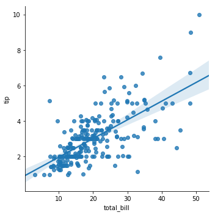
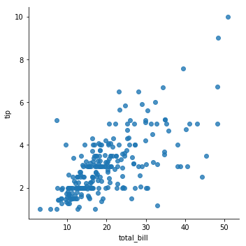
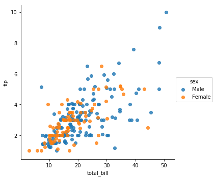
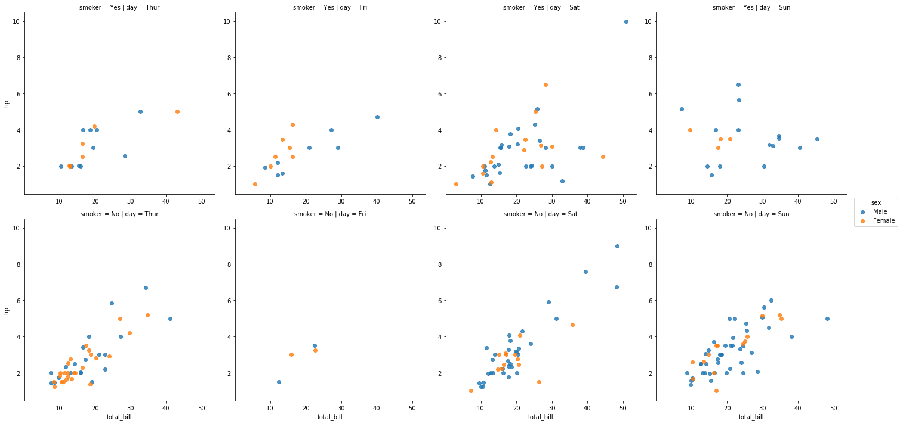

```python
import matplotlib.pyplot as plt
import seaborn as sns
```


```python
tips = sns.load_dataset('tips')
```


```python
tips.head()
```


<div>
<style>
    .dataframe thead tr:only-child th {
        text-align: right;
    }

    .dataframe thead th {
        text-align: left;
    }

    .dataframe tbody tr th {
        vertical-align: top;
    }
</style>
<table border="1" class="dataframe">
  <thead>
    <tr style="text-align: right;">
      <th></th>
      <th>total_bill</th>
      <th>tip</th>
      <th>sex</th>
      <th>smoker</th>
      <th>day</th>
      <th>time</th>
      <th>size</th>
    </tr>
  </thead>
  <tbody>
    <tr>
      <th>0</th>
      <td>16.99</td>
      <td>1.01</td>
      <td>Female</td>
      <td>No</td>
      <td>Sun</td>
      <td>Dinner</td>
      <td>2</td>
    </tr>
    <tr>
      <th>1</th>
      <td>10.34</td>
      <td>1.66</td>
      <td>Male</td>
      <td>No</td>
      <td>Sun</td>
      <td>Dinner</td>
      <td>3</td>
    </tr>
    <tr>
      <th>2</th>
      <td>21.01</td>
      <td>3.50</td>
      <td>Male</td>
      <td>No</td>
      <td>Sun</td>
      <td>Dinner</td>
      <td>3</td>
    </tr>
    <tr>
      <th>3</th>
      <td>23.68</td>
      <td>3.31</td>
      <td>Male</td>
      <td>No</td>
      <td>Sun</td>
      <td>Dinner</td>
      <td>2</td>
    </tr>
    <tr>
      <th>4</th>
      <td>24.59</td>
      <td>3.61</td>
      <td>Female</td>
      <td>No</td>
      <td>Sun</td>
      <td>Dinner</td>
      <td>4</td>
    </tr>
  </tbody>
</table>
</div>


```python
sns.lmplot(x='total_bill', y='tip', data=tips)
```


    <seaborn.axisgrid.FacetGrid at 0x249785f0dd8>


```python
plt.show()
```





```python
sns.lmplot(x='total_bill', y='tip', data=tips, fit_reg=False)
plt.show()
```





```python
sns.lmplot(x='total_bill', y='tip', data=tips, hue='sex', fit_reg=False)
plt.show()
```





```python
tips.info()
```

    <class 'pandas.core.frame.DataFrame'>
    RangeIndex: 244 entries, 0 to 243
    Data columns (total 7 columns):
    total_bill    244 non-null float64
    tip           244 non-null float64
    sex           244 non-null category
    smoker        244 non-null category
    day           244 non-null category
    time          244 non-null category
    size          244 non-null int64
    dtypes: category(4), float64(2), int64(1)
    memory usage: 7.2 KB
    


```python
sns.lmplot(x='total_bill', y='tip', data=tips,
           hue='sex', col='day', row='smoker', fit_reg=False)
plt.show()
```





```python

```
