# 使用Python进行全面的数据探索

网址：https://www.kaggle.com/pmarcelino/comprehensive-data-exploration-with-python

人生中最困难的事情就是认识自己

我不会说了解你要分析的数据是数据科学中最困难的事情，但这很耗时。因此，很容易忽略这一初始步骤，过早地跳入水中。

因此，我尝试学习了如何在跳入水中之前游泳。基于Hair（2013）“检查您的数据”一章中，我竭尽所能对数据进行了全面但不太详尽的分析。我还没有报告对此内核进行严格的研究，但是我希望它对社区有用，因此，我将分享我如何将某些数据分析原理应用于该问题。

尽管我在各章中使用了奇怪的名字，但在此内核中我们正在做的事情如下：

1. 了解问题。我们将研究每个变量，并对它们对这个问题的意义和重要性进行哲学分析。

2. 单变量研究。我们仅关注因变量（'SalePrice'），并尝试进一步了解它。

3. 多变量研究。我们将尝试了解因变量和自变量之间的关系。

4. 基本清洁。我们将清理数据集并处理缺失的数据，离群值和分类变量。

5. 测试假设。我们将检查我们的数据是否符合大多数多元技术所要求的假设。

现在，该玩得开心了！


```python
import pandas as pd
import matplotlib.pyplot as plt
import seaborn as sns
import numpy as np
from scipy.stats import norm
from sklearn.preprocessing import StandardScaler
from scipy import stats
```


```python
df_train = pd.read_csv('C:/pwork/train.csv')
df_train.columns
```


    Index(['Id', 'MSSubClass', 'MSZoning', 'LotFrontage', 'LotArea', 'Street',
           'Alley', 'LotShape', 'LandContour', 'Utilities', 'LotConfig',
           'LandSlope', 'Neighborhood', 'Condition1', 'Condition2', 'BldgType',
           'HouseStyle', 'OverallQual', 'OverallCond', 'YearBuilt', 'YearRemodAdd',
           'RoofStyle', 'RoofMatl', 'Exterior1st', 'Exterior2nd', 'MasVnrType',
           'MasVnrArea', 'ExterQual', 'ExterCond', 'Foundation', 'BsmtQual',
           'BsmtCond', 'BsmtExposure', 'BsmtFinType1', 'BsmtFinSF1',
           'BsmtFinType2', 'BsmtFinSF2', 'BsmtUnfSF', 'TotalBsmtSF', 'Heating',
           'HeatingQC', 'CentralAir', 'Electrical', '1stFlrSF', '2ndFlrSF',
           'LowQualFinSF', 'GrLivArea', 'BsmtFullBath', 'BsmtHalfBath', 'FullBath',
           'HalfBath', 'BedroomAbvGr', 'KitchenAbvGr', 'KitchenQual',
           'TotRmsAbvGrd', 'Functional', 'Fireplaces', 'FireplaceQu', 'GarageType',
           'GarageYrBlt', 'GarageFinish', 'GarageCars', 'GarageArea', 'GarageQual',
           'GarageCond', 'PavedDrive', 'WoodDeckSF', 'OpenPorchSF',
           'EnclosedPorch', '3SsnPorch', 'ScreenPorch', 'PoolArea', 'PoolQC',
           'Fence', 'MiscFeature', 'MiscVal', 'MoSold', 'YrSold', 'SaleType',
           'SaleCondition', 'SalePrice'],
          dtype='object')


```python
df_train.info()
```

    <class 'pandas.core.frame.DataFrame'>
    RangeIndex: 1460 entries, 0 to 1459
    Data columns (total 81 columns):
     #   Column         Non-Null Count  Dtype  
    ---  ------         --------------  -----  
     0   Id             1460 non-null   int64  
     1   MSSubClass     1460 non-null   int64  
     2   MSZoning       1460 non-null   object 
     3   LotFrontage    1201 non-null   float64
     4   LotArea        1460 non-null   int64  
     5   Street         1460 non-null   object 
     6   Alley          91 non-null     object 
     7   LotShape       1460 non-null   object 
     8   LandContour    1460 non-null   object 
     9   Utilities      1460 non-null   object 
     10  LotConfig      1460 non-null   object 
     11  LandSlope      1460 non-null   object 
     12  Neighborhood   1460 non-null   object 
     13  Condition1     1460 non-null   object 
     14  Condition2     1460 non-null   object 
     15  BldgType       1460 non-null   object 
     16  HouseStyle     1460 non-null   object 
     17  OverallQual    1460 non-null   int64  
     18  OverallCond    1460 non-null   int64  
     19  YearBuilt      1460 non-null   int64  
     20  YearRemodAdd   1460 non-null   int64  
     21  RoofStyle      1460 non-null   object 
     22  RoofMatl       1460 non-null   object 
     23  Exterior1st    1460 non-null   object 
     24  Exterior2nd    1460 non-null   object 
     25  MasVnrType     1452 non-null   object 
     26  MasVnrArea     1452 non-null   float64
     27  ExterQual      1460 non-null   object 
     28  ExterCond      1460 non-null   object 
     29  Foundation     1460 non-null   object 
     30  BsmtQual       1423 non-null   object 
     31  BsmtCond       1423 non-null   object 
     32  BsmtExposure   1422 non-null   object 
     33  BsmtFinType1   1423 non-null   object 
     34  BsmtFinSF1     1460 non-null   int64  
     35  BsmtFinType2   1422 non-null   object 
     36  BsmtFinSF2     1460 non-null   int64  
     37  BsmtUnfSF      1460 non-null   int64  
     38  TotalBsmtSF    1460 non-null   int64  
     39  Heating        1460 non-null   object 
     40  HeatingQC      1460 non-null   object 
     41  CentralAir     1460 non-null   object 
     42  Electrical     1459 non-null   object 
     43  1stFlrSF       1460 non-null   int64  
     44  2ndFlrSF       1460 non-null   int64  
     45  LowQualFinSF   1460 non-null   int64  
     46  GrLivArea      1460 non-null   int64  
     47  BsmtFullBath   1460 non-null   int64  
     48  BsmtHalfBath   1460 non-null   int64  
     49  FullBath       1460 non-null   int64  
     50  HalfBath       1460 non-null   int64  
     51  BedroomAbvGr   1460 non-null   int64  
     52  KitchenAbvGr   1460 non-null   int64  
     53  KitchenQual    1460 non-null   object 
     54  TotRmsAbvGrd   1460 non-null   int64  
     55  Functional     1460 non-null   object 
     56  Fireplaces     1460 non-null   int64  
     57  FireplaceQu    770 non-null    object 
     58  GarageType     1379 non-null   object 
     59  GarageYrBlt    1379 non-null   float64
     60  GarageFinish   1379 non-null   object 
     61  GarageCars     1460 non-null   int64  
     62  GarageArea     1460 non-null   int64  
     63  GarageQual     1379 non-null   object 
     64  GarageCond     1379 non-null   object 
     65  PavedDrive     1460 non-null   object 
     66  WoodDeckSF     1460 non-null   int64  
     67  OpenPorchSF    1460 non-null   int64  
     68  EnclosedPorch  1460 non-null   int64  
     69  3SsnPorch      1460 non-null   int64  
     70  ScreenPorch    1460 non-null   int64  
     71  PoolArea       1460 non-null   int64  
     72  PoolQC         7 non-null      object 
     73  Fence          281 non-null    object 
     74  MiscFeature    54 non-null     object 
     75  MiscVal        1460 non-null   int64  
     76  MoSold         1460 non-null   int64  
     77  YrSold         1460 non-null   int64  
     78  SaleType       1460 non-null   object 
     79  SaleCondition  1460 non-null   object 
     80  SalePrice      1460 non-null   int64  
    dtypes: float64(3), int64(35), object(43)
    memory usage: 678.7+ KB
    

## 1. So... What can we expect?

为了了解我们的数据，我们可以查看每个变量并尝试了解它们的含义以及与该问题的相关性。我知道这很耗时，但是它能让我们初尝数据集。

为了使我们的分析更具纪律性，我们可以创建一个包含以下各列的Excel电子表格：

- 变量-变量名。
- 类型-标识变量的类型。该字段有两个可能的值："数字"或"类别"。 "数字"是指值是数字的变量，"类别"是指值是类别的变量。
- 细分-标识变量的细分。我们可以定义三个可能的部分：建筑物，空间或位置。当我们说"建筑物"时，是指与建筑物的物理特性相关的变量（例如" OverallQual"）。当我们说"空间"时，是指一个报告房屋空间属性的变量（例如" TotalBsmtSF"）。最后，当我们说"位置"时，我们指的是一个变量，它提供有关房屋所在位置的信息（例如"邻居"）。
- 期望-我们对" SalePrice"中可变影响的期望。我们可以使用带有"高"，"中"和"低"的分类标尺作为可能的值。
- 结论-在快速浏览数据后，我们得出的关于变量重要性的结论。我们可以保持与"期望"中相同的分类范围。
- 评论-我们发生的任何一般性评论。

虽然"类型"和"细分"仅供将来参考，但"期望"一栏很重要，因为它将帮助我们发展"第六感"。为了填补这一列，我们应该阅读所有变量的描述，并一步步地问自己：

- 我们在购买房屋时会考虑这个变量吗？ （例如，当我们想到自己梦dream以求的房子时，我们是否在乎它的"砌体贴面类型"？）。
- 如果是这样，此变量将有多重要？ （例如，在外部使用"优质"材料而不是"差"的影响？而使用"优质"材料而不是"良好"的影响是什么？）。
- 此信息是否已在其他任何变量中描述过？ （例如，如果" LandContour"给出了属性的平坦度，我们是否真的需要知道" LandSlope"？）。

经过艰巨的练习后，我们可以过滤电子表格并仔细查看带有"高""期望"的变量。然后，我们可以冲入这些变量和" SalePrice"之间的一些散点图，在"结论"列中进行填充，这只是对我们期望值的修正。

我经历了这个过程并得出结论，以下变量可以在此问题中发挥重要作用：

- TotalQual（这是我不喜欢的变量，因为我不知道它是如何计算的；一个有趣的练习是使用所有其他可用变量来预测"OverallQual"）。
- YearBuilt。
- TotalBsmtSF。
- GrLivArea。

我最后得到了两个"build"变量（"OverallQual"和"YearBuilt"）和两个"space"变量（" TotalBsmtSF"和"GrLivArea"）。这可能有点出乎意料，因为它违反了房地产的口头禅，即所有重要的是"位置，位置和位置"。对于分类变量来说，这种快速的数据检查过程可能有点苛刻。例如，我期望'Neigborhood'变量更加相关，但是在数据检查之后，我最终将其排除在外。也许这与散点图而不是箱线图的使用有关，散点图更适合于分类变量的可视化。我们可视化数据的方式通常会影响我们的结论。

但是，此练习的重点是对数据和预期行为进行一些思考，因此我认为我们实现了目标。现在是时候"少说话了，请多采取一些行动"。让我们摇一摇吧！

## 2. First things first: analysing 'SalePrice'

SalePrice”是我们追求的原因。 就像我们要去参加聚会时一样。 我们总是有理由在那里。 通常，女人就是那个原因。 （免责声明：根据您的喜好将其调整为适合男性，舞蹈或酒精饮料）

使用女性的类比，让我们建立一个小故事，即“我们如何认识'SalePrice'的故事。

一切都始于我们寻找舞伴的Kaggle派对。 在舞池中搜寻了一会儿之后，我们在酒吧附近看到了一个穿着舞鞋的女孩。 这表明她在那里跳舞。 我们花费大量时间进行预测建模和参加分析竞赛，因此与女孩聊天并不是我们的超级能力之一。 即使这样，我们还是尝试一下：

嗨，我叫卡格利！ 你呢？ '销售价格'？ 好漂亮的名字！ 您知道“ SalePrice”，可以给我一些有关您的数据吗？ 我刚刚开发了一个模型来计算两个人之间成功建立关系的可能性。 我想将它应用于我们！


```python
df_train['SalePrice'].describecribe()
```


    count      1460.000000
    mean     180921.195890
    std       79442.502883
    min       34900.000000
    25%      129975.000000
    50%      163000.000000
    75%      214000.000000
    max      755000.000000
    Name: SalePrice, dtype: float64


“很好。看来您的最低价格大于零。 优秀的！ 您没有破坏我模型的个人特征之一！ 你有什么可以寄给我的照片吗？ 我不知道...喜欢你在海滩上...还是在健身房自拍照？


```python
sns.distplot(df_train['SalePrice'])
```


    <matplotlib.axes._subplots.AxesSubplot at 0x1fd2a778>


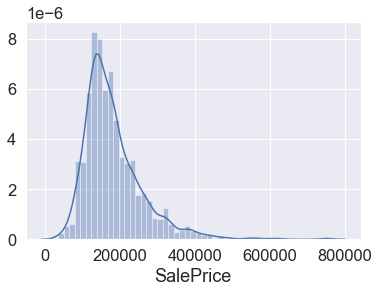


'啊！ 我看到您外出时使用了淡淡的化妆品...真是太优雅了！ 我还看到你：

- 偏离正态分布。
- 有明显的正偏度。
- 表现出顶峰。

这变得越来越有趣！ “ SalePrice”，您能给我您的身体尺寸吗？


```python
#skewness and kurtosis
print(f"Skewness: {df_train['SalePrice'].skew()}")
print(f"Kurtosis: {df_train['SalePrice'].kurt()}")
```

    Skewness: 1.8828757597682129
    Kurtosis: 6.536281860064529
    

惊人！ 如果我的爱情计算器正确，我们的成功概率为97.834657％。 我想我们应该再见面！ 请保持我的电话号码，如果您下周五有空，请给我打电话。 一会儿见，鳄鱼！

### Relationship with numerical variables

选择要战斗的地形是军事智慧。 一旦“ SalePrice”走开，我们就去了Facebook。 是的，现在情况越来越严重了。 请注意，这不是跟踪。 如果您知道我的意思，那只是对个人的深入研究。

根据她的个人资料，我们有一些共同的朋友。 除了查克·诺里斯（Chuck Norris），我们都知道“ GrLivArea”和“ TotalBsmtSF”。 此外，我们也有共同的利益，例如“ OverallQual”和“ YearBuilt”。 这看起来很有希望！

为了充分利用我们的研究，我们将首先仔细查看我们共同朋友的概况，然后我们将专注于我们的共同利益。


```python
#scatter plot grlivarea/saleprice
var = 'GrLivArea'
data = pd.concat([df_train['SalePrice'], df_train[var]], axis=1)
data.plot.scatter(x=var, y='SalePrice', ylim=(0, 800000))
```

    'c' argument looks like a single numeric RGB or RGBA sequence, which should be avoided as value-mapping will have precedence in case its length matches with 'x' & 'y'.  Please use a 2-D array with a single row if you really want to specify the same RGB or RGBA value for all points.
    


    <matplotlib.axes._subplots.AxesSubplot at 0x1fb7a4d8>


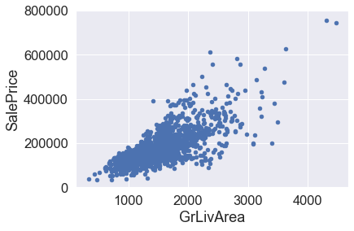


Hmmm... It seems that 'SalePrice' and 'GrLivArea' are really old friends, with a linear relationship.

And what about 'TotalBsmtSF'?


```python
var = 'TotalBsmtSF'
data = pd.concat([df_train['SalePrice'], df_train[var]], axis=1)
data.plot.scatter(x=var, y='SalePrice', ylim=(0, 800000))
```


    <matplotlib.axes._subplots.AxesSubplot at 0x1427e670>


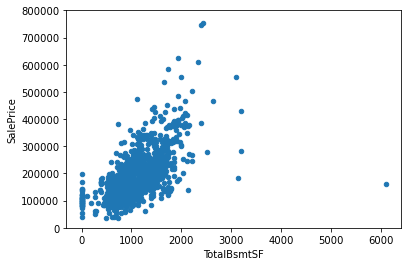


“ TotalBsmtSF”也是“ SalePrice”的好朋友，但这似乎是一种情感上的联系！ 一切正常，突然之间，在强烈的线性（指数？）反应中，一切都发生了变化。 而且，很明显，有时'TotalBsmtSF'本身会关闭，并且对'SalePrice'给予零信用。

Relationship with categorical features


```python
var = 'OverallQual'
data = pd.concat([df_train['SalePrice'], df_train[var]], axis=1)
f, ax = plt.subplots(figsize=(8, 6))
fig = sns.boxplot(x=var, y='SalePrice', data=data)
fig.axis(ymin=0, ymax=800000);
```


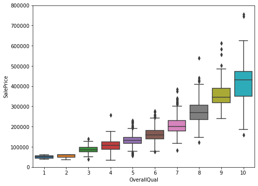


像所有漂亮的女孩一样，“ SalePrice”享有“ OverallQual”。 自我提醒：考虑一下麦当劳是否适合第一次约会。


```python
var = 'YearBuilt'
data = pd.concat([df_train['SalePrice'], df_train[var]], axis=1)
f, ax = plt.subplots(figsize=(16, 8))
fig = sns.boxplot(x=var, y="SalePrice", data=data)
fig.axis(ymin=0, ymax=800000);
plt.xticks(rotation=90);
```


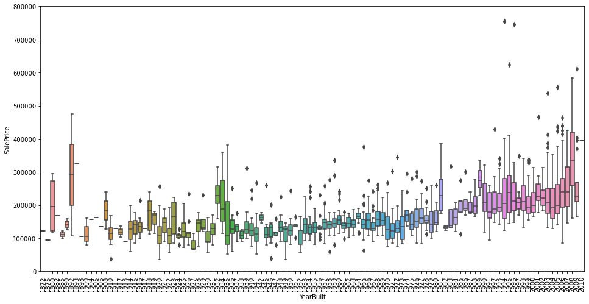


尽管这不是一个很强的趋势，但我想说“ SalePrice”比起在旧文物上更倾向于在新事物上花费更多的钱。

注意：我们不知道“ SalePrice”是否为固定价格。不变价格试图消除通货膨胀的影响。如果“ SalePrice”不是固定价格，则应该是固定价格，因此多年来的价格是可比的。

### 综上所述

除了故事，我们可以得出以下结论：

“ GrLivArea”和“ TotalBsmtSF”似乎与“ SalePrice”线性相关。两种关系都是正的，这意味着随着一个变量增加，另一个变量也增加。在“ TotalBsmtSF”的情况下，我们可以看到线性关系的斜率特别高。
“ OverallQual”和“ YearBuilt”似乎也与“ SalePrice”相关。在“ OverallQual”的情况下，这种关系似乎更加牢固，其中的方框图显示了销售价格如何随着整体质量而增加。

我们只是分析了四个变量，但是还有许多其他的我们需要分析。这里的技巧似乎是正确特征的选择（特征选择），而不是它们之间复杂关系的定义（特征工程）。

就是说，让我们从谷壳中分离出小麦。

## 3. Keep calm and work smart

到目前为止，我们只是按照直觉来分析我们认为重要的变量。尽管我们努力使我们的分析具有客观性，但我们必须说我们的出发点是主观的。

作为工程师，我对这种方法不满意。我所有的教育都是关于培养纪律严明，能够承受主观之风的。这是有原因的。尝试主观结构工程，您将看到物理使事物下降。会疼的。

因此，让我们克服惯性并进行更客观的分析。

### The 'plasma soup'

“一开始除了血浆汤外什么都没有。在我们研究宇宙学的开始时，这些短暂的时刻在很大程度上是推测的。但是，科学根据对当今宇宙的了解，为可能发生的事情设计了一些草图。

为了探索宇宙，我们将从一些实用的食谱入手，以理解我们的“血浆汤”：

相关矩阵（热图样式）。
“ SalePrice”相关矩阵（缩放的热图样式）。
关联最密切的变量之间的散点图（移动类似Jagger样式）。

### Correlation matrix (heatmap style)


```python
#correlation matrix
corrmat = df_train.corr()
f, ax = plt.subplots(figsize=(12, 9))
sns.heatmap(corrmat, vmax=.8, square=True)
```


    <matplotlib.axes._subplots.AxesSubplot at 0x17b79850>


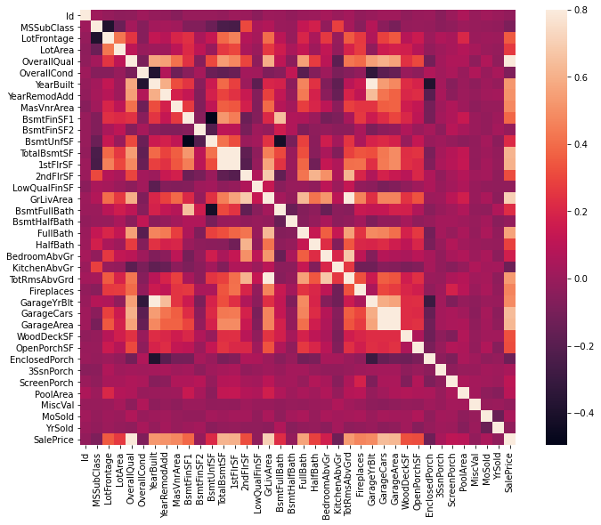


我认为，此热图是快速了解我们的“血浆汤”及其关系的最佳方法。 （谢谢@seaborn！）

乍看之下，有两个红色正方形引起了我的注意。第一个引用“ TotalBsmtSF”和“ 1stFlrSF”变量，第二个引用“ GarageX”变量。两种情况都表明这些变量之间的相关性有多重要。实际上，这种相关性是如此之强，以至于可以指示多重共线性的情况。如果我们考虑这些变量，我们可以得出结论，它们给出的信息几乎相同，因此确实存在多重共线性。热图非常适合检测这种情况，在像我们这样的以特征选择为主的问题中，热图是必不可少的工具。

引起我注意的另一件事是“ SalePrice”相关性。我们可以看到我们著名的“ GrLivArea”，“ TotalBsmtSF”和“ OverallQual”说的是“嗨！”，但是我们还可以看到许多其他变量，应予以考虑。这就是我们接下来要做的。


```python
#saleprice correlation matrix
k = 10 #number of variables for heatmap
cols = corrmat.nlargest(k, 'SalePrice')['SalePrice'].index
cm = np.corrcoef(df_train[cols].values.T)
sns.set(font_scale=1.5)
f, ax = plt.subplots(figsize=(12, 9))
hm = sns.heatmap(cm, cbar=True, annot=True, square=True, fmt='.2f', annot_kws={'size': 10},
                yticklabels=cols.values, xticklabels=cols.values)
```


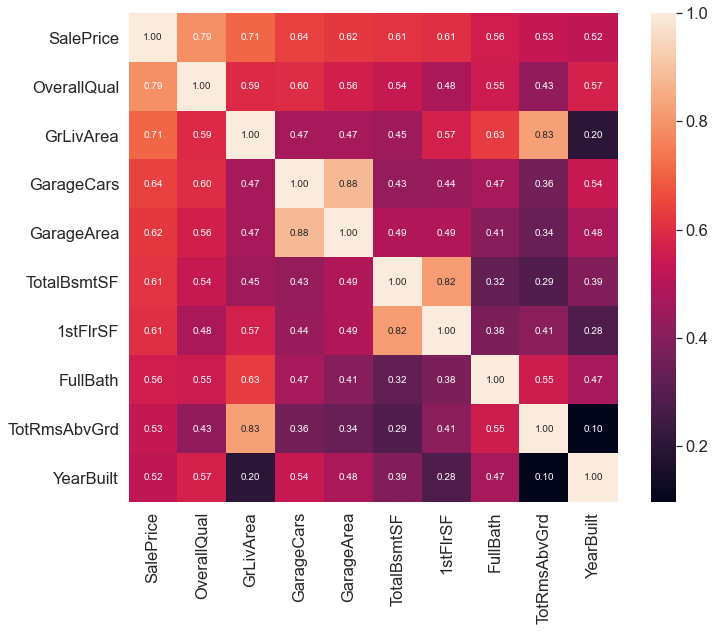


根据我们的水晶球，这些是与“ SalePrice”最相关的变量。我对此的想法：

- “ OverallQual”，“ GrLivArea”和“ TotalBsmtSF”与“ SalePrice”密切相关。检查！
- “ GarageCars”和“ GarageArea”也是一些最相关的变量。但是，正如我们在最后一个子点中所讨论的，适合车库的汽车数量是车库面积的结果。 “ GarageCars”和“ GarageArea”就像孪生兄弟。您将永远无法区分它们。因此，我们在分析中只需要这些变量之一（我们可以保留“ GarageCars”，因为它与“ SalePrice”的相关性更高）。
- “ TotalBsmtSF”和“ 1stFloor”似乎也是孪生兄弟。我们可以保持'TotalBsmtSF'只是说我们的第一个猜测是正确的（重新读'So ...我们可以期待什么？'）。
- “（FullBath）全浴” ？？是真的吗？
- “TotRmsAbvGrd”和“GrLivArea”，又是双胞胎兄弟。该数据集来自切尔诺贝利吗？
- 啊...“ YearBuilt” ...似乎“ YearBuilt”与“ SalePrice”略相关。坦率地说，让我想到“ YearBuilt”让我感到害怕，因为我开始觉得我们应该做一些时间序列分析以实现这一目标。我将把它作为作业留给您。

让我们继续进行散点图。

为您将要看到的东西做好准备。 我必须承认，当我第一次看到这些散点图时，我完全被震撼了！ 在如此短的空间内提供了如此多的信息……真是太神奇了。 再次感谢@seaborn！ 你让我“像贾格尔一样移动”！


```python
sns.set(font_scale=1.5)
cols = ['SalePrice', 'OverallQual', 'GrLivArea', 'GarageCars', 'TotalBsmtSF', 'FullBath', 'YearBuilt']
sns.pairplot(df_train[cols], size=2.5)
```

    c:\users\13631\appdata\local\programs\python\python38-32\lib\site-packages\seaborn\axisgrid.py:2071: UserWarning: The `size` parameter has been renamed to `height`; please update your code.
      warnings.warn(msg, UserWarning)
    


    <seaborn.axisgrid.PairGrid at 0x1a9fc4c0>


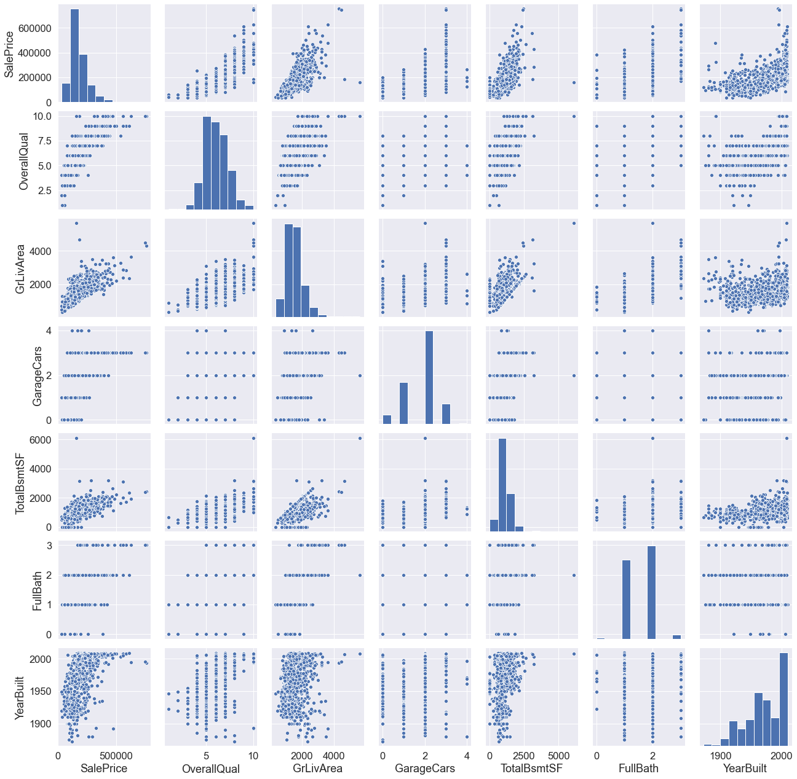


尽管我们已经了解了一些主要数据，但此巨型散点图为我们提供了有关变量关系的合理思路。

我们可能会发现有趣的数字之一是“ TotalBsmtSF”和“ GrLiveArea”之间的数字。在此图中，我们可以看到点画了一条直线，几乎像一个边界。完全有道理的是，大多数点都位于该线以下。地下室的面积可以等于地面上的居住面积，但是地下室的面积不能大于地面上的居住面积（除非您要购买掩体）。

关于“ SalePrice”和“ YearBuilt”的图也可以使我们思考。在“点云”的底部，我们看到的几乎是一个害羞的指数函数（富有创造力）。我们还可以在“点云”的上限中看到相同的趋势（甚至更具创造力）。另外，请注意有关过去几年的点集如何趋于保持在此限制之上（我只是想说现在价格上涨得更快）。

好的，到目前为止，足够进行罗夏墨迹测验。让我们前进到缺失的地方：缺失的数据！

## 4. Missing data

考虑丢失数据时的重要问题：

- 丢失的数据有多普遍？
- 丢失数据是随机的还是有规律的？

出于实际原因，这些问题的答案很重要，因为缺少数据可能意味着样本量的减少。 这可能会阻止我们继续进行分析。 而且，从实质的角度来看，我们需要确保丢失的数据过程不存在偏见并掩盖不便的事实。


```python
#missing data
total = df_train.isnull().sum().sort_values(ascending=False)
percent = (df_train.isnull().sum()/df_train.isnull().count()).sort_values(ascending=False)
missing_data = pd.concat([total, percent], axis=1, keys=['Total','percent'])
missing_data.head(20)
```


<div>
<style scoped>
    .dataframe tbody tr th:only-of-type {
        vertical-align: middle;
    }

    .dataframe tbody tr th {
        vertical-align: top;
    }

    .dataframe thead th {
        text-align: right;
    }
</style>
<table border="1" class="dataframe">
  <thead>
    <tr style="text-align: right;">
      <th></th>
      <th>Total</th>
      <th>percent</th>
    </tr>
  </thead>
  <tbody>
    <tr>
      <th>PoolQC</th>
      <td>1453</td>
      <td>0.995205</td>
    </tr>
    <tr>
      <th>MiscFeature</th>
      <td>1406</td>
      <td>0.963014</td>
    </tr>
    <tr>
      <th>Alley</th>
      <td>1369</td>
      <td>0.937671</td>
    </tr>
    <tr>
      <th>Fence</th>
      <td>1179</td>
      <td>0.807534</td>
    </tr>
    <tr>
      <th>FireplaceQu</th>
      <td>690</td>
      <td>0.472603</td>
    </tr>
    <tr>
      <th>LotFrontage</th>
      <td>259</td>
      <td>0.177397</td>
    </tr>
    <tr>
      <th>GarageCond</th>
      <td>81</td>
      <td>0.055479</td>
    </tr>
    <tr>
      <th>GarageType</th>
      <td>81</td>
      <td>0.055479</td>
    </tr>
    <tr>
      <th>GarageYrBlt</th>
      <td>81</td>
      <td>0.055479</td>
    </tr>
    <tr>
      <th>GarageFinish</th>
      <td>81</td>
      <td>0.055479</td>
    </tr>
    <tr>
      <th>GarageQual</th>
      <td>81</td>
      <td>0.055479</td>
    </tr>
    <tr>
      <th>BsmtExposure</th>
      <td>38</td>
      <td>0.026027</td>
    </tr>
    <tr>
      <th>BsmtFinType2</th>
      <td>38</td>
      <td>0.026027</td>
    </tr>
    <tr>
      <th>BsmtFinType1</th>
      <td>37</td>
      <td>0.025342</td>
    </tr>
    <tr>
      <th>BsmtCond</th>
      <td>37</td>
      <td>0.025342</td>
    </tr>
    <tr>
      <th>BsmtQual</th>
      <td>37</td>
      <td>0.025342</td>
    </tr>
    <tr>
      <th>MasVnrArea</th>
      <td>8</td>
      <td>0.005479</td>
    </tr>
    <tr>
      <th>MasVnrType</th>
      <td>8</td>
      <td>0.005479</td>
    </tr>
    <tr>
      <th>Electrical</th>
      <td>1</td>
      <td>0.000685</td>
    </tr>
    <tr>
      <th>Utilities</th>
      <td>0</td>
      <td>0.000000</td>
    </tr>
  </tbody>
</table>
</div>


让我们对此进行分析，以了解如何处理丢失的数据。

我们将考虑到，当丢失超过15％的数据时，我们应该删除相应的变量，并假装它不存在。这意味着在这种情况下，我们不会尝试任何技巧来填充丢失的数据。据此，我们应删除一组变量（例如“PoolQC”，“MiscFeature”，“Alley”等）。关键是：我们会错过这些数据吗？我不这么认为。这些变量似乎都不是很重要，因为大多数都不是我们在购买房屋时要考虑的方面（也许这就是数据丢失的原因？）。此外，仔细观察变量，我们可以说像'PoolQC'，'MiscFeature'和'FireplaceQu'这样的变量是异常值的强力候选者，因此我们很乐意将其删除。

在剩下的情况下，我们可以看到“GarageX”变量具有相同数量的丢失数据。我敢打赌，缺失的数据指的是同一组观察结果（尽管我不会对其进行检查；仅为5％，我们不应在5个问题中花费20个）。由于有关车库的最重要信息是由“GarageCars”表示的，并且考虑到我们仅在谈论丢失数据的5％，因此我将删除提及的“GarageX”变量。相同的逻辑适用于“BsmtX”变量。

关于“MasVnrArea”和“MasVnrType”，我们可以认为这些变量不是必需的。此外，它们与已经考虑的“YearBuilt”和“OverallQual”有很强的相关性。因此，如果删除“MasVnrArea”和“MasVnrType”，我们将不会丢失信息。

最后，我们在“电气”中有一个缺失的观察。由于这只是一个观察值，因此我们将删除该观察值并保留变量。

总之，要处理丢失的数据，我们将删除所有带有丢失数据的变量，但变量“Electrical”除外。在“电子”中，我们将删除缺少数据的观测值。


```python
#dealing with missing data
df_train = df_train.drop(missing_data[missing_data['Total'] > 1].index, axis=1)
df_train = df_train.drop(df_train.loc[df_train['Electrical'].isnull()].index)
df_train.isnull().sum().max() #just checking that there's no missing data missing...
```


    0


### 撒谎！

离群值也是我们应注意的事情。 为什么？ 因为离群值会明显影响我们的模型，并且会成为有价值的信息来源，从而为我们提供了有关特定行为的见解。

离群值是一个复杂的主题，应引起更多关注。 在这里，我们将通过“ SalePrice”的标准偏差和一组散点图进行快速分析。

### 单变量分析

这里主要关注的是建立一个将观察值定义为离群值的阈值。 为此，我们将对数据进行标准化。 在这种情况下，数据标准化意味着将数据值转换为均值为0且标准差为1。


```python
StandardScaler().fit_transform(df_train['SalePrice'][:,np.newaxis])
```


    array([[ 0.34704187],
           [ 0.0071701 ],
           [ 0.53585953],
           ...,
           [ 1.07713679],
           [-0.48847623],
           [-0.42081658]])


```python
StandardScaler().fit_transform(df_train[['SalePrice']])
```


    array([[ 0.34704187],
           [ 0.0071701 ],
           [ 0.53585953],
           ...,
           [ 1.07713679],
           [-0.48847623],
           [-0.42081658]])


```python
#standardizing data
saleprice_scaled = StandardScaler().fit_transform(df_train['SalePrice'][:,np.newaxis])
low_range = saleprice_scaled[saleprice_scaled[:,0].argsort()][:10]
high_range= saleprice_scaled[saleprice_scaled[:,0].argsort()][-10:]
print('outer range (low) of the distribution:')
print(low_range)
print('\nouter range (high) of the distribution:')
print(high_range)
```

    outer range (low) of the distribution:
    [[-1.83820775]
     [-1.83303414]
     [-1.80044422]
     [-1.78282123]
     [-1.77400974]
     [-1.62295562]
     [-1.6166617 ]
     [-1.58519209]
     [-1.58519209]
     [-1.57269236]]
    
    outer range (high) of the distribution:
    [[3.82758058]
     [4.0395221 ]
     [4.49473628]
     [4.70872962]
     [4.728631  ]
     [5.06034585]
     [5.42191907]
     [5.58987866]
     [7.10041987]
     [7.22629831]]
    

她的新衣服的“ SalePrice”外观如何：

- 低范围值相似，并且离0不太远。
- 高范围值距离0远，而7值实际上超出范围。

目前，我们不会将这些值中的任何一个视为异常值，但应谨慎使用这两个7.something值。

### 双变量分析

我们已经了解了以下散点图。 但是，当我们从新的角度看待事物时，总会有发现的地方。 正如艾伦·凯（Alan Kay）所说，“改变观点值得80智商点”。


```python
#bivariate analysis saleprice/grlivarea
var = 'GrLivArea'
data = pd.concat([df_train['SalePrice'], df_train[var]], axis=1)
data.plot.scatter(x=var, y='SalePrice', ylim=(0,800000));
```

    'c' argument looks like a single numeric RGB or RGBA sequence, which should be avoided as value-mapping will have precedence in case its length matches with 'x' & 'y'.  Please use a 2-D array with a single row if you really want to specify the same RGB or RGBA value for all points.
    


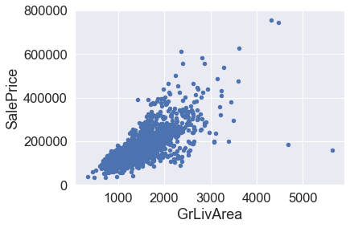


发现了什么：

- 具有较大“ GrLivArea”的两个值似乎很奇怪，并且它们并未跟随人群。 我们可以推测为什么会这样。 也许他们指的是农业领域，这可以解释价格低廉的原因。 我对此不确定，但我很有信心，这两点不能代表典型案例。 因此，我们将它们定义为离群值并将其删除。
- 图顶部的两个观测值是我们应注意的那些观测值。 它们看起来像两种特殊情况，但是它们似乎在追随潮流。 因此，我们将保留它们。


```python
#deleting points
deleting_points = df_train.sort_values(by = 'GrLivArea', ascending = False)[:2].index
```


```python
# my method
# df_train = df_train.drop(deleting_points)
```


```python
df_train = df_train.drop(df_train[df_train['Id'] == 1299].index)
df_train = df_train.drop(df_train[df_train['Id'] == 524].index)
```


```python
#bivariate analysis saleprice/grlivarea
var = 'TotalBsmtSF'
data = pd.concat([df_train['SalePrice'], df_train[var]], axis=1)
data.plot.scatter(x=var, y='SalePrice', ylim=(0,800000));
```

    'c' argument looks like a single numeric RGB or RGBA sequence, which should be avoided as value-mapping will have precedence in case its length matches with 'x' & 'y'.  Please use a 2-D array with a single row if you really want to specify the same RGB or RGBA value for all points.
    


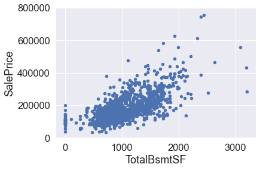


我们可能会想消除一些观察结果（例如TotalBsmtSF> 3000），但我认为这样做是不值得的。 我们可以忍受，所以我们什么也不会做。

## 5. Getting hard core


在艾恩·兰德（Ayn Rand）的小说《耸耸肩膀》（Atlas Shrugged）中，经常出现一个问题：谁是约翰·加尔特（John Galt）？这本书的很大一部分是关于寻找这个问题答案的探索。

我现在觉得randian。谁是“ SalePrice”？

这个问题的答案在于测试用于多元分析的统计基础所依据的假设。我们已经进行了一些数据清理，并发现了很多有关“ SalePrice”的信息。现在是时候深入了解“ SalePrice”如何符合使我们能够应用多元技术的统计假设。

根据头发等。 （2013），应检验以下四个假设：

- 正态性-当谈论正态性时，我们的意思是数据应该看起来像正态分布。这很重要，因为几个统计检验都依赖于此（例如t统计）。在本练习中，我们将仅检查“ SalePrice”的单变量正态性（这是一种有限的方法）。请记住，单变量正态性不能确保多元正态性（这是我们希望拥有的），但可以提供帮助。要考虑的另一个细节是，在大样本（> 200个观测值）中，正态性不是这样的问题。但是，如果我们解决正态性，就可以避免很多其他问题（例如异方差性），这就是我们进行此分析的主要原因。

- 均方根性-我只是希望我写对了。同方性是指“假设因变量在预测变量范围内表现出相同的方差水平”（Hair等人，2013）。同调性是可取的，因为我们希望误差项在自变量的所有值上都相同。

- 线性-评估线性的最常用方法是检查散点图并搜索线性模式。如果模式不是线性的，则值得探索数据转换。但是，由于我们看到的大多数散点图似乎都具有线性关系，因此我们将不予讨论。

- 缺少相关错误-关联错误（如定义所示）发生在一个错误与另一个错误相关时。例如，如果一个正误差系统地产生一个负误差，则意味着这些变量之间存在关联。这通常发生在时间序列中，其中某些模式与时间相关。我们也不会对此进行讨论。但是，如果您检测到某些东西，请尝试添加一个变量，该变量可以解释您所获得的效果。这是相关错误的最常见解决方案。

您认为猫王会对这个冗长的解释怎么说？ “少聊一点，请多采取一些行动”？大概...顺便问一下，您知道猫王的最后一次成功是什么吗？

（...）

浴室地板。


### 在寻找常态

这里的重点是要以非常精简的方式测试“ SalePrice”。我们将注意以下事项：

- 直方图-峰度和偏度。
- 正态概率图-数据分布应紧跟代表正态分布的对角线。


```python
#histogram and normal probability plot
sns.distplot(df_train['SalePrice'], fit=norm)
```


    <matplotlib.axes._subplots.AxesSubplot at 0x1fcf46b8>


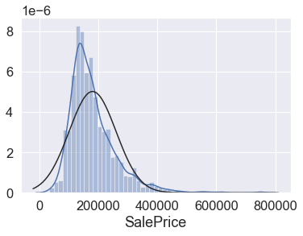


```python
fig = plt.figure()
res = stats.probplot(df_train['SalePrice'], plot=plt)
```


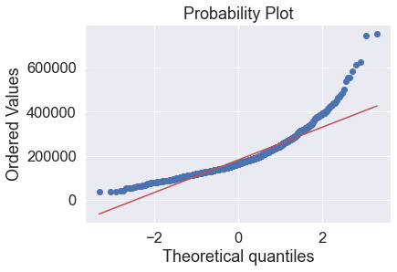


好的，“ SalePrice”是不正常的。 它显示“峰值”，正偏度，并且不遵循对角线。

但是，一切并没有丢失。 简单的数据转换可以解决问题。 这是您可以在统计书籍中学到的很棒的事情之一：如果出现正偏斜，对数转换通常效果很好。 当我发现这一点时，我感觉就像是霍格沃茨的学生发现了一个新的酷法术。

Avada kedavra！


```python
#applying log transformation
df_train['SalePrice'] = np.log(df_train['SalePrice'])
```


```python
#transformed histogram and normal probability plot
sns.distplot(df_train['SalePrice'], fit=norm);
fig = plt.figure()
res = stats.probplot(df_train['SalePrice'], plot=plt)
```


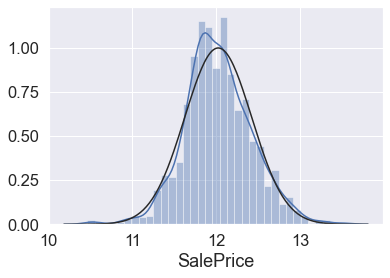


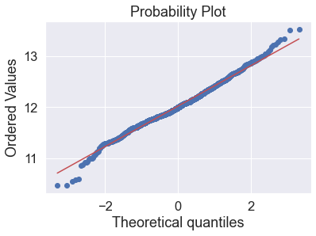


Done! Let's check what's going on with 'GrLivArea'.


```python
#histogram and normal probability plot
sns.distplot(df_train['GrLivArea'], fit=norm);
fig = plt.figure()
res = stats.probplot(df_train['GrLivArea'], plot=plt)
```


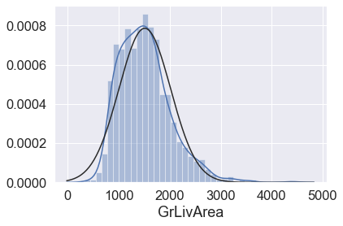


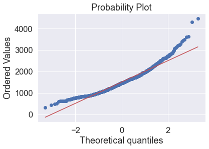


Tastes like skewness... Avada kedavra!


```python
#data transformation
df_train['GrLivArea'] = np.log(df_train['GrLivArea'])
```


```python
#transformed histogram and normal probability plot
sns.distplot(df_train['GrLivArea'], fit=norm);
fig = plt.figure()
res = stats.probplot(df_train['GrLivArea'], plot=plt)
```


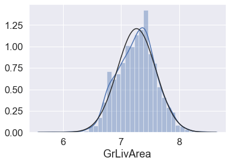


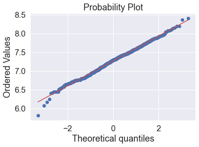


Next, please...


```python
#histogram and normal probability plot
sns.distplot(df_train['TotalBsmtSF'], fit=norm);
fig = plt.figure()
res = stats.probplot(df_train['TotalBsmtSF'], plot=plt)
```


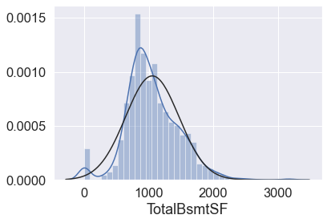


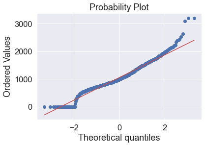


好吧，现在我们正在与大老板打交道。 我们有什么在这里？

总的来说，有些东西偏斜。
大量值为零的观测值（无地下室的房屋）。
一个大问题是因为零值不允许我们进行对数转换。
要在此处应用对数转换，我们将创建一个变量，该变量可以具有或不具有地下室的效果（二进制变量）。 然后，我们将对所有非零观测值进行对数转换，而忽略那些值为零的观测值。 这样，我们可以转换数据，而不会失去具有或不具有地下室的影响。

我不确定这种方法是否正确。 在我看来，这似乎是正确的。 这就是我所说的“高风险工程”。


```python
#create column for new variable (one is enough because it's a binary categorical feature)
#if area>0 it gets 1, for area==0 it gets 0
df_train['HasBsmt'] = pd.Series(len(df_train['TotalBsmtSF']), index=df_train.index)
df_train['HasBsmt'] = 0 
df_train.loc[df_train['TotalBsmtSF']>0,'HasBsmt'] = 1
```


```python
df_train['HasBsmt'].value_counts()
```


    1    1420
    0      37
    Name: HasBsmt, dtype: int64


```python
#transform data
df_train.loc[df_train['HasBsmt']==1,'TotalBsmtSF'] = np.log(df_train['TotalBsmtSF'])
```

    c:\users\13631\appdata\local\programs\python\python38-32\lib\site-packages\pandas\core\series.py:679: RuntimeWarning: divide by zero encountered in log
      result = getattr(ufunc, method)(*inputs, **kwargs)
    


```python
#histogram and normal probability plot
sns.distplot(df_train[df_train['TotalBsmtSF']>0]['TotalBsmtSF'], fit=norm);
fig = plt.figure()
res = stats.probplot(df_train[df_train['TotalBsmtSF']>0]['TotalBsmtSF'], plot=plt)
```


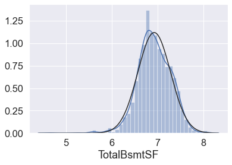


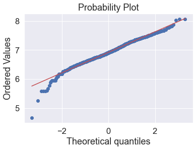


### 首次尝试寻找“同质性”时

测试两个度量变量的均方差的最佳方法是图形方式。 通过圆锥（在图形的一侧较小的色散，在相反侧的较大色散）或菱形（分布的中心有大量点）来表示偏离均等色散的形状。

从“ SalePrice”和“ GrLivArea”开始...


```python
plt.scatter(df_train['GrLivArea'], df_train['SalePrice']);
```


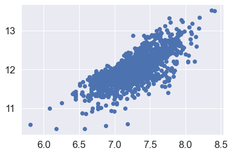


此散点图的较旧版本（在对数转换之前）具有圆锥形状（返回并检查“'SalePrice'和相关变量之间的散点图（如Jagger样式）”）。 如您所见，当前散点图不再具有圆锥形状。 那就是标准化的力量！ 仅通过确保某些变量的正态性，我们就解决了同方差问题。

现在，让我们用“ TotalBsmtSF”检查“ SalePrice”。


```python
#scatter plot
plt.scatter(df_train[df_train['TotalBsmtSF']>0]['TotalBsmtSF'], df_train[df_train['TotalBsmtSF']>0]['SalePrice']);
```


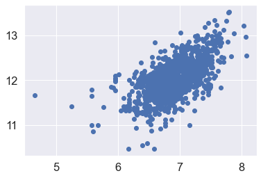


我们可以说，通常，“ SalePrice”在“ TotalBsmtSF”的整个范围内均表现出相同的方差水平。 Cool！

### Last but not the least, dummy variables

Easy mode.


```python
#convert categorical variable into dummy
df_train = pd.get_dummies(df_train)
```

## 结论

我们到了练习的结尾。

在整个内核中，我们将Hair等人提出的许多策略付诸实践。 （2013）。 我们对变量进行了哲学思考，仅对“ SalePrice”进行了分析，并且使用了相关性最高的变量，处理了缺失的数据和异常值，测试了一些基本的统计假设，甚至将分类变量转换为虚拟变量。 Python帮助我们简化了很多工作。

但是任务还没有结束。 请记住，我们的故事在Facebook研究中停止了。 现在是时候打电话给“ SalePrice”并邀请她共进晚餐。 尝试预测她的行为。 您认为她是一个喜欢正规线性回归方法的女孩吗？ 还是您认为她更喜欢集成方法？ 也许还有其他东西？

由您决定。
