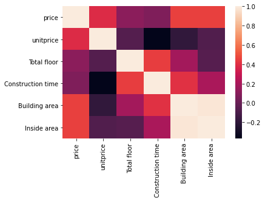

# １．データの導入


```python
import pandas as pd
import numpy as np

df = pd.read_csv('c:/pwork/ershoufang.csv', encoding='gbk')
df.head()
```


<div>
<style scoped>
    .dataframe tbody tr th:only-of-type {
        vertical-align: middle;
    }

    .dataframe tbody tr th {
        vertical-align: top;
    }

    .dataframe thead th {
        text-align: right;
    }
</style>
<table border="1" class="dataframe">
  <thead>
    <tr style="text-align: right;">
      <th></th>
      <th>id</th>
      <th>title</th>
      <th>price</th>
      <th>unitprice</th>
      <th>roomtype</th>
      <th>floor</th>
      <th>Total floor</th>
      <th>direction</th>
      <th>Construction time</th>
      <th>area</th>
      <th>...</th>
      <th>Scale of households</th>
      <th>Heating mode</th>
      <th>Equipped with elevator</th>
      <th>Listing time</th>
      <th>Transaction ownership</th>
      <th>Last transaction</th>
      <th>usage of houses</th>
      <th>Housing years</th>
      <th>Ownership</th>
      <th>mortgage</th>
    </tr>
  </thead>
  <tbody>
    <tr>
      <th>0</th>
      <td>1</td>
      <td>海淀西四环 精装三居 不临街 花园式小区 满五年唯一</td>
      <td>865万</td>
      <td>68175元/平米</td>
      <td>3室1厅</td>
      <td>中楼层</td>
      <td>共12层</td>
      <td>东</td>
      <td>2003年建</td>
      <td>玉阜嘉园</td>
      <td>...</td>
      <td>两梯八户</td>
      <td>自供暖</td>
      <td>有</td>
      <td>2020/6/11</td>
      <td>商品房</td>
      <td>2005/7/7</td>
      <td>普通住宅</td>
      <td>满五年</td>
      <td>非共有</td>
      <td>无</td>
    </tr>
    <tr>
      <th>1</th>
      <td>2</td>
      <td>盛嘉华苑 一居室 东向 看房方便</td>
      <td>206万</td>
      <td>35561元/平米</td>
      <td>2室1厅</td>
      <td>顶层</td>
      <td>共18层</td>
      <td>东</td>
      <td>2012年建</td>
      <td>盛嘉华苑</td>
      <td>...</td>
      <td>两梯六户</td>
      <td>集中供暖</td>
      <td>有</td>
      <td>2020/6/9</td>
      <td>限价商品房</td>
      <td>2015/2/6</td>
      <td>普通住宅</td>
      <td>满五年</td>
      <td>非共有</td>
      <td>无</td>
    </tr>
    <tr>
      <th>2</th>
      <td>3</td>
      <td>新都丽苑 3室2厅 599万</td>
      <td>599万</td>
      <td>48918元/平米</td>
      <td>3室2厅</td>
      <td>高楼层</td>
      <td>共18层</td>
      <td>南北</td>
      <td>2002年建</td>
      <td>新都丽苑</td>
      <td>...</td>
      <td>一梯两户</td>
      <td>集中供暖</td>
      <td>有</td>
      <td>2020/6/2</td>
      <td>商品房</td>
      <td>2015/12/9</td>
      <td>普通住宅</td>
      <td>满两年</td>
      <td>非共有</td>
      <td>有</td>
    </tr>
    <tr>
      <th>3</th>
      <td>4</td>
      <td>首座御园二期，满2年两梯四户板楼户型</td>
      <td>315万</td>
      <td>33504元/平米</td>
      <td>2室1厅</td>
      <td>中楼层</td>
      <td>共14层</td>
      <td>西南</td>
      <td>2015年建</td>
      <td>首座御园二区二期</td>
      <td>...</td>
      <td>一梯四户</td>
      <td>集中供暖</td>
      <td>有</td>
      <td>2020/6/11</td>
      <td>商品房</td>
      <td>2018/4/23</td>
      <td>普通住宅</td>
      <td>满两年</td>
      <td>非共有</td>
      <td>无</td>
    </tr>
    <tr>
      <th>4</th>
      <td>5</td>
      <td>房子空置，看房方便，南北通透，采光好。</td>
      <td>451万</td>
      <td>81867元/平米</td>
      <td>2室1厅</td>
      <td>中楼层</td>
      <td>共5层</td>
      <td>南北</td>
      <td>1972年建</td>
      <td>永安南里</td>
      <td>...</td>
      <td>一梯三户</td>
      <td>集中供暖</td>
      <td>无</td>
      <td>2020/6/11</td>
      <td>央产房</td>
      <td>2011/4/18</td>
      <td>普通住宅</td>
      <td>满五年</td>
      <td>非共有</td>
      <td>无</td>
    </tr>
  </tbody>
</table>
<p>5 rows × 29 columns</p>
</div>


# ２．データの整理とdescribe


```python
df.columns
```


    Index(['id', 'title', 'price', 'unitprice', 'roomtype', 'floor', 'Total floor',
           'direction', 'Construction time', 'area', 'region', 'street',
           'Distance Center', 'Building area', 'House structure', 'Inside area',
           'Building Type', 'building structure', 'Decoration',
           'Scale of households', 'Heating mode', 'Equipped with elevator',
           'Listing time', 'Transaction ownership', 'Last transaction',
           'usage of houses', 'Housing years', 'Ownership', 'mortgage'],
          dtype='object')


```python
df['price'].replace("[^0-9]+", "", regex=True, inplace=True)
df['unitprice'].replace("[^0-9]+", "", regex=True, inplace=True)
df['Total floor'].replace("[^0-9]+", "", regex=True, inplace=True)
df['Construction time'].replace("[^0-9]+", "", regex=True, inplace=True)
df['Construction time'].replace("", np.nan, inplace=True)
df['Inside area'].replace("暂无数据", np.nan, inplace=True)
df['Construction time'].unique()
df[['price', 'unitprice', 'Total floor', 'Construction time', 'Inside area']] = df[['price', 'unitprice', 'Total floor', 'Construction time', 'Inside area']].astype('float')

```


```python
df.describe().round(2)
```


<div>
<style scoped>
    .dataframe tbody tr th:only-of-type {
        vertical-align: middle;
    }

    .dataframe tbody tr th {
        vertical-align: top;
    }

    .dataframe thead th {
        text-align: right;
    }
</style>
<table border="1" class="dataframe">
  <thead>
    <tr style="text-align: right;">
      <th></th>
      <th>id</th>
      <th>price</th>
      <th>unitprice</th>
      <th>Total floor</th>
      <th>Construction time</th>
      <th>Building area</th>
      <th>Inside area</th>
    </tr>
  </thead>
  <tbody>
    <tr>
      <th>count</th>
      <td>2812.00</td>
      <td>2812.00</td>
      <td>2812.00</td>
      <td>2812.00</td>
      <td>2757.00</td>
      <td>2812.00</td>
      <td>1504.00</td>
    </tr>
    <tr>
      <th>mean</th>
      <td>1406.50</td>
      <td>522.84</td>
      <td>64447.22</td>
      <td>13.44</td>
      <td>1999.81</td>
      <td>80.41</td>
      <td>72.90</td>
    </tr>
    <tr>
      <th>std</th>
      <td>811.90</td>
      <td>388.82</td>
      <td>27565.61</td>
      <td>7.86</td>
      <td>9.38</td>
      <td>32.81</td>
      <td>32.12</td>
    </tr>
    <tr>
      <th>min</th>
      <td>1.00</td>
      <td>116.00</td>
      <td>16889.00</td>
      <td>2.00</td>
      <td>1954.00</td>
      <td>25.54</td>
      <td>1.00</td>
    </tr>
    <tr>
      <th>25%</th>
      <td>703.75</td>
      <td>320.00</td>
      <td>44869.25</td>
      <td>6.00</td>
      <td>1993.00</td>
      <td>58.74</td>
      <td>52.68</td>
    </tr>
    <tr>
      <th>50%</th>
      <td>1406.50</td>
      <td>437.50</td>
      <td>57111.50</td>
      <td>12.00</td>
      <td>2001.00</td>
      <td>73.66</td>
      <td>68.27</td>
    </tr>
    <tr>
      <th>75%</th>
      <td>2109.25</td>
      <td>599.00</td>
      <td>77740.00</td>
      <td>20.00</td>
      <td>2007.00</td>
      <td>91.91</td>
      <td>82.91</td>
    </tr>
    <tr>
      <th>max</th>
      <td>2812.00</td>
      <td>6299.00</td>
      <td>181522.00</td>
      <td>35.00</td>
      <td>2017.00</td>
      <td>373.34</td>
      <td>337.78</td>
    </tr>
  </tbody>
</table>
</div>


# ３．変数選択


```python
labelcolumns = ['roomtype', 'floor',
    'direction', 'area', 'region', 'street',
    'Distance Center', 'Building area', 'House structure',
    'Building Type', 'building structure', 'Decoration',
    'Scale of households', 'Heating mode', 'Equipped with elevator',
    'Transaction ownership', 
    'usage of houses', 'Housing years', 'Ownership', 'mortgage']

for label in labelcolumns:
    print(f'{label}: {df[label].unique()}, 累計{len(df[label].unique())}個。')
```

    roomtype: ['3室1厅' '2室1厅' '3室2厅' '1室1厅' '2室2厅' '5室3厅' '1室0厅' '4室2厅' '4室3厅' '2室0厅'
     '4室1厅' '6室3厅' '5室2厅' '6室2厅' '3室0厅' '1室2厅' '3室3厅'], 累計17個。
    floor: ['中楼层' '顶层' '高楼层' '低楼层' '底层' '地下室'], 累計6個。
    direction: ['东' '南北' '西南' '东南' '西北' '东东南南' '南西北' '东南北' '南' '东北' '北南' '西南东南' '南西' '东西'
     '南东北' '西南北' '西' '北' '南西南' '南北西' '东西北' '西南南西' '北西南' '西东' '东南西北东北' '东南西南'
     '东南西' '东南西北' '北南西' '东南南' '西东北' '东西南' '西北南' '西南西北' '西南东北' '南北东' '东东北'
     '西北东' '南东' '南东南' '西西南'], 累計41個。
    area: ['玉阜嘉园' '盛嘉华苑' '新都丽苑' ... '万福家园' '徜徉嘉园5号院' '康宁居'], 累計1688個。
    region: ['海淀' '大兴' '石景山' '朝阳' '西城' '昌平' '通州' '丰台' '房山' '东城' '门头沟' '顺义' '亦庄开发区'
     '平谷'], 累計14個。
    street: ['玉泉路' '枣园' '杨庄' '建国门外' '广安门' '朝阳门外' '回龙观' '官园' '武夷花园' '霍营' '望京' '潘家园'
     '新宫' '木樨园' '长阳' '田村' '北苑' '常营' '石佛营' '德胜门' '东关' '左安门' '门头沟其它' '阎村' '天通苑'
     '玉泉营' '马家堡' '中央别墅区' '方庄' '西红门' '农展馆' '亚运村' '马连洼' '五棵松' '首都机场' '朝青' '长椿街'
     '古城' '郁花园' '城子' '顺义其它' '十八里店' '鼓楼大街' '管庄' '青塔' '三元桥' '亦庄' '顺义城' '西坝河'
     '花乡' '万寿路' '四季青' '大峪' '西罗园' '后沙峪' '垡头' '定福庄' '双井' '朝阳门内' '通州北苑' '大兴其它'
     '马连道' '魏公村' '黄村北' '玉桥' '大兴新机场' '九棵树(家乐福)' '紫竹桥' '八角' '劲松' '华威桥' '牡丹园'
     '双桥' '右安门内' '沙河' '南中轴机场商务区' '甘露园' '旧宫' '亦庄开发区其它' '科技园区' '北七家' '万达' '高米店南'
     '草桥' '立水桥' '和平里' '苹果园' '北工大' '天宁寺' '刘家窑' '卢沟桥' '良乡' '果园' '太平桥' '新街口' '马甸'
     '鲁谷' '车公庄' 'CBD' '百子湾' '西二旗' '清河' '西三旗' '红庙' '马驹桥' '七里庄' '洋桥' '高碑店' '定慧寺'
     '大望路' '白纸坊' '东坝' '公主坟' '北大地' '观音寺' '西关环岛' '朝阳公园' '甘家口' '亚运村小营' '芍药居' '四惠'
     '通州其它' '亮马桥' '和义' '酒仙桥' '月坛' '宣武门' '六铺炕' '金融街' '西北旺' '安贞' '南邵' '奥林匹克公园'
     '广渠门' '大红门' '滨河西区' '国展' '阜成门' '东直门' '世纪城' '义和庄' '健翔桥' '临河里' '乔庄' '五里店'
     '西四' '蒲黄榆' '东花市' '双榆树' '丽泽' '甜水园' '欢乐谷' '安定门' '北关' '崇文门' '前门' '团结湖' '六里桥'
     '苏州桥' '豆各庄' '三里屯' '十里堡' '惠新西街' '颐和园' '南口' '知春路' '梨园' '赵公口' '北京南站' '宋家庄'
     '东大桥' '角门' '成寿寺' '永定门' '右安门外' '昌平其它' '白石桥' '黄村火车站' '万柳' '中关村' '菜户营' '二里庄'
     '五道口' '工体' '黄村中' '窦店' '牛街' '潞苑' '学院路' '安宁庄' '西直门' '海淀北部新区' '皂君庙' '石景山其它'
     '天坛' '冯村' '瀛海' '岳各庄' '南沙滩' '太阳宫' '西单' '燕莎' '十里河' '天宫院' '海淀其它' '丰台其它'
     '北太平庄' '木樨地' '军博' '马坡' '地安门' '看丹桥' '李桥' '陶然亭' '厂洼' '小西天' '天宫院南' '圆明园'
     '老山' '交道口' '上地' '建国门内' '金宝街' '平谷其它' '大兴开发区'], 累計225個。
    Distance Center: ['四至五环' '五至六环' '二至三环' '二环内近' '三至四环' '六环外' '二环内' '六环外近' nan], 累計9個。
    Building area: [126.88  57.93 122.45 ...  66.91 110.89 117.  ], 累計2291個。
    House structure: ['平层' '复式' '错层' '暂无数据' '跃层'], 累計5個。
    Building Type: ['板楼' '板塔结合' '塔楼' '暂无数据'], 累計4個。
    building structure: ['钢混结构' '混合结构' '砖混结构' '未知结构'], 累計4個。
    Decoration: ['精装' '简装' '毛坯' '其他'], 累計4個。
    Scale of households: ['两梯八户' '两梯六户' '一梯两户' '一梯四户' '一梯三户' '两梯七户' '两梯三户' '两梯四户' '三梯十二户' '四梯十六户'
     '三梯十户' '两梯十二户' '三梯十五户' '两梯五户' '三梯八户' '两梯十户' '三梯十七户' '一梯五户' '两梯十一户' '两梯两户'
     '三梯十三户' '两梯九户' '三梯十九户' '一梯六户' '一梯一户' '五梯十七户' '三梯六户' '六梯五户' '四梯十二户' '四梯一户'
     '一梯十一户' '一梯七户' '两梯二十七户' '两梯十六户' '两梯十四户' '一梯八户' '三梯十一户' '三梯十六户' '四梯三户'
     '一梯十四户' '三梯十八户' '三梯两户' '一梯十户' '四梯十四户' '三梯九户' '三梯三十八户' '四梯二十二户' '五梯十九户'
     '两梯十三户' '一梯十二户' '四梯九户' '四梯三十九户' '一梯十六户' '四梯三十六户' '三梯二十户' '五梯三十一户' '三梯三户'
     '八梯十六户' '两梯十五户' '四梯十九户' '两梯十七户' '三梯七户' '四梯十户' '三梯二十二户' '两梯十八户' '一梯三十三户'
     '三梯三十七户' '六梯十八户' '两梯四十四户' '两梯一户' '四梯六户' '四梯三十三户' '三梯二十七户' '八梯三十三户'
     '三梯十四户' '三梯三十户' '一梯九户' '两梯二十二户' '六梯四十户' '四梯十七户' '两梯三十八户' '四梯八户' '两梯三十五户'
     '三梯二十五户' '一梯五十一户' '五梯二十一户' '五梯三户' '三梯三十九户' '四梯二十户' '四梯二十七户' '六梯三十七户'
     '四梯二十四户' '六梯二十户' '两梯二十一户' '二十梯三户' '四梯十五户' '两梯十九户' '四梯四十四户' '四梯三十一户'
     '两梯二十户' '两梯二十九户' '一梯十三户' '两梯二十四户' '一梯十七户' '一梯三十户'], 累計105個。
    Heating mode: ['自供暖' '集中供暖' '暂无数据'], 累計3個。
    Equipped with elevator: ['有' '无' '暂无数据'], 累計3個。
    Transaction ownership: ['商品房' '限价商品房' '央产房' '已购公房' '二类经济适用房' '一类经济适用房' '私产' '定向安置房'], 累計8個。
    usage of houses: ['普通住宅' '公寓/公寓' '公寓' '公寓/住宅'], 累計4個。
    Housing years: ['满五年' '满两年' '未满两年'], 累計3個。
    Ownership: ['非共有' '共有' '产权所属非共有' '产权所属共有'], 累計4個。
    mortgage: ['无' '有'], 累計2個。
    


```python
suiticolumns = ["price", "unitprice", "Total floor", "Construction time", "Building area", "Inside area"]
corr = df[suiticolumns].corr()
corr
```


<div>
<style scoped>
    .dataframe tbody tr th:only-of-type {
        vertical-align: middle;
    }

    .dataframe tbody tr th {
        vertical-align: top;
    }

    .dataframe thead th {
        text-align: right;
    }
</style>
<table border="1" class="dataframe">
  <thead>
    <tr style="text-align: right;">
      <th></th>
      <th>price</th>
      <th>unitprice</th>
      <th>Total floor</th>
      <th>Construction time</th>
      <th>Building area</th>
      <th>Inside area</th>
    </tr>
  </thead>
  <tbody>
    <tr>
      <th>price</th>
      <td>1.000000</td>
      <td>0.389108</td>
      <td>0.112227</td>
      <td>0.075851</td>
      <td>0.458072</td>
      <td>0.456656</td>
    </tr>
    <tr>
      <th>unitprice</th>
      <td>0.389108</td>
      <td>1.000000</td>
      <td>-0.064038</td>
      <td>-0.366448</td>
      <td>-0.188074</td>
      <td>-0.076246</td>
    </tr>
    <tr>
      <th>Total floor</th>
      <td>0.112227</td>
      <td>-0.064038</td>
      <td>1.000000</td>
      <td>0.447639</td>
      <td>0.184037</td>
      <td>-0.057247</td>
    </tr>
    <tr>
      <th>Construction time</th>
      <td>0.075851</td>
      <td>-0.366448</td>
      <td>0.447639</td>
      <td>1.000000</td>
      <td>0.407773</td>
      <td>0.206616</td>
    </tr>
    <tr>
      <th>Building area</th>
      <td>0.458072</td>
      <td>-0.188074</td>
      <td>0.184037</td>
      <td>0.407773</td>
      <td>1.000000</td>
      <td>0.980557</td>
    </tr>
    <tr>
      <th>Inside area</th>
      <td>0.456656</td>
      <td>-0.076246</td>
      <td>-0.057247</td>
      <td>0.206616</td>
      <td>0.980557</td>
      <td>1.000000</td>
    </tr>
  </tbody>
</table>
</div>


```python
import seaborn as sns
sns.heatmap(corr)
```


    <matplotlib.axes._subplots.AxesSubplot at 0x139fd220>





```python
from sklearn.linear_model import LinearRegression
from sklearn.tree import DecisionTreeClassifier
linear = LinearRegression()
tree = DecisionTreeClassifier()
```


```python
from sklearn.model_selection import train_test_split
y = np.log(df['unitprice'])
```


```python
y
```


    0       11.129833
    1       10.479005
    2       10.797901
    3       10.419420
    4       11.312851
              ...    
    2807    11.174567
    2808    11.114029
    2809    10.535743
    2810    10.608835
    2811    11.193409
    Name: unitprice, Length: 2812, dtype: float64


```python
for i in suiticolumns:
    X_train, X_test, y_train, y_test = train_test_split(df[[i]].fillna(df[[i]].mean()), y)
    linear.fit(X_train, y_train)
    print(f'{i}だけ予測の精度：{linear.score(X_train, y_train).round(3), linear.score(X_test, y_test).round(3)}.')
```

    priceだけ予測の精度：(0.145, 0.16).
    unitpriceだけ予測の精度：(0.94, 0.93).
    Total floorだけ予測の精度：(0.001, -0.001).
    Construction timeだけ予測の精度：(0.137, 0.099).
    Building areaだけ予測の精度：(0.03, 0.047).
    Inside areaだけ予測の精度：(0.007, -0.012).
    


```python
for i in labelcolumns:
    X_train, X_test, y_train, y_test = train_test_split(pd.get_dummies(df[[i]]),  y)
    linear.fit(X_train, y_train)
    print(f'{i}だけ予測の精度：{linear.score(X_train, y_train).round(3), linear.score(X_test, y_test).round(3)}.')
```

    roomtypeだけ予測の精度：(0.04, -1.3010724453173934e+22).
    floorだけ予測の精度：(0.002, -0.005).
    directionだけ予測の精度：(0.042, -7.215984241795093e+23).
    areaだけ予測の精度：(0.945, -1.2921666769139262e+28).
    regionだけ予測の精度：(0.71, 0.702).
    streetだけ予測の精度：(0.865, -8.86072400191282e+22).
    Distance Centerだけ予測の精度：(0.576, 0.518).
    Building areaだけ予測の精度：(0.038, 0.021).
    House structureだけ予測の精度：(0.002, 0.0).
    Building Typeだけ予測の精度：(0.016, 0.009).
    building structureだけ予測の精度：(0.005, 0.006).
    Decorationだけ予測の精度：(0.001, -0.0).
    Scale of householdsだけ予測の精度：(0.131, -2.1765935254951634e+24).
    Heating modeだけ予測の精度：(0.034, 0.023).
    Equipped with elevatorだけ予測の精度：(0.015, 0.009).
    Transaction ownershipだけ予測の精度：(0.129, 0.085).
    usage of housesだけ予測の精度：(0.003, -0.008).
    Housing yearsだけ予測の精度：(-0.001, -0.001).
    Ownershipだけ予測の精度：(0.002, 0.003).
    mortgageだけ予測の精度：(0.004, -0.001).
    


```python
for i in labelcolumns:
    X_train, X_test, y_train, y_test = train_test_split(pd.get_dummies(df[[i]]),  y)
    linear.fit(X_train, y_train)
    if linear.score(X_test, y_test).round(3) > 0.2:
        print(f'{i}だけ予測の精度：{linear.score(X_train, y_train).round(3), linear.score(X_test, y_test).round(3)}.')
```

    regionだけ予測の精度：(0.703, 0.724).
    Distance Centerだけ予測の精度：(0.564, 0.56).
    


```python
region_price = df[['region', 'unitprice']].groupby('region').mean()
region_price
```


<div>
<style scoped>
    .dataframe tbody tr th:only-of-type {
        vertical-align: middle;
    }

    .dataframe tbody tr th {
        vertical-align: top;
    }

    .dataframe thead th {
        text-align: right;
    }
</style>
<table border="1" class="dataframe">
  <thead>
    <tr style="text-align: right;">
      <th></th>
      <th>unitprice</th>
    </tr>
    <tr>
      <th>region</th>
      <th></th>
    </tr>
  </thead>
  <tbody>
    <tr>
      <th>东城</th>
      <td>94973.058140</td>
    </tr>
    <tr>
      <th>丰台</th>
      <td>57345.062500</td>
    </tr>
    <tr>
      <th>亦庄开发区</th>
      <td>43922.740741</td>
    </tr>
    <tr>
      <th>大兴</th>
      <td>41044.500000</td>
    </tr>
    <tr>
      <th>平谷</th>
      <td>24160.000000</td>
    </tr>
    <tr>
      <th>房山</th>
      <td>34875.519481</td>
    </tr>
    <tr>
      <th>昌平</th>
      <td>43087.960474</td>
    </tr>
    <tr>
      <th>朝阳</th>
      <td>64613.542607</td>
    </tr>
    <tr>
      <th>海淀</th>
      <td>85404.709360</td>
    </tr>
    <tr>
      <th>石景山</th>
      <td>50498.078571</td>
    </tr>
    <tr>
      <th>西城</th>
      <td>122559.876147</td>
    </tr>
    <tr>
      <th>通州</th>
      <td>43141.123596</td>
    </tr>
    <tr>
      <th>门头沟</th>
      <td>34908.487179</td>
    </tr>
    <tr>
      <th>顺义</th>
      <td>37957.571429</td>
    </tr>
  </tbody>
</table>
</div>


```python
from eplot import eplot
a = region_price.sort_values(by='unitprice', ascending=False)
a.eplot.bar(title='中心からの距離')
```

    c:\users\13631\appdata\local\programs\python\python38-32\lib\site-packages\pyecharts\charts\chart.py:14: PendingDeprecationWarning: pyecharts 所有图表类型将在 v1.9.0 版本开始强制使用 ChartItem 进行数据项配置 :)
      super().__init__(init_opts=init_opts)
    


<script>
    require.config({
        paths: {
            'echarts':'https://assets.pyecharts.org/assets/echarts.min'
        }
    });
</script>

        <div id="40202da437ff4fc49b975f704c66e42b" style="width:900px; height:500px;"></div>

<script>
        require(['echarts'], function(echarts) {
                var chart_40202da437ff4fc49b975f704c66e42b = echarts.init(
                    document.getElementById('40202da437ff4fc49b975f704c66e42b'), 'white', {renderer: 'canvas'});
                var option_40202da437ff4fc49b975f704c66e42b = {
    "animation": true,
    "animationThreshold": 2000,
    "animationDuration": 1000,
    "animationEasing": "cubicOut",
    "animationDelay": 0,
    "animationDurationUpdate": 300,
    "animationEasingUpdate": "cubicOut",
    "animationDelayUpdate": 0,
    "color": [
        "#c23531",
        "#2f4554",
        "#61a0a8",
        "#d48265",
        "#749f83",
        "#ca8622",
        "#bda29a",
        "#6e7074",
        "#546570",
        "#c4ccd3",
        "#f05b72",
        "#ef5b9c",
        "#f47920",
        "#905a3d",
        "#fab27b",
        "#2a5caa",
        "#444693",
        "#726930",
        "#b2d235",
        "#6d8346",
        "#ac6767",
        "#1d953f",
        "#6950a1",
        "#918597"
    ],
    "series": [
        {
            "type": "bar",
            "name": "unitprice",
            "legendHoverLink": true,
            "data": [
                122559.87614678899,
                94973.05813953489,
                85404.70935960591,
                64613.54260651629,
                57345.0625,
                50498.078571428574,
                43922.74074074074,
                43141.12359550562,
                43087.960474308304,
                41044.5,
                37957.57142857143,
                34908.48717948718,
                34875.51948051948,
                24160.0
            ],
            "showBackground": false,
            "barMinHeight": 0,
            "barCategoryGap": "20%",
            "barGap": "30%",
            "large": false,
            "largeThreshold": 400,
            "seriesLayoutBy": "column",
            "datasetIndex": 0,
            "clip": true,
            "zlevel": 0,
            "z": 2,
            "label": {
                "show": true,
                "position": "top",
                "margin": 8
            }
        }
    ],
    "legend": [
        {
            "data": [
                "unitprice"
            ],
            "selected": {
                "unitprice": true
            },
            "show": true,
            "padding": 5,
            "itemGap": 10,
            "itemWidth": 25,
            "itemHeight": 14
        }
    ],
    "tooltip": {
        "show": true,
        "trigger": "item",
        "triggerOn": "mousemove|click",
        "axisPointer": {
            "type": "line"
        },
        "showContent": true,
        "alwaysShowContent": false,
        "showDelay": 0,
        "hideDelay": 100,
        "textStyle": {
            "fontSize": 14
        },
        "borderWidth": 0,
        "padding": 5
    },
    "xAxis": [
        {
            "show": true,
            "scale": false,
            "nameLocation": "end",
            "nameGap": 15,
            "gridIndex": 0,
            "inverse": false,
            "offset": 0,
            "splitNumber": 5,
            "minInterval": 0,
            "splitLine": {
                "show": false,
                "lineStyle": {
                    "show": true,
                    "width": 1,
                    "opacity": 1,
                    "curveness": 0,
                    "type": "solid"
                }
            },
            "data": [
                "\u897f\u57ce",
                "\u4e1c\u57ce",
                "\u6d77\u6dc0",
                "\u671d\u9633",
                "\u4e30\u53f0",
                "\u77f3\u666f\u5c71",
                "\u4ea6\u5e84\u5f00\u53d1\u533a",
                "\u901a\u5dde",
                "\u660c\u5e73",
                "\u5927\u5174",
                "\u987a\u4e49",
                "\u95e8\u5934\u6c9f",
                "\u623f\u5c71",
                "\u5e73\u8c37"
            ]
        }
    ],
    "yAxis": [
        {
            "show": true,
            "scale": false,
            "nameLocation": "end",
            "nameGap": 15,
            "gridIndex": 0,
            "inverse": false,
            "offset": 0,
            "splitNumber": 5,
            "minInterval": 0,
            "splitLine": {
                "show": false,
                "lineStyle": {
                    "show": true,
                    "width": 1,
                    "opacity": 1,
                    "curveness": 0,
                    "type": "solid"
                }
            }
        }
    ],
    "title": [
        {
            "text": "\u4e2d\u5fc3\u304b\u3089\u306e\u8ddd\u96e2",
            "padding": 5,
            "itemGap": 10
        }
    ]
};
                chart_40202da437ff4fc49b975f704c66e42b.setOption(option_40202da437ff4fc49b975f704c66e42b);
        });
    </script>


```python
distance_price = df[['Distance Center', 'unitprice']].groupby('Distance Center').mean()
distance_price
```


<div>
<style scoped>
    .dataframe tbody tr th:only-of-type {
        vertical-align: middle;
    }

    .dataframe tbody tr th {
        vertical-align: top;
    }

    .dataframe thead th {
        text-align: right;
    }
</style>
<table border="1" class="dataframe">
  <thead>
    <tr style="text-align: right;">
      <th></th>
      <th>unitprice</th>
    </tr>
    <tr>
      <th>Distance Center</th>
      <th></th>
    </tr>
  </thead>
  <tbody>
    <tr>
      <th>三至四环</th>
      <td>78017.351816</td>
    </tr>
    <tr>
      <th>二环内</th>
      <td>100894.150000</td>
    </tr>
    <tr>
      <th>二环内近</th>
      <td>114808.666667</td>
    </tr>
    <tr>
      <th>二至三环</th>
      <td>89674.448513</td>
    </tr>
    <tr>
      <th>五至六环</th>
      <td>46993.802432</td>
    </tr>
    <tr>
      <th>六环外</th>
      <td>34291.253623</td>
    </tr>
    <tr>
      <th>六环外近</th>
      <td>37937.264706</td>
    </tr>
    <tr>
      <th>四至五环</th>
      <td>63225.672481</td>
    </tr>
  </tbody>
</table>
</div>


```python
a = distance_price.sort_values(by='unitprice', ascending=False)
a.eplot.bar(title='中心からの距離')
```

    c:\users\13631\appdata\local\programs\python\python38-32\lib\site-packages\pyecharts\charts\chart.py:14: PendingDeprecationWarning: pyecharts 所有图表类型将在 v1.9.0 版本开始强制使用 ChartItem 进行数据项配置 :)
      super().__init__(init_opts=init_opts)
    


<script>
    require.config({
        paths: {
            'echarts':'https://assets.pyecharts.org/assets/echarts.min'
        }
    });
</script>

        <div id="d8e81b57815a482bb4774351f42e590e" style="width:900px; height:500px;"></div>

<script>
        require(['echarts'], function(echarts) {
                var chart_d8e81b57815a482bb4774351f42e590e = echarts.init(
                    document.getElementById('d8e81b57815a482bb4774351f42e590e'), 'white', {renderer: 'canvas'});
                var option_d8e81b57815a482bb4774351f42e590e = {
    "animation": true,
    "animationThreshold": 2000,
    "animationDuration": 1000,
    "animationEasing": "cubicOut",
    "animationDelay": 0,
    "animationDurationUpdate": 300,
    "animationEasingUpdate": "cubicOut",
    "animationDelayUpdate": 0,
    "color": [
        "#c23531",
        "#2f4554",
        "#61a0a8",
        "#d48265",
        "#749f83",
        "#ca8622",
        "#bda29a",
        "#6e7074",
        "#546570",
        "#c4ccd3",
        "#f05b72",
        "#ef5b9c",
        "#f47920",
        "#905a3d",
        "#fab27b",
        "#2a5caa",
        "#444693",
        "#726930",
        "#b2d235",
        "#6d8346",
        "#ac6767",
        "#1d953f",
        "#6950a1",
        "#918597"
    ],
    "series": [
        {
            "type": "bar",
            "name": "unitprice",
            "legendHoverLink": true,
            "data": [
                114808.66666666667,
                100894.15,
                89674.44851258582,
                78017.3518164436,
                63225.67248062015,
                46993.802431610944,
                37937.26470588235,
                34291.25362318841
            ],
            "showBackground": false,
            "barMinHeight": 0,
            "barCategoryGap": "20%",
            "barGap": "30%",
            "large": false,
            "largeThreshold": 400,
            "seriesLayoutBy": "column",
            "datasetIndex": 0,
            "clip": true,
            "zlevel": 0,
            "z": 2,
            "label": {
                "show": true,
                "position": "top",
                "margin": 8
            }
        }
    ],
    "legend": [
        {
            "data": [
                "unitprice"
            ],
            "selected": {
                "unitprice": true
            },
            "show": true,
            "padding": 5,
            "itemGap": 10,
            "itemWidth": 25,
            "itemHeight": 14
        }
    ],
    "tooltip": {
        "show": true,
        "trigger": "item",
        "triggerOn": "mousemove|click",
        "axisPointer": {
            "type": "line"
        },
        "showContent": true,
        "alwaysShowContent": false,
        "showDelay": 0,
        "hideDelay": 100,
        "textStyle": {
            "fontSize": 14
        },
        "borderWidth": 0,
        "padding": 5
    },
    "xAxis": [
        {
            "show": true,
            "scale": false,
            "nameLocation": "end",
            "nameGap": 15,
            "gridIndex": 0,
            "inverse": false,
            "offset": 0,
            "splitNumber": 5,
            "minInterval": 0,
            "splitLine": {
                "show": false,
                "lineStyle": {
                    "show": true,
                    "width": 1,
                    "opacity": 1,
                    "curveness": 0,
                    "type": "solid"
                }
            },
            "data": [
                "\u4e8c\u73af\u5185\u8fd1",
                "\u4e8c\u73af\u5185",
                "\u4e8c\u81f3\u4e09\u73af",
                "\u4e09\u81f3\u56db\u73af",
                "\u56db\u81f3\u4e94\u73af",
                "\u4e94\u81f3\u516d\u73af",
                "\u516d\u73af\u5916\u8fd1",
                "\u516d\u73af\u5916"
            ]
        }
    ],
    "yAxis": [
        {
            "show": true,
            "scale": false,
            "nameLocation": "end",
            "nameGap": 15,
            "gridIndex": 0,
            "inverse": false,
            "offset": 0,
            "splitNumber": 5,
            "minInterval": 0,
            "splitLine": {
                "show": false,
                "lineStyle": {
                    "show": true,
                    "width": 1,
                    "opacity": 1,
                    "curveness": 0,
                    "type": "solid"
                }
            }
        }
    ],
    "title": [
        {
            "text": "\u4e2d\u5fc3\u304b\u3089\u306e\u8ddd\u96e2",
            "padding": 5,
            "itemGap": 10
        }
    ]
};
                chart_d8e81b57815a482bb4774351f42e590e.setOption(option_d8e81b57815a482bb4774351f42e590e);
        });
    </script>


# ４．機械学習の方法で分析する


```python
from sklearn.ensemble import RandomForestRegressor as RFR
# region と Distance Center　2つ変数合併の予測精度
x0 = pd.get_dummies(df[['region', 'Distance Center']])
x1 = df[['Total floor', 'Building area']]
# y = df['unitprice']
x = pd.concat((x0,x1), axis=1)
X_train, X_test, y_train, y_test = train_test_split(x, y)
rfr = RFR()
rfr.fit(X_train, y_train)
print(f'region and Distance Center RFR予測の精度：{rfr.score(X_train, y_train),rfr.score(X_test, y_test)}')
```

    region and Distance Center RFR予測の精度：(0.9690203487309413, 0.8108482659677475)
    


```python
# 全てのラベル変数と数値を合併してRFRより予測する
x0 = pd.get_dummies(df[labelcolumns])
x1 = df[['Total floor', 'Building area']]
# y = df['unitprice']
x = pd.concat((x0,x1), axis=1)
X_train, X_test, y_train, y_test = train_test_split(x, y)
rfr = RFR()
rfr.fit(X_train, y_train)
print(f'全ての変数予測の精度：{rfr.score(X_train, y_train),rfr.score(X_test, y_test)}')
```

    全ての変数予測の精度：(0.9817708073998072, 0.8802787062004644)
    


```python
# Lasso　RFR　MLP方法を比較する
from sklearn.linear_model import Lasso
from sklearn.ensemble import RandomForestRegressor as RFR
from sklearn.neural_network import MLPRegressor

X_train, X_test, y_train, y_test = train_test_split(x, y)
rfr = RFR(); lasso = Lasso(); mlp = MLPRegressor()
for name, i in {'rfr':rfr, 'linear':lasso, 'mlp': mlp}.items():
    i.fit(X_train, y_train)
    print(f"{name}'s score: {i.score(X_test, y_test).round(3)}")
# rfr が一番精度高い
```

    rfr's score: 0.87
    linear's score: 0.017
    mlp's score: 0.564
    
